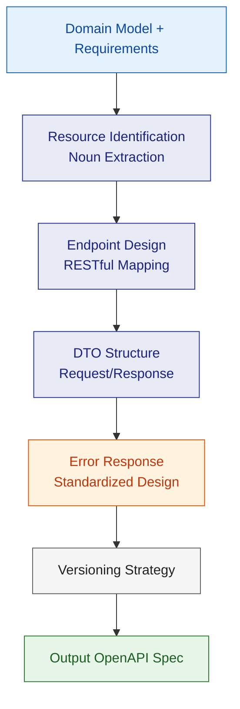
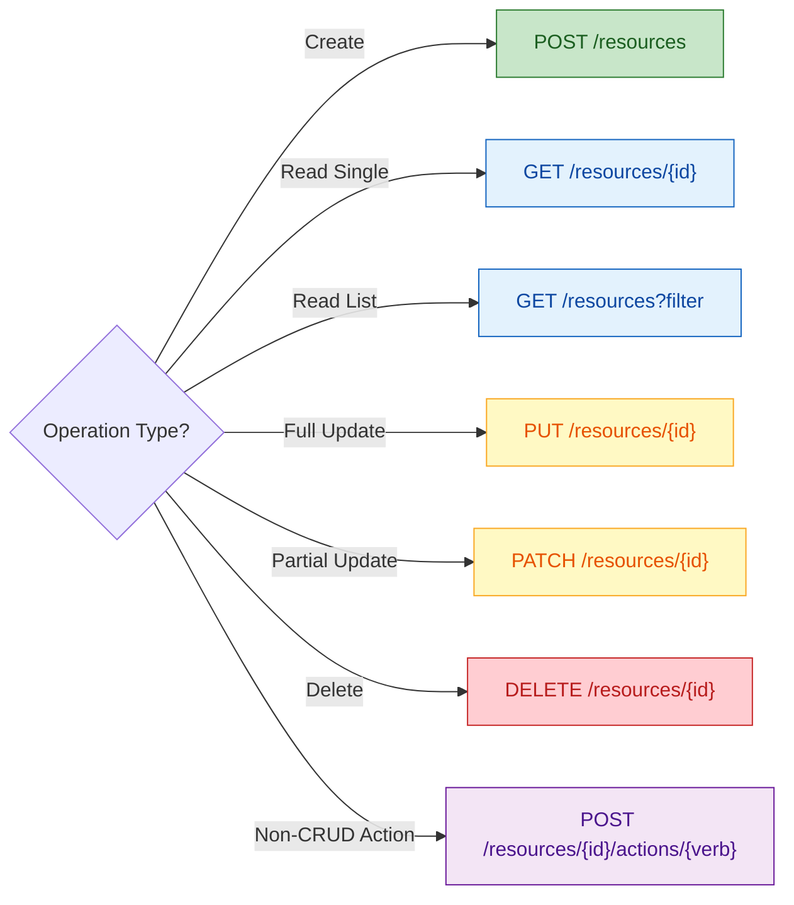
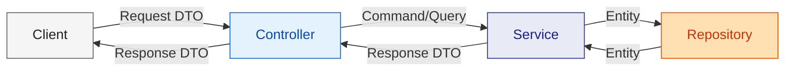
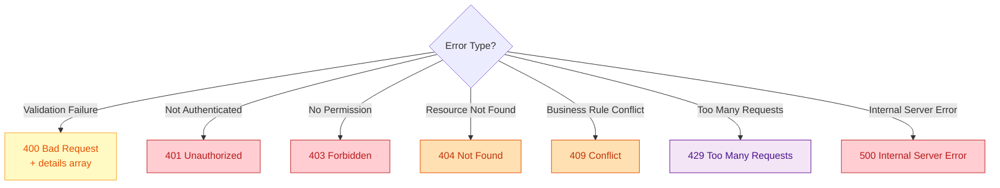
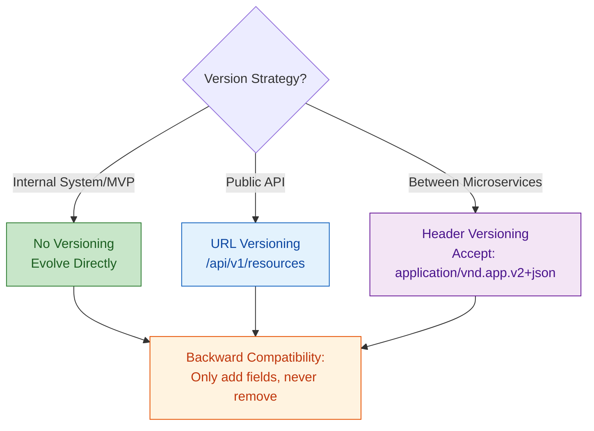

# API Contract Design

Starting from domain models + requirement documents, produce complete API interface contracts. All design decisions are expressed as Mermaid flowcharts.

---

## Design Flow



---

## 1. Resource Identification

Extract API resources from the domain model:

| Domain Concept | API Resource | Notes |
|--|--|--|
| Aggregate Root | Top-level resource `/resources` | Directly exposed as RESTful resource |
| Entity (non-root) | Sub-resource `/resources/{id}/sub` | Accessed through parent resource |
| Value Object | Embedded in DTO | Not exposed independently |
| Domain Service | Action endpoint `/resources/{id}/actions/do` | Non-CRUD operations |

---

## 2. Endpoint Design Standards

### RESTful Mapping Rules



### Naming Conventions
- Resource names: Plural form (`/users` not `/user`)
- Paths: kebab-case (`/migration-tasks`)
- Query parameters: camelCase (`?pageSize=20&sortBy=createdAt`)
- Nesting max 2 levels: `/resources/{id}/sub-resources/{subId}`

### Idempotency Requirements

| Method | Idempotent? | Safe? | Notes |
|--|--|--|--|
| GET | Yes | Yes | Read-only, no side effects |
| PUT | Yes | No | Full replacement, repeated execution yields same result |
| DELETE | Yes | No | Delete again returns 404/204 |
| POST | **No** | No | Requires additional mechanism for idempotency (Idempotency-Key) |
| PATCH | **No** | No | Depends on the specific operation |

---

## 3. DTO Design Standards

### Layered Structure



### DTO Design Principles
- **Request DTO ≠ Entity**: Don't expose internal fields (e.g., id, createdAt are server-generated)
- **Response DTO ≠ Entity**: Trim fields as needed, avoid over-exposure
- **List DTO is slim**: List endpoints return summaries, detail endpoints return full data
- **Flatten nesting**: Avoid > 3 levels of nesting, use ID references instead

### Pagination Standard

```typescript
// Request
interface PaginationQuery {
  page?: number;       // Default 1
  pageSize?: number;   // Default 20, max 100
  sortBy?: string;
  sortOrder?: 'asc' | 'desc';
}

// Response
interface PaginatedResponse<T> {
  data: T[];
  pagination: {
    page: number;
    pageSize: number;
    total: number;
    totalPages: number;
  };
}
```

---

## 4. Error Response Standardization

### Unified Error Format

```typescript
interface ErrorResponse {
  code: string;        // Business error code: "RESOURCE_NOT_FOUND"
  message: string;     // Human-readable message
  details?: Array<{    // Field-level errors (on validation failure)
    field: string;
    message: string;
  }>;
  traceId?: string;    // Distributed trace ID
}
```

### HTTP Status Code Mapping



### Error Code Naming Conventions
- All uppercase + underscore: `RESOURCE_NOT_FOUND`
- Prefix by module: `USER_NOT_FOUND`, `ORDER_ALREADY_PAID`
- Use semantic strings, not numeric codes

---

## 5. Versioning Strategy



### Deprecation Management
- After a new version launches, keep the old version for at least **6 months**
- Add `Deprecation: true` + `Sunset: <date>` response headers
- Mark deprecation status in documentation

---

## 6. Output Checklist

After design is complete, produce the following artifacts:

| Artifact | Format | Notes |
|--|--|--|
| API endpoint list | Markdown table | Path, method, description, idempotent? |
| Request/Response DTOs | TypeScript/Java interface definitions | DTOs for each endpoint |
| Error code catalog | Markdown table | code + HTTP status + usage scenario |
| OpenAPI specification | YAML | Importable into Swagger UI |
| Contract test cases | Description | Consumer-Provider verification points |

---

## Reference

For detailed specifications, see the `references/` directory:
- `api-design-rules.md` — Detailed RESTful design rules and anti-patterns
