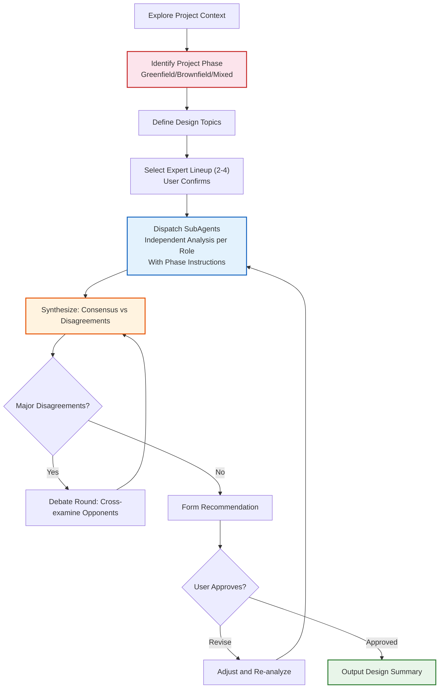

# Multi-Perspective Brainstorming

Through multiple SubAgents playing different expert roles, independently analyze the same problem, then synthesize and debate to form a consensus solution. Core problem solved: a single perspective easily falls into blind spots — multi-perspective adversarial thinking exposes hidden assumptions, discovers overlooked risks, and compares trade-offs.

<HARD-GATE>
No code implementation, file creation, or scaffolding is allowed before the design proposal receives user approval. No matter how simple the project seems, it must go through at least one round of multi-perspective analysis.
</HARD-GATE>

## Anti-pattern: "This problem is too simple to discuss"

Every design decision goes through this flow. Even "simple" problems need at least two perspectives. Discussion for simple problems can be brief (a few sentences per perspective), but must exist. "Simple" projects are precisely where unexamined assumptions cause the most rework.

## Project Phase Identification

After exploring project context, the moderator first determines the project phase — different phases require fundamentally different discussion strategies:

### New Project (Greenfield)

**Identification Signals**: No code repository / empty repository / only initialization scaffolding

**Discussion Strategy**:
- SubAgents analyze based on requirements and domain knowledge, **unconstrained by existing architecture**
- Solution space is fully open — encourage proposing fundamentally different architecture/technology paths
- Risk analysis focuses on: inherent flaws of the solution, team capability match, technology maturity
- Output emphasis: initial design decisions, technology selection recommendations, MVP boundaries

**SubAgent Extra Instructions**:
```
This is a brand new project with no existing code constraints. Feel free to propose
what you consider the best solution without worrying about backward compatibility.
Focus on: why this solution and not others.
```

### Existing Project (Brownfield)

**Identification Signals**: Has substantial code / existing architecture and tech stack / has technical debt

**Discussion Strategy**:
- Moderator first uses Explore SubAgent to scan: directory structure, package.json/pom.xml, core modules, recent changes
- Background info sent to SubAgents **must include existing architecture summary**
- Solutions must evaluate compatibility with existing system — direct replacement vs gradual migration vs coexistence
- Risk analysis focuses on: blast radius, breaking changes, migration cost
- Output emphasis: evolution strategy, compatibility assessment, migration path

**SubAgent Extra Instructions**:
```
This is an existing project with {tech stack}. Your solution must consider:
1. Compatibility with existing architecture (can it be gradually introduced?)
2. Blast radius (what existing features would break?)
3. Migration path (if migration needed, how many steps? Risk at each step?)
When the existing approach "works well enough", don't advocate rewriting for architectural elegance.
```

### Mixed Projects

For scenarios with "existing partial code but adding an independent new module", the new module follows Greenfield strategy, while integration with old modules follows Brownfield strategy.

## Flow Checklist

Execute in order, marking each step complete:

1. **Explore project context** — Check files, documentation, recent changes
2. **Identify project phase** — Greenfield / Brownfield / Mixed, determine discussion strategy
3. **Define topics** — Break user's question into independently discussable design topics
4. **Select expert lineup** — Choose 2-4 roles based on scenario templates, confirm with user
5. **Dispatch SubAgents** — One SubAgent per role, with project phase extra instructions
6. **Synthesize analysis** — Collect perspectives, identify consensus and disagreements
7. **Debate round** (if disagreements) — Have opposing sides cross-examine each other
8. **Form recommendation** — Comprehensive weighing, clear recommendation with reasoning
9. **User approval** — Present solution, obtain user confirmation or revision feedback
10. **Output design summary** — Record final decisions (can be handed to spec-writing for documentation)

## Flowchart



## Moderator Rules

You are the **Moderator**, not a debate participant. Your responsibilities:

1. **Frame the question**: Transform vague questions into clear propositions SubAgents can independently analyze
2. **Select lineup**: Choose appropriate roles from `agents/` directory based on topic nature
3. **Control pace**: Discuss only one topic per round, don't be greedy
4. **Synthesize, don't concatenate**: Perspectives need to be weighed and integrated, not simply listed
5. **Expose disagreements**: When expert opinions conflict, clearly state the conflict points and each side's reasoning
6. **Follow up on details**: If a role's analysis is too vague, add another round requesting specifics

### Topic Framing Template

When dispatching to SubAgents, each topic must include:
- **Background**: Project context, existing constraints, decisions already made
- **Question**: The specific design question to answer (one question, not multiple)
- **Dimensions to address**: Advantages, disadvantages, risks, alternatives, recommendation

### SubAgent Dispatch Template

```
You are a {role name}.

Background: {project context and constraints}

Design question: {one specific design question}

Please analyze from your professional perspective:
1. What solution do you recommend? Why?
2. What are the main risks and drawbacks of this solution?
3. Are there better alternatives?
4. If others oppose your solution, what would be their most likely reasons?

Be concise, 2-3 sentences per point. Total word count under 300.
```

## Expert Roles

The role system uses a **scenario template + free combination** model. No "must participate" fixed roles — the moderator selects the most appropriate lineup based on project scenario.

### Preset Role Library

Preset roles in `agents/` directory, loaded on demand:

| Role | Core Perspective | Typical Scenarios |
|------|---------|---------|
| **Product Manager** (product-manager) | User value, requirement priority, business model, MVP scope | Product design, feature planning |
| **Architect** (architect) | System design, scalability, technology selection, long-term maintenance | Technical architecture decisions |
| **UI/UX Designer** (ux-designer) | User experience, interaction flow, information architecture, usability | Products involving user interfaces |
| **Domain Expert** (domain-expert) | Business logic, industry conventions, compliance requirements | Clear business domains |
| **Pragmatist** (pragmatist) | Implementation cost, team capability, schedule estimation | Technical feasibility assessment |
| **Challenger** (challenger) | Risk, security, failure modes, hidden assumptions | Need for adversarial review |

### Scenario Templates

Moderator recommends lineup based on project type; user can adjust:

| Project Scenario | Recommended Lineup (3-4) | Description |
|---------|-------------------|------|
| **Software Product Development** | Product Manager + Architect + UI/UX Designer + Domain Expert | Covers "what + how + usability + correctness" |
| **Technical Architecture Decision** | Architect + Pragmatist + Challenger | Pure technical solution evaluation |
| **Business Process Optimization** | Product Manager + Domain Expert + Challenger | Focus on process rationality and risk |
| **Refactoring/Technical Debt** | Architect + Pragmatist + Challenger | Evaluate renovation feasibility |
| **New Market/New Domain** | Product Manager + Domain Expert + Challenger + Pragmatist | High uncertainty, multi-dimensional validation |

### Dynamic Role Generation

When preset roles don't cover the project domain, the moderator **dynamically generates roles**:

1. **Identify needed perspective**: What analytical dimension is missing from the current lineup?
2. **Construct role prompt**:

```
Role name: {domain + specialty}
You are an expert in the {domain} field, with {specific experience description}.
Your core dimensions of concern:
- {dimension1}: {one-sentence description}
- {dimension2}: {one-sentence description}
- {dimension3}: {one-sentence description}
Your preferences: {2-3 items}
Your blind spots: {1-2 items, self-awareness}
Output requirements: Same as standard template, total words <= 300.
```

**Dynamic Generation Examples**:

| Project Scenario | Dynamic Role | Replaces/Supplements |
|---------|---------|------------|
| Novel writing software | **Creator Experience Expert** | Replaces Domain Expert |
| E-commerce platform | **Growth/Operations Expert** | Replaces Domain Expert |
| Game development | **Player Experience Designer** | Replaces UI/UX Designer |
| Education product | **Instructional Designer** | Replaces Domain Expert |
| Financial system | **Compliance/Risk Expert** | Added to lineup |
| Medical software | **Clinical Workflow Expert** | Replaces Domain Expert |

### Selection Rules

- Minimum 2, maximum 4
- Moderator recommends lineup based on scenario template, **confirms with user before dispatching**
- User can replace, add, or remove any role
- Each role has built-in "blind spot self-reflection", reducing dependence on a dedicated challenger
- When no dedicated challenger exists, moderator **proactively supplements risk review** during synthesis

## Synthesis and Debate

### Synthesis Report Format

After SubAgent analysis is complete, the moderator outputs:

```markdown
### Topic: {question description}

**Consensus**:
- {points all parties agree on}

**Disagreements**:
| Viewpoint | Supporters | Opponents | Core Reasoning |
|------|--------|--------|---------|
| ... | ... | ... | ... |

**Moderator Recommendation**: {recommended solution} — Reasoning: {comprehensive trade-off}
```

### Debate Round Trigger Conditions

Enter a debate round only when any of the following conditions are met:
- Two or more roles recommended completely different solutions
- A role identified a P0-level risk in another's solution
- The moderator cannot determine which solution is better from current information

Debate round format: Cross-send opposing sides' core arguments to each other, requesting responses. Maximum 2 debate rounds to avoid infinite loops.

## Design Summary Output

Final output format:

```markdown
# Design Decision Summary

## Topic
{core question discussed}

## Background and Constraints
{project context}

## Solutions Discussed
| Solution | Supporters | Advantages | Disadvantages |
|------|--------|------|------|
| A | Architect | ... | ... |
| B | Pragmatist | ... | ... |

## Final Decision
**Selected Solution**: {solution name}
**Reasoning**: {comprehensive reasoning}
**Known Risks**: {accepted risks and mitigation measures}
**Rejected Solutions**: {unselected solutions and rejection reasons}

## To Be Further Clarified
- {remaining issues needing more information before deciding}
```

## Key Principles

- **One topic per round** — Don't discuss multiple questions simultaneously
- **Independent analysis first** — SubAgents think independently first, then see others' views
- **Disagreement is value** — Unanimous agreement may mean insufficient depth of thinking
- **300-word limit** — Each role's response per round stays under 300 words, preventing verbosity
- **User always has final say** — Moderator recommends but doesn't decide for the user
- **YAGNI** — Ruthlessly remove unnecessary features and over-engineering
