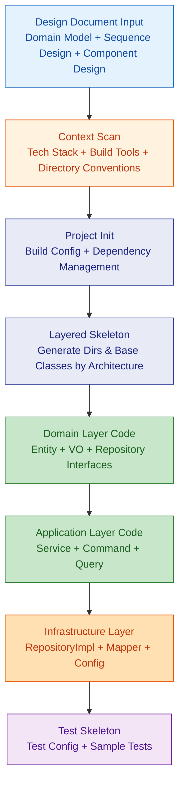
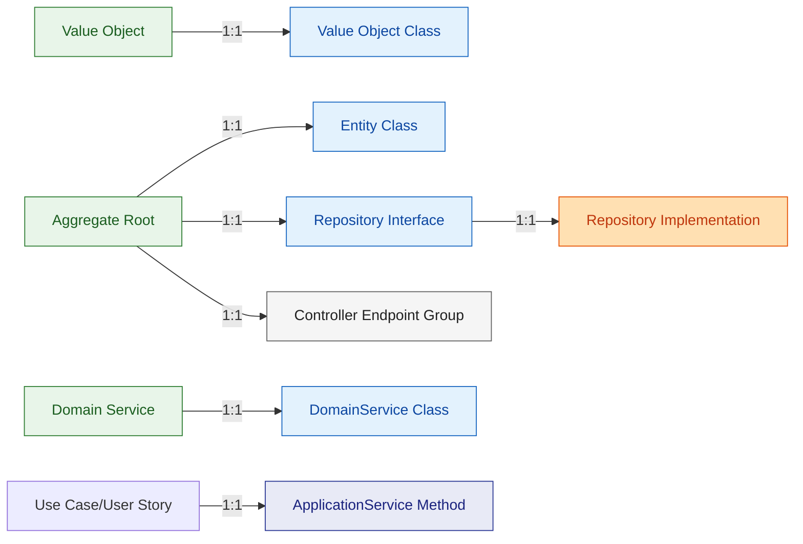

# Code Scaffold Generation

Starting from domain models + sequence designs + component designs, produce a compilable and runnable layered project skeleton.

---

## Generation Flow



---

## 1. Context Scan

Before generation, confirm the following information (obtained from project-context / tech-stack or ask the user):

| Scan Item | Impact | Example |
|--|--|--|
| Language / Framework | Directory structure template | Java + Spring Boot / TypeScript + NestJS |
| Build Tool | Config files | Gradle / Maven / pnpm / npm |
| Architecture Pattern | Layering strategy | Layered / Hexagonal / Modular Monolith |
| ORM / Data Access | Repository implementation | MyBatis / JPA / Prisma / TypeORM |
| Test Framework | Test directory & config | JUnit5 / Vitest / Pytest |
| Monorepo? | Top-level layout | Single module / apps+packages |

---

## 2. Directory Structure Templates

### Java + Spring Boot (Modular Monolith)

```
src/
├── main/java/com/example/project/
│   ├── common/                   # Common utilities
│   │   ├── exception/            # Unified exceptions
│   │   ├── response/             # Unified responses
│   │   └── config/               # Global config
│   ├── module1/                  # Business module
│   │   ├── controller/
│   │   ├── dto/
│   │   │   ├── request/
│   │   │   └── response/
│   │   ├── application/          # Application services
│   │   ├── domain/
│   │   │   ├── entity/
│   │   │   ├── vo/
│   │   │   └── repository/       # Interfaces
│   │   └── infrastructure/
│   │       ├── repository/       # Implementations
│   │       └── mapper/           # MyBatis Mapper
│   └── module2/
│       └── ...
├── main/resources/
│   ├── application.yml
│   ├── mapper/                   # MyBatis XML
│   └── db/migration/             # Database migration scripts
└── test/java/com/example/project/
    ├── module1/
    │   ├── controller/           # Controller tests
    │   ├── application/          # Service tests
    │   └── domain/               # Domain logic tests
    └── common/
        └── BaseIntegrationTest.java
```

### TypeScript + NestJS (Monorepo)

```
apps/
├── api/
│   └── src/
│       ├── modules/
│       │   ├── module1/
│       │   │   ├── module1.module.ts
│       │   │   ├── module1.controller.ts
│       │   │   ├── module1.service.ts
│       │   │   ├── dto/
│       │   │   ├── entities/
│       │   │   └── __tests__/
│       │   └── module2/
│       ├── common/
│       │   ├── filters/
│       │   ├── guards/
│       │   └── interceptors/
│       └── main.ts
packages/
├── shared/
│   └── src/
│       ├── types/
│       └── utils/
```

---

## 3. Layered Skeleton Generation Rules

### Domain Model to Code Mapping



### Layer Responsibilities and Constraints

| Layer | Responsibility | Allowed Dependencies | Forbidden Dependencies |
|--|--|--|--|
| Controller | HTTP entry, parameter validation, DTO conversion | Application layer | Direct Domain operations |
| Application | Use case orchestration, transaction control | Domain layer, Repository interfaces | Infrastructure implementations |
| Domain | Core business rules, invariant constraints | Self only (no external deps) | Any framework annotations |
| Infrastructure | Persistence impl, external integrations | Domain layer (implementing interfaces) | Controller / Application |

---

## 4. Entity Skeleton Generation

Each aggregate root generates the following:

### Java Example

```java
// domain/entity/MigrationTask.java
public class MigrationTask {
    private Long id;
    private String name;
    private TaskStatus status;
    private LocalDateTime createdAt;
    private LocalDateTime updatedAt;

    // Domain behavior (extracted from use cases)
    public void start() {
        if (this.status != TaskStatus.CONFIGURED) {
            throw new TaskNotExecutableException(this.id);
        }
        this.status = TaskStatus.RUNNING;
    }
}
```

### TypeScript Example

```typescript
// entities/migration-task.entity.ts
export class MigrationTask {
  constructor(
    public readonly id: string,
    public name: string,
    public status: TaskStatus,
    public readonly createdAt: Date,
    public updatedAt: Date,
  ) {}

  start(): void {
    if (this.status !== TaskStatus.CONFIGURED) {
      throw new TaskNotExecutableError(this.id);
    }
    this.status = TaskStatus.RUNNING;
  }
}
```

### Generation Elements
- Extract **all fields** from domain model (attribute names, types, constraints)
- Extract **domain behavior methods** from sequence design (method signatures + precondition checks)
- Value objects expressed as immutable classes / `readonly`
- Status fields use enums

---

## 5. Repository + Service Skeleton

### Repository Interface (Domain Layer)

```java
public interface MigrationTaskRepository {
    Optional<MigrationTask> findById(Long id);
    List<MigrationTask> findByStatus(TaskStatus status);
    MigrationTask save(MigrationTask task);
    void deleteById(Long id);
}
```

### ApplicationService (Application Layer)

```java
@Service
@Transactional
public class MigrationTaskAppService {

    private final MigrationTaskRepository taskRepository;

    // Methods extracted from use cases US001~US008
    public MigrationTaskResponse createTask(CreateTaskCommand command) {
        // TODO: implement
        throw new UnsupportedOperationException();
    }

    public void startTask(Long taskId) {
        // TODO: implement
        throw new UnsupportedOperationException();
    }
}
```

### Generation Principles
- Each `TODO` corresponds to a user story
- Repository methods extracted from database calls in sequence design
- Service method signatures extracted from call chains in sequence design
- Skeleton code compiles but throws `UnsupportedOperationException`

---

## 6. Test Skeleton

### Test Configuration

```java
// BaseIntegrationTest.java
@SpringBootTest
@Transactional
@Rollback
public abstract class BaseIntegrationTest {
    // Integration test base class, auto-rollback
}
```

### Unit Test Skeleton

```java
class MigrationTaskTest {

    @Test
    void should_start_task_when_status_is_configured() {
        // TODO: implement
    }

    @Test
    void should_throw_when_starting_non_configured_task() {
        // TODO: implement
    }
}
```

### Generation Principles
- Each Entity domain behavior -> at least 1 positive + 1 negative test skeleton
- Each Service method -> 1 integration test skeleton
- Test naming: `should_[behavior]_when_[condition]`

---

## 7. Output Checklist

| Deliverable | Description |
|--|--|
| Project Directory Structure | Complete directory tree, including README |
| Build Configuration | build.gradle / pom.xml / package.json |
| Entity Classes | All aggregate roots + value objects |
| Repository Interfaces + Implementations | Data access layer |
| Service Skeletons | Methods for all use cases (TODO) |
| Controller Skeletons | RESTful endpoints |
| DTO Classes | Request + Response |
| Test Skeletons | Unit tests + integration test base class |
| Configuration Files | application.yml / .env |

---

## References

See `references/` directory for detailed templates and rules:
- `scaffold-rules.md` — Detailed scaffolding rules and checklists for each tech stack
