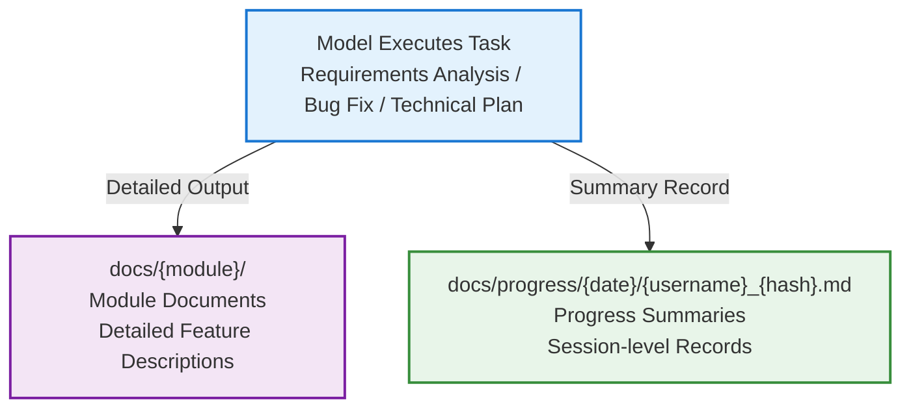

# Documentation Output Management

This Skill solves two core problems:

1. **Lack of unified organization for documentation output**: Module documents scattered, classification chaotic
2. **No task progress records**: After the model processes requirements/fixes bugs, there's no brief summary, making retrospection difficult

This Skill manages two types of content in the `docs/` directory: detailed module documents + progress summary records.

## Data Model



## Principles

- **Mandatory orchestrator invocation**: This is an infrastructure skill, mandatorily invoked by the orchestrator at the end of Plan and during Deliver stages. Must not be skipped.
- **Modular organization (mandatory)**: Module documents must be organized by business dimension in subdirectories (e.g., `docs/auth/login.md`). **Flat output is forbidden** (e.g., `docs/login.md`).
- **One file per session**: Progress records stored independently by date/session hash, no multi-person conflicts.
- **Structure only, not content format**: Document content format is determined by the caller.
- **Git account identification**: Progress record headers include developer Git account.

## Forbidden

- **DO NOT** place documents directly under `docs/` root (e.g., `docs/login.md`). Must be in business module subdirectories (e.g., `docs/auth/login.md`).
- **DO NOT** skip this skill. If a task produces documentation, it must be organized through this skill.
- **DO NOT** omit progress records. Every completed task must write to `docs/progress/{date}/{username}_{hash}.md`.
- **DO NOT** manually generate timestamps. All times (dates, HH:mm:ss) must be produced by the `docs_manager.py` script. LLMs must never calculate or concatenate time strings themselves (common error: manually adding timezone offset to UTC time produces invalid hours like 25:xx).

## Directory Structure

```
docs/
├── auth/                              # Business module — detailed docs
│   ├── login.md
│   └── register.md
├── user/
│   ├── profile.md
│   └── settings.md
├── progress/                          # Progress records
│   ├── 2024-01-15/
│   │   ├── zhangsan_a3f8c1.md         # username_session-hash
│   │   └── lisi_b7d2e4.md
│   ├── 2024-01-16/
│   │   └── zhangsan_c9e5f0.md
│   └── archive/                       # Archive (>30 days)
│       └── 2024-01/
│           └── ...
```

### Module Document Rules

- First-level directory = business module (e.g., `auth`, `user`, `dashboard`)
- Second-level files = pages/features (e.g., `login.md`, `register.md`)
- Module and file names use kebab-case
- Chinese projects may use Chinese naming

### Progress Record Rules

- Path: `docs/progress/{YYYY-MM-DD}/{username}_{session-hash}.md`
- username: from `git config user.name` (spaces replaced with `-`, lowercased)
- Session hash: 6-digit random hexadecimal (e.g., `a3f8c1`), ensures uniqueness
- **Same-session append**: Within the same Agent session window, all progress records are appended to the same file — no new files created. A new session hash is generated only when switching to a new session window.
- Multiple session files per day allowed (different people/different tasks)
- **Must use script**: Progress record creation and appending must be done via `python scripts/docs_manager.py progress` command. LLMs must not directly generate/write progress Markdown files. The script guarantees timestamps use system local time (`datetime.now()`), avoiding timezone calculation errors.

> Complete naming rules in → `references/naming-rules.md`

## Progress Record Template

Each file contains one or more **record entries**. After each task is completed within the same session, append a new `---`-separated entry. **Only include sections that have content** — empty sections are omitted:

```markdown
# Session Progress: {username}_{hash}

> huyongle <568055454@qq.com> · 2026-04-09 10:38:13 start

---

## [10:38:13] User Auth Module Requirements Analysis · Feature Development

Completed domain model design for login/register flow

- `docs/auth/login.md` — Added login flow documentation

> **Decision**: Adopted JWT + Refresh Token dual-token scheme

---

## [10:52:40] Fix Token Refresh Race Condition · Bug Fix

Concurrent refresh overwrites new token with old one; resolved with mutex lock

> **Remaining**: Add refresh token expiry degradation plan

---

## [11:05:22] Code Review · Other

Review PR #42, no changes
```

> Rule: Type merged into heading (`[time] topic · type`); changed files listed directly after summary; decisions/remaining use `>` blockquotes; empty sections omitted.

## Core Capabilities

### 1. create — Create Module Document

Creates a new document in the specified module directory.

- Auto-creates module directory (if it doesn't exist)
- Generates blank document (containing only the top-level heading)

### 2. update — Create or Update Module Document (with content)

Creates or overwrites a module document with content provided via parameter. Mandatory during Deliver stage.

- Creates if not exists, overwrites if exists
- `--content` parameter receives full Markdown body (including feature descriptions, interface definitions, technical decisions, etc.)

### 3. progress — Record Progress

Creates or appends a session progress record.

- First call: creates `{username}_{hash}.md` with header (Git info) + first entry
- With `--session-id`: appends entry to existing file, each entry timestamped `[HH:mm:ss]` to the second
- Returns `session_id` for reuse in subsequent calls

### 4. list — List Documents

Lists all content under docs/ by module and progress separately.

### 5. validate — Validate Directory

Checks basic health of the document directory.

### 6. archive — Archive Old Progress

Moves progress records older than 30 days to `progress/archive/YYYY-MM/`.

## Multi-person Collaboration

- **Module granularity isolation**: Different developers work on different module directories, naturally avoiding file conflicts
- **No progress conflicts**: Each session has an independent file (date+hash), multiple people working simultaneously won't conflict
- **Branch workflow**: Each person works on an independent Git branch, merging through PRs
- **Git account tracing**: Progress record headers contain `git user.name` and `git user.email`, traceable to specific developers

## Python Script

```bash
python scripts/docs_manager.py create   --root <project_root> --module <module_name> --name <doc_name> [--title <heading>]
python scripts/docs_manager.py update   --root <project_root> --module <module_name> --name <doc_name> --content <content> [--title <heading>]
python scripts/docs_manager.py progress --root <project_root> --topic <topic> --type <type> --summary <summary> [--session-id <session_id>] [--files <changed_files_JSON>] [--decisions <decisions>] [--todos <remaining>]
python scripts/docs_manager.py list     --root <project_root>
python scripts/docs_manager.py validate --root <project_root>
python scripts/docs_manager.py archive  --root <project_root> [--older-than <days>]
```

> All output is in JSON format for easy model parsing.
