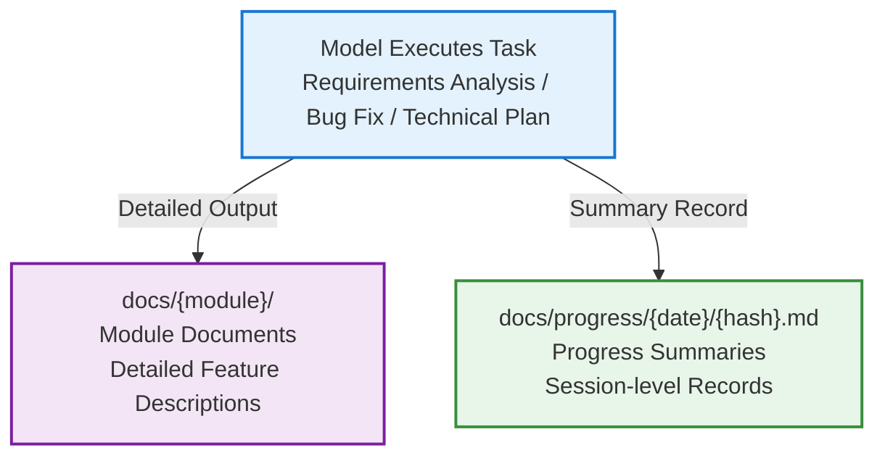

# Documentation Output Management

This Skill solves two core problems:

1. **Lack of unified organization for documentation output**: Module documents scattered, classification chaotic
2. **No task progress records**: After the model processes requirements/fixes bugs, there's no brief summary, making retrospection difficult

This Skill manages two types of content in the `docs/` directory: detailed module documents + progress summary records.

## Data Model



## Principles

- **Passively invoked**: This skill does not auto-trigger, only invoked when document creation/management or progress recording is needed.
- **Modular organization**: Module documents organized by business dimension in subdirectories.
- **One file per session**: Progress records stored independently by date/session hash, no multi-person conflicts.
- **Structure only, not content format**: Document content format is determined by the caller.
- **Git account identification**: Progress record headers include developer Git account.

## Directory Structure

```
docs/
├── auth/                              # Business module — detailed docs
│   ├── login.md
│   └── register.md
├── user/
│   ├── profile.md
│   └── settings.md
├── progress/                          # Progress records
│   ├── 2024-01-15/
│   │   ├── a3f8c1.md                  # Session hash
│   │   └── b7d2e4.md
│   ├── 2024-01-16/
│   │   └── c9e5f0.md
│   └── archive/                       # Archive (>30 days)
│       └── 2024-01/
│           └── ...
```

### Module Document Rules

- First-level directory = business module (e.g., `auth`, `user`, `dashboard`)
- Second-level files = pages/features (e.g., `login.md`, `register.md`)
- Module and file names use kebab-case
- Chinese projects may use Chinese naming

### Progress Record Rules

- Path: `docs/progress/{YYYY-MM-DD}/{session-hash}.md`
- Session hash: 6-digit random hexadecimal (e.g., `a3f8c1`), ensures uniqueness
- Multiple session files per day allowed (different people/different tasks)

> Complete naming rules in → `references/naming-rules.md`

## Progress Record Template

```markdown
# {Topic}

- **Date**: YYYY-MM-DD
- **Developer**: {git user.name} <{git user.email}>
- **Type**: Feature Development | Bug Fix | Technical Plan | Refactoring | Other

## Task Summary

(One or two sentences describing what was accomplished in this session)

## Changed Files

- `path/to/file1.ts` — Reason for change

## Decision Records

(Brief record of important technical decisions)

## Remaining Issues

(Incomplete items or issues to follow up on)
```

## Core Capabilities (Passive API)

### 1. create — Create Module Document

Creates a new document in the specified module directory.

- Auto-creates module directory (if it doesn't exist)
- Generates blank document (containing only the top-level heading)

### 2. progress — Record Progress

Creates a session progress summary.

- Automatically obtains Git account information
- Generates date directory and session hash file
- Fills progress template

### 3. list — List Documents

Lists all content under docs/ by module and progress separately.

### 4. validate — Validate Directory

Checks basic health of the document directory.

### 5. archive — Archive Old Progress

Moves progress records older than 30 days to `progress/archive/YYYY-MM/`.

## Multi-person Collaboration

- **Module granularity isolation**: Different developers work on different module directories, naturally avoiding file conflicts
- **No progress conflicts**: Each session has an independent file (date+hash), multiple people working simultaneously won't conflict
- **Branch workflow**: Each person works on an independent Git branch, merging through PRs
- **Git account tracing**: Progress record headers contain `git user.name` and `git user.email`, traceable to specific developers

## Python Script

```bash
python scripts/docs_manager.py create   --root <project_root> --module <module_name> --name <doc_name> [--title <heading>]
python scripts/docs_manager.py progress --root <project_root> --topic <topic> --type <type> --summary <summary> [--files <changed_files_JSON>] [--decisions <decisions>] [--todos <remaining>]
python scripts/docs_manager.py list     --root <project_root>
python scripts/docs_manager.py validate --root <project_root>
python scripts/docs_manager.py archive  --root <project_root> [--older-than <days>]
```

> All output is in JSON format for easy model parsing.
