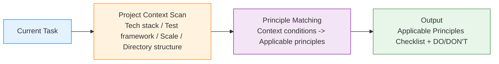

# Engineering Principles Matcher

This Skill solves a core problem: **Models lack engineering discipline when writing code**. Not all principles apply to all projects — legacy projects without test frameworks shouldn't be forced into TDD, small projects don't need DDD layering.

Core logic: **Sense project context first -> Match applicable principles -> Output actionable constraints**.

## Core Mechanism



## Principle Categories and Applicability Conditions

Each principle category has explicit **prerequisite conditions** — skip if conditions are not met.

| Category | Included Principles | Applicability Condition |
|------|---------|---------|
| **SOLID** | SRP, OCP, LSP, ISP, DIP | Project uses OOP language (TS/Java/Python class) |
| **DDD Layering** | Aggregates, bounded contexts, domain services, value objects | Project has clear business domain with >= 3 modules |
| **TDD** | Red-green-refactor, test-first, test pyramid | Project has configured test framework (jest/vitest/junit/pytest) |
| **BDD** | Gherkin acceptance, scenario-driven | Project has E2E test tools (cypress/playwright) |
| **Design Patterns** | Small-scale (Guard Clause/table-driven/Pipe), Classic GoF (Factory/Builder/Decorator/Strategy/Observer/State Machine/Command/Chain of Responsibility), Mid-scale (Pipeline/Circuit Breaker/Worker Pool/Repository), Frontend/Backend/Cross-cutting patterns | Code has identifiable pattern-applicable scenarios |
| **Architecture Patterns** | Layered, Hexagonal/Clean Architecture, Microkernel/Plugin, Modular Monolith, Microservices, Event-driven, Serverless | Involves system architecture decisions or project initialization |
| **Anti-patterns** | God Object, circular dependency, shotgun surgery, over-abstraction, anemic model, etc. | Code review or refactoring tasks |
| **Clean Code** | Naming, function length, comments, readability | **Always applicable** (unconditional) |
| **Error Handling** | Exception classification, boundary validation, defensive programming | **Always applicable** (unconditional) |
| **Testability** | Dependency injection, pure functions, interface isolation | Project has test framework OR new project |
| **Performance Awareness** | Avoid N+1, lazy loading, caching strategies | Tasks involving DB queries or API calls |
| **Security Practices** | Input validation, SQL injection prevention, XSS, CSRF | Tasks involving user input, API endpoints, authentication |

> Full principles and DO/DON'T for each category -> `references/` corresponding files
>
> Design patterns by scale: `design-patterns.md` (index) -> `patterns-small-scale.md` / `patterns-classic.md` / `patterns-module.md` / `patterns-frontend.md` / `patterns-backend.md` / `patterns-crosscut.md` / `patterns-architecture.md` / `anti-patterns.md` (load on demand)

## Context Scanning

Before matching principles, scan project context to determine the following:

### Auto-detection Items

| Detection Item | Detection Method | Affects Selection |
|-------|---------|---------|
| Language/Framework | package.json, pom.xml, pyproject.toml, tsconfig | How SOLID/DDD/design patterns apply |
| Test Framework | jest.config, vitest.config, pytest.ini, build.gradle | Whether TDD/BDD applies |
| Project Scale | File count, module count | Whether DDD layering is worth introducing |
| Directory Structure | Whether layering exists (controller/service/repository) | Whether to continue layered practices |
| Existing Tests | __tests__/, *.test.*, *.spec.* | Current test coverage status |
| E2E Tools | cypress/, playwright.config | Whether BDD applies |
| ORM/Database | prisma/, typeorm, mybatis, sequelize | Performance awareness, data modeling principles |

### Context Tiers

| Project Type | Characteristics | Default Applicable Principles |
|---------|------|------------|
| **New project** | No src/, no package.json or empty project | Clean Code + SOLID + Testability (recommend TDD) |
| **Small project** | < 50 files, single module | Clean Code + SOLID + Error Handling |
| **Medium project** | 50-500 files, 2-5 modules, has tests | All optional (per detection results) |
| **Large project** | > 500 files, multi-module | DDD + SOLID + Performance + Security (per detection results) |
| **Legacy project** | No test framework, no clear layering | Clean Code + Error Handling + Gradual improvement |

## Output Format

### Principles Checklist

```markdown
# Engineering Principles Matching Report

## Project Context
- Language/Framework: TypeScript + NestJS
- Test Framework: vitest (configured)
- Project Scale: Medium (~200 files)
- Directory Structure: DDD layering (controller/service/repository)

## Applicable Principles

### Always Applicable
- **Clean Code**: Functions <= 30 lines, meaningful variable names, no magic numbers
- **Error Handling**: Business vs system exception classification, never swallow exceptions

### Applicable Per Detection
- **SOLID (OOP)**: Class usage detected -> SRP, OCP, DIP applicable
- **TDD**: vitest detected -> New features should write tests first
- **DDD Layering**: controller/service/repository structure detected -> Continue
- **Testability**: Dependency injection in use (NestJS @Injectable) -> Continue following
- **Performance**: Database involved -> Watch for N+1, add necessary indexes

### Not Applicable (Skip Reasons)
- **BDD**: No E2E framework detected (no cypress/playwright)
- **Design Patterns - Factory/Strategy**: Current task doesn't involve polymorphism/strategy selection
```

### Single Principle Constraints (Embedded in Coding)

When the model executes coding tasks, applicable principles are embedded as brief constraints:

```
[Principle Constraints]
- SRP: Each class/function does only one thing
- OCP: Extend through interfaces, don't modify existing classes
- TDD: Write failing test first -> pass -> refactor
- Error Handling: Use custom exception classes, not strings
```

## Python Script

```bash
python scripts/principles_matcher.py match --root <project_root> [--task <task description>] [--format json|markdown]
```

- `--root`: Project path for context scanning
- `--task`: Task description (optional) for more precise principle matching
- Without `--root`, only generic matching based on task description

> Script implementation -> `scripts/principles_matcher.py`
