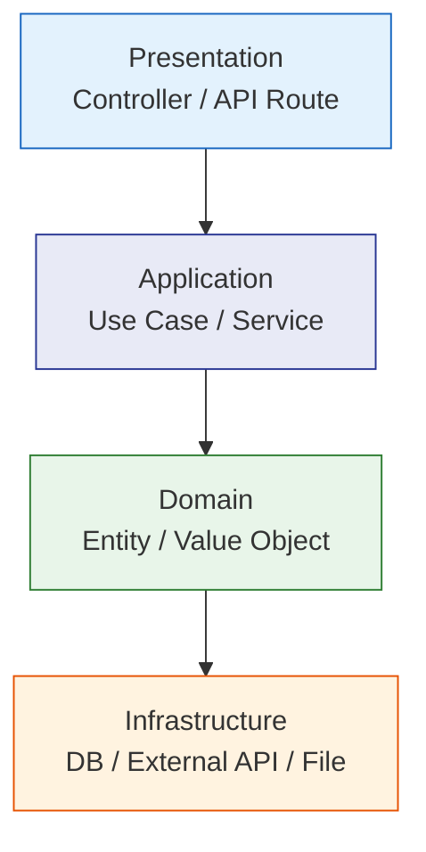
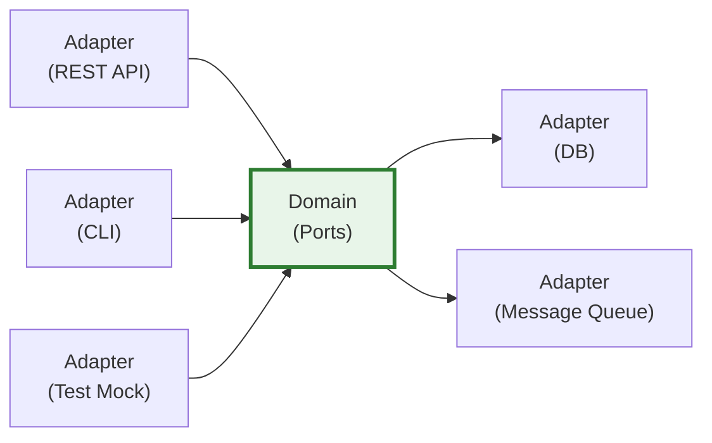
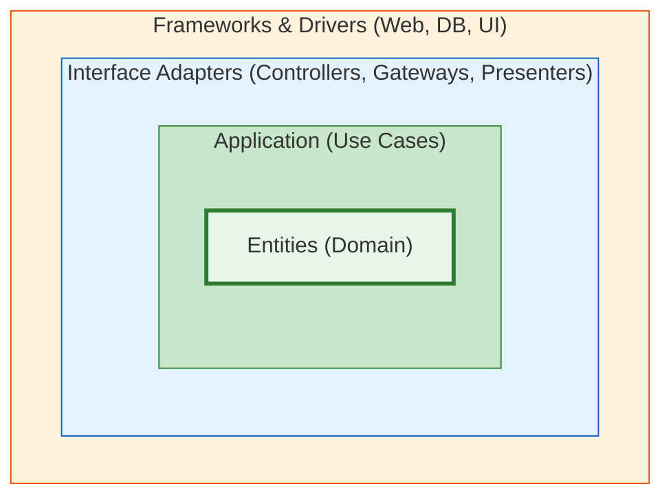
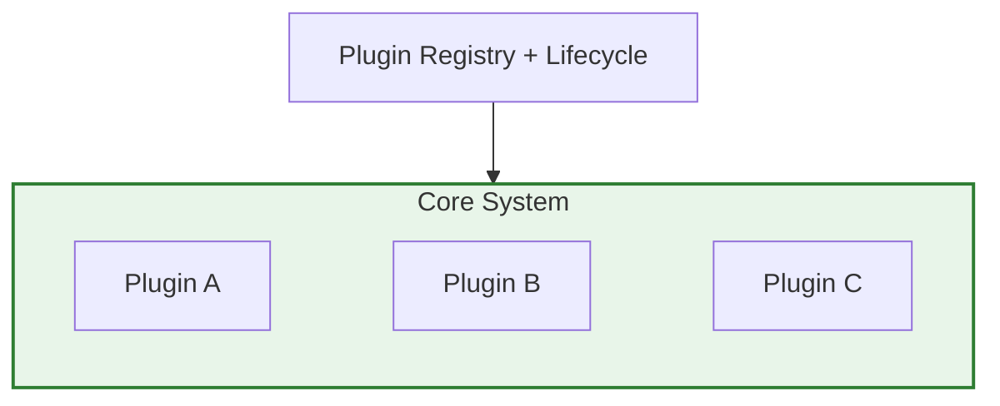
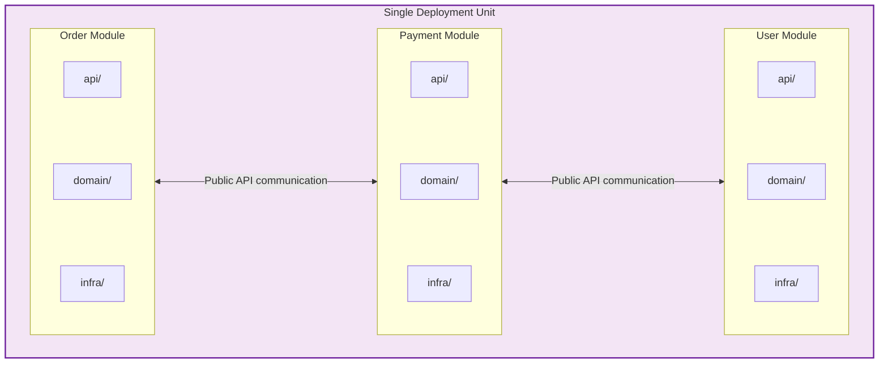
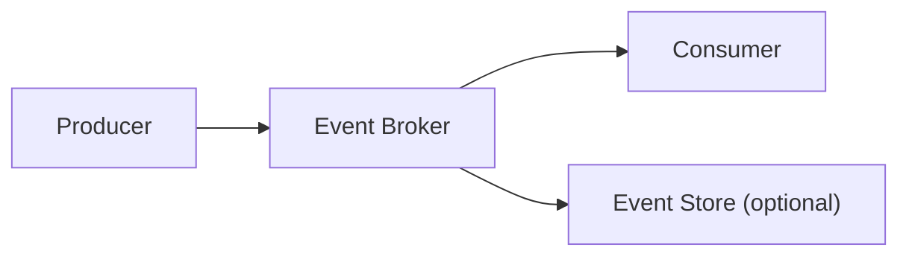
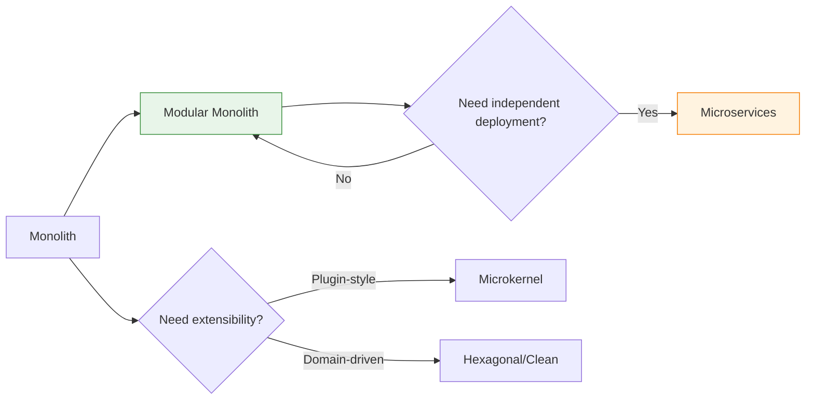

# Architecture Patterns (System Level)

System or application-level architectural decisions. Before choosing an architecture, answer: **team size, deployment constraints, business complexity, change frequency**.

## Architecture Selection Decision Table

| Scenario | Recommended Architecture | Not Recommended |
|------|---------|--------|
| Small team, simple business, quick launch | **Modular Monolith** | Microservices (high ops cost) |
| Complex business logic, clear domain boundaries | **Hexagonal / Clean Architecture** | Traditional layered (domain logic leaks) |
| Need third-party extensions, stable core | **Microkernel (Plugin Architecture)** | Hard-coded extension points |
| Team > 30 people, independent deployment needs | **Microservices** | Monolith (team collaboration bottleneck) |
| High throughput, primarily async processing | **Event-Driven Architecture** | Synchronous RPC chains |
| Heavy traffic fluctuation, pay-per-use | **Serverless** | Long connections / stateful services |
| Legacy system progressive refactoring | **Modular Monolith -> Progressive split** | Full rewrite |

---

## Layered Architecture (N-Tier)

The most fundamental architecture, suitable for most small to medium projects.



**Core rule**: Dependencies can only go downward; no cross-layer or upward dependencies.

**Suitable for**: Projects with non-complex business logic where the team is unfamiliar with DDD.

**Caution**: Easily degenerates into an "anemic architecture" where all logic ends up in the Service layer.

---

## Hexagonal Architecture / Ports & Adapters

Domain logic at the center; external dependencies connect through ports/adapters.



**Core concepts**:
- **Port**: Interface defined by the domain (e.g., `UserRepository`, `PaymentGateway`)
- **Adapter**: External implementation (e.g., `PostgresUserRepository`, `StripePaymentAdapter`)
- Domain layer depends on no framework or infrastructure

```typescript
// Port (domain-defined)
interface OrderRepository {
  save(order: Order): Promise<void>
  findById(id: OrderId): Promise<Order | null>
}

// Adapter (infrastructure implementation)
class TypeORMOrderRepository implements OrderRepository {
  async save(order: Order) { /* TypeORM impl */ }
  async findById(id: OrderId) { /* TypeORM impl */ }
}

// Domain service depends only on Port, unaware of concrete implementation
class PlaceOrderUseCase {
  constructor(
    private orderRepo: OrderRepository,   // Port
    private payment: PaymentGateway,      // Port
  ) {}
}
```

**Suitable for**: Complex business logic, high testability needs, potential infrastructure swap (change database, message queue).

---

## Clean Architecture

Concentric circle dependency rule: inner layers are unaware of outer layers.



**Dependency rule**: Dependencies can only flow from outer to inner. Inner layers define interfaces; outer layers implement them.

**Difference from Hexagonal**: Clean Architecture emphasizes Use Case layer independence more, explicitly distinguishing Entity (domain rules) from Use Case (application rules).

**Suitable for**: Large projects, long-term maintenance, multi-team collaboration. High adoption cost; use cautiously for small projects.

---

## Microkernel / Plugin Architecture

Stable core + pluggable extensions.



**Core structure**:

```typescript
// Plugin contract
interface Plugin {
  name: string
  version: string
  install(core: CoreAPI): void
  destroy?(): void
}

// Core system
class PluginManager {
  private plugins = new Map<string, Plugin>()

  register(plugin: Plugin) {
    plugin.install(this.coreAPI)
    this.plugins.set(plugin.name, plugin)
  }

  unregister(name: string) {
    this.plugins.get(name)?.destroy?.()
    this.plugins.delete(name)
  }
}

// Core API (controlled interface exposed to plugins)
interface CoreAPI {
  registerRoute(path: string, handler: Handler): void
  registerHook(event: string, callback: Function): void
  getConfig(key: string): unknown
}
```

**Applicable scenarios**:
- IDEs / editors (VS Code is a microkernel)
- Low-code platforms (components as plugins)
- Toolchains (Webpack/Vite plugin systems)
- Need third-party extensions while keeping core stable

**Key decision**: Core API granularity — too coarse and plugins can't do useful work; too fine and core changes break all plugins.

---

## Modular Monolith

Single deployment unit with clear internal module boundaries. Precursor to microservices.



**Core rules**:
- Each module has independent `api/` (public interface), `domain/`, `infra/`
- Modules communicate only through public APIs or events; **direct import of another module's internal classes is forbidden**
- Can share database, but table ownership is clear (or each module has independent schema)

```typescript
// Module public API
// modules/order/api/order.facade.ts
export class OrderFacade {
  async createOrder(dto: CreateOrderDto): Promise<OrderId> { ... }
  async getOrderStatus(id: OrderId): Promise<OrderStatus> { ... }
}

// Other modules call through Facade, not accessing Order's domain/infra directly
// modules/payment/domain/payment.service.ts
class PaymentService {
  constructor(private orderFacade: OrderFacade) {} // Via API, not internal classes
}
```

**Suitable for**: Best starting point for most projects. Better boundaries than monolith, less operational burden than microservices. Can split into microservices by module in the future.

---

## Microservices

Independently deployed, independent data stores, communicating over network.

**Adoption conditions** (all must be met):
- Team > 30 people, need independent release cadence
- Different services have significantly different scaling needs (e.g., search needs elastic scaling)
- Already validated modular monolith, boundaries are clear enough

**Key decisions**:

| Decision Point | Options |
|-------|------|
| Communication | Sync REST/gRPC vs Async message queue |
| Data | Per-service independent database vs Shared database (not recommended) |
| Transactions | Saga vs Eventual consistency |
| Discovery | Service registry vs DNS vs API Gateway |
| Observability | Distributed tracing + Centralized logging + Health checks |

**Common pitfalls**:
- Distributed monolith: Strong inter-service dependencies; changing one requires deploying many
- Over-splitting: One service per CRUD operation
- Ignoring ops cost: CI/CD, monitoring, logging, tracing complexity

---

## Event-Driven Architecture

Async communication pattern centered on events.



**Two patterns**:

| Pattern | Description | Suitable For |
|------|------|------|
| **Event Notification** | Events carry only IDs; consumers query for details | Simple notifications, history not important |
| **Event-Carried State Transfer** | Events carry complete data | Consumers need autonomy, reduce callbacks |

**Suitable for**: High-throughput async processing, inter-service decoupling, audit logs, real-time data pipelines.

**Note**: Event ordering, idempotency, and eventual consistency are problems that must be solved.

---

## Serverless / FaaS

Functions as a Service, billed per invocation.

**Suitable scenarios**:
- Webhook handling, scheduled tasks, file processing
- Extremely uneven traffic (large peak/trough differences)
- Stateless computation

**Not suitable for**:
- Long-running tasks (timeout limits)
- WebSocket / long connections needed
- Cold-start-sensitive low-latency scenarios

---

## Architecture Evolution Path



> **Default recommended path**: Monolith -> Modular Monolith -> Microservices as needed. Don't skip Modular Monolith and go straight to Microservices.
