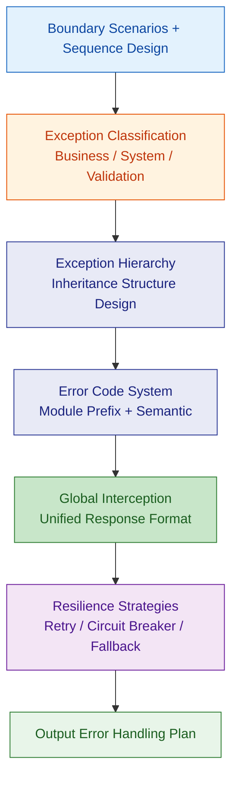
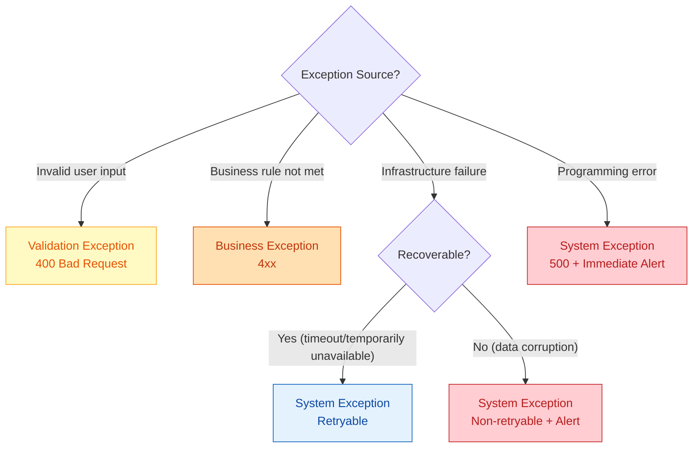
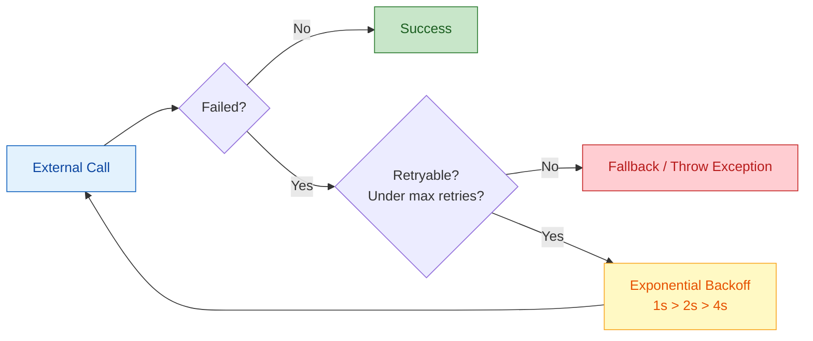

# Error Handling and Resilience Design

Starting from boundary scenarios, produce a complete exception hierarchy + error code standards + resilience strategies.

---

## Design Flow



---

## 1. Exception Classification

All exceptions fall into three categories with different handling strategies:

| Exception Level | Meaning | HTTP Status Code | Log Level | Alert? |
|--|--|--|--|--|
| Business Exception | Expected business rule violation | 400/404/409 | INFO | No |
| Validation Exception | Invalid parameters | 400 | WARN | Cumulative alert |
| System Exception | Unexpected technical failure | 500 | ERROR | Immediate alert |

### Classification Flow



---

## 2. Exception Hierarchy Design

### Java Exception Inheritance Structure

```java
// Base exception
public abstract class BaseException extends RuntimeException {
    private final String errorCode;
    private final int httpStatus;

    protected BaseException(String errorCode, int httpStatus, String message) {
        super(message);
        this.errorCode = errorCode;
        this.httpStatus = httpStatus;
    }
}

// Business exception base class
public class BusinessException extends BaseException {
    public BusinessException(String errorCode, String message) {
        super(errorCode, 400, message);
    }
    public BusinessException(String errorCode, int httpStatus, String message) {
        super(errorCode, httpStatus, message);
    }
}

// System exception base class
public class SystemException extends BaseException {
    private final boolean retryable;

    public SystemException(String errorCode, String message, boolean retryable) {
        super(errorCode, 500, message);
        this.retryable = retryable;
    }
}

// Validation exception
public class ValidationException extends BaseException {
    private final List<FieldError> fieldErrors;

    public ValidationException(List<FieldError> fieldErrors) {
        super("VALIDATION_ERROR", 400, "Parameter validation failed");
        this.fieldErrors = fieldErrors;
    }
}
```

### Module-level Business Exceptions

```java
// Each module extends BusinessException
public class TaskNotFoundException extends BusinessException {
    public TaskNotFoundException(Long taskId) {
        super("TASK_NOT_FOUND", 404,
              "Migration task not found: " + taskId);
    }
}

public class TaskNotExecutableException extends BusinessException {
    public TaskNotExecutableException(Long taskId) {
        super("TASK_NOT_EXECUTABLE", 409,
              "Task status does not allow execution: " + taskId);
    }
}
```

### TypeScript Exception Structure

```typescript
export abstract class BaseError extends Error {
  constructor(
    public readonly code: string,
    public readonly httpStatus: number,
    message: string,
  ) {
    super(message);
    this.name = this.constructor.name;
  }
}

export class BusinessError extends BaseError {
  constructor(code: string, message: string, httpStatus = 400) {
    super(code, httpStatus, message);
  }
}

export class SystemError extends BaseError {
  constructor(
    code: string,
    message: string,
    public readonly retryable: boolean = false,
  ) {
    super(code, 500, message);
  }
}
```

---

## 3. Error Code System

### Naming Rules
- ALL_CAPS + underscore
- Format: `{MODULE}_{NOUN}_{VERB/STATE}`
- Examples: `TASK_NOT_FOUND`, `ORDER_ALREADY_PAID`, `DATASOURCE_CONNECTION_FAILED`

### Error Code Registry

| Error Code | HTTP | Module | Meaning |
|--|--|--|--|
| VALIDATION_ERROR | 400 | Common | Parameter validation failed |
| UNAUTHORIZED | 401 | Common | Not authenticated |
| FORBIDDEN | 403 | Common | No permission |
| RESOURCE_NOT_FOUND | 404 | Common | Generic resource not found |
| RATE_LIMITED | 429 | Common | Too many requests |
| INTERNAL_ERROR | 500 | Common | Unknown internal error |
| TASK_NOT_FOUND | 404 | Task | Task not found |
| TASK_NOT_EXECUTABLE | 409 | Task | Task status doesn't allow execution |
| TASK_NOT_DELETABLE | 409 | Task | Running task cannot be deleted |

### Error Code Design Rules
- **No numeric codes**: Use semantic strings for readability
- **Each module maintains its own error codes**: Avoid global numbering conflicts
- **Error codes don't expose implementation details**: No table names or column names

---

## 4. Global Error Interception

### Spring Boot

```java
@RestControllerAdvice
public class GlobalExceptionHandler {

    @ExceptionHandler(BusinessException.class)
    public ResponseEntity<ErrorResponse> handleBusiness(BusinessException e) {
        return ResponseEntity.status(e.getHttpStatus())
            .body(new ErrorResponse(e.getErrorCode(), e.getMessage()));
    }

    @ExceptionHandler(ValidationException.class)
    public ResponseEntity<ErrorResponse> handleValidation(ValidationException e) {
        return ResponseEntity.badRequest()
            .body(new ErrorResponse(e.getErrorCode(), e.getMessage(),
                                    e.getFieldErrors()));
    }

    @ExceptionHandler(SystemException.class)
    public ResponseEntity<ErrorResponse> handleSystem(SystemException e) {
        log.error("System exception: {}", e.getErrorCode(), e);
        // Don't expose internal error details
        return ResponseEntity.internalServerError()
            .body(new ErrorResponse("INTERNAL_ERROR", "Service temporarily unavailable"));
    }

    @ExceptionHandler(Exception.class)
    public ResponseEntity<ErrorResponse> handleUnexpected(Exception e) {
        log.error("Unexpected exception", e);
        return ResponseEntity.internalServerError()
            .body(new ErrorResponse("INTERNAL_ERROR", "Service temporarily unavailable"));
    }
}
```

### NestJS

```typescript
@Catch()
export class GlobalExceptionFilter implements ExceptionFilter {
  catch(exception: unknown, host: ArgumentsHost) {
    const ctx = host.switchToHttp();
    const response = ctx.getResponse();

    if (exception instanceof BaseError) {
      response.status(exception.httpStatus).json({
        code: exception.code,
        message: exception.message,
      });
    } else {
      response.status(500).json({
        code: 'INTERNAL_ERROR',
        message: 'Service temporarily unavailable',
      });
    }
  }
}
```

---

## 5. Resilience Strategies

### Retry Strategy



| Parameter | Default | Description |
|--|--|--|
| Max retries | 3 | Including initial call |
| Initial wait | 1 second | First retry interval |
| Backoff multiplier | 2 | Exponential backoff |
| Max wait | 30 seconds | Per-retry wait cap |
| Retryable exceptions | Timeout, 503, network errors | Don't retry 4xx |

### Circuit Breaker

| State | Behavior | Entry Condition |
|--|--|--|
| CLOSED | Normal pass-through | Default state |
| OPEN | Fast fail | Consecutive failures >= 5 or error rate > 50% |
| HALF_OPEN | Probe pass-through | After 30s of circuit open |

### Fallback Strategies

| Scenario | Fallback Plan |
|--|--|
| Cache service unavailable | Query database directly |
| Third-party API timeout | Return cached data + mark "not real-time" |
| Non-core feature exception | Return default value / silently skip |
