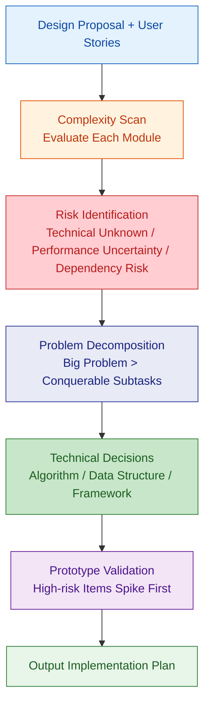
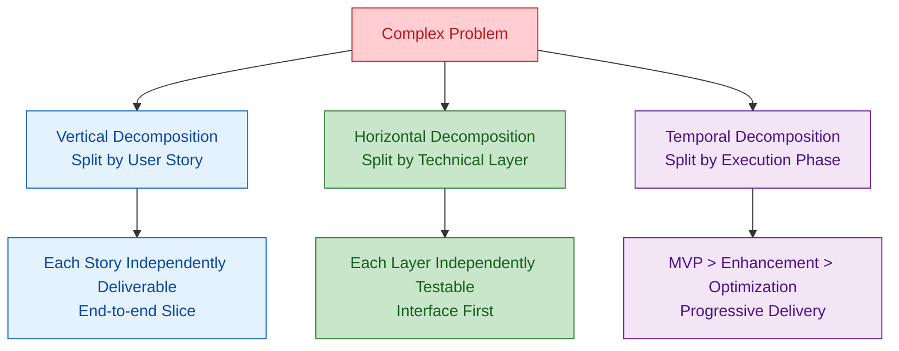

# Implementation Complexity Analysis

Evaluate implementation difficulty of design proposals, identify technical risks, and decompose complex problems into conquerable subtasks.

---

## Analysis Flow



---

## 1. Complexity Dimension Assessment

Score each module/feature across five dimensions:

| Dimension | Description | Low (1-3) | Medium (4-6) | High (7-10) |
|--|--|--|--|--|
| Algorithm Complexity | Core algorithm difficulty | CRUD | Rule engine / state machine | Graph algorithms / optimization |
| Data Complexity | Data model & volume | Single table < 100K | Multi-table joins < 1M | Big data / real-time streaming |
| Integration Complexity | External dependency count & stability | No external deps | 1-2 stable APIs | Multiple unstable APIs |
| Concurrency Complexity | Concurrency control difficulty | No concurrency | Optimistic locking / simple queue | Distributed locks / transactions |
| Domain Complexity | Business rule complexity | Simple flow | Multi-branch + validation rules | Complex workflows / compliance |

### Composite Score

```
Total Complexity = max(dimension scores)  // Barrel principle, take highest
```

| Score | Strategy |
|--|--|
| 1-3 | Can code directly, no extra design needed |
| 4-6 | Needs detailed design, may need technology selection |
| 7-10 | Needs Spike / POC validation, recommend splitting |

---

## 2. Technical Risk Identification

### Risk Levels

| Level | Definition | Handling Strategy |
|--|--|--|
| Known-Known | Clear problem and solution | Normal estimation |
| Known-Unknown | Know there's a challenge but uncertain about solution | Technical research + buffer |
| Unknown-Unknown | Completely unforeseen problems | Reserve contingency time + fallback plan |

### Common Risk Types

| Risk Type | Example | Mitigation |
|--|--|--|
| Performance Risk | Data volume exceeds expectations | Load testing + sharding as backup |
| Compatibility Risk | Third-party API changes | Anti-corruption layer + contract testing |
| Security Risk | Potential data leakage | Security review + penetration testing |
| Dependency Risk | Library/framework unmaintained | Evaluate alternatives |
| Domain Risk | Frequent business rule changes | Rule engine + configuration-driven |

---

## 3. Problem Decomposition Strategy

### Decomposition Principles



### Decomposition Checks
- Each subtask is **independently testable**
- Each subtask takes **< 1 day of effort**
- Subtask **interfaces are clear**
- High-risk subtasks are **executed first**

---

## 4. Algorithm and Data Structure Selection

### Common Scenario Decisions

| Scenario | Recommended | Time | Space | Alternative |
|--|--|--|--|--|
| Exact lookup | HashMap / HashSet | O(1) | O(n) | B-Tree (persistent) |
| Range query | TreeMap / B-Tree | O(log n) | O(n) | Skip List |
| Sorting | Arrays.sort (TimSort) | O(n log n) | O(n) | Radix sort (integers) |
| Deduplication | HashSet / Bloom Filter | O(1) / probabilistic | O(n) / O(m) | DB unique constraint |
| Top-K | Min Heap | O(n log k) | O(k) | QuickSelect |
| Graph traversal | BFS / DFS | O(V+E) | O(V) | - |
| Shortest path | Dijkstra / A* | O(E log V) | O(V) | Floyd (all-pairs) |
| Pattern matching | Regex / Trie | - | - | Aho-Corasick (multi-pattern) |
| State management | Finite State Machine (FSM) | O(1) transition | O(states) | State Pattern |
| Workflow | DAG + Topological Sort | O(V+E) | O(V+E) | Workflow engine |

### Trade-off Framework

```
Choice = f(data scale, query pattern, consistency requirements, operational cost)
```

| Trade-off Dimension | Decision |
|--|--|
| Time vs Space | Cache/index trades space for time; compression trades time for space |
| Consistency vs Availability | CP: choose ZooKeeper; AP: choose Redis |
| Simple vs Flexible | Hardcoded is fast but hard to change; config-driven is flexible but complex |
| Build vs Buy | Build: controllable but costly; Third-party: fast but creates dependency |

---

## 5. Spike / POC Strategy

### When to Spike

- Modules with complexity score >= 7
- First-time use of a technology/framework
- Core paths with uncertain performance
- Verifying real behavior of third-party APIs

### Spike Template

```markdown
## Spike: [Name]

**Goal**: Validate [specific technical question]
**Time Box**: [1-3 days]
**Success Criteria**: [measurable criteria]

### Validation Steps
1. ...
2. ...

### Conclusion
- Feasible / Not feasible
- Selected approach: [...]
- Remaining risks: [...]
```

---

## 6. Output Checklist

| Deliverable | Description |
|--|--|
| Module Complexity Scorecard | Five-dimension scoring + composite score |
| Technical Risk List | Risk + level + mitigation measures |
| Decomposed Task List | Subtasks + dependencies + priorities |
| Algorithm Decision Records | Scenario + approach + trade-off reasoning |
| Spike Plan | POC plan for high-risk items |
| Implementation Roadmap | Phased delivery plan |

---

## References

See `references/` directory for detailed rules:
- `complexity-rules.md` — Detailed complexity assessment rules and decomposition templates
