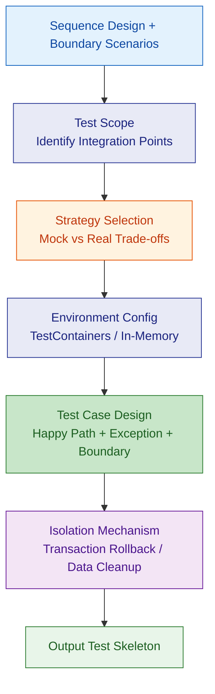
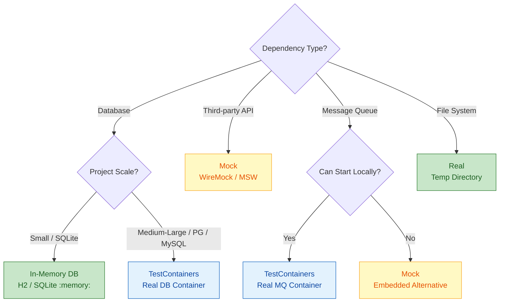

# Integration Test Design

Starting from sequence designs + boundary scenarios, produce executable integration test strategies and test case skeletons.

---

## Design Flow



---

## 1. Identify Integration Points

Extract all cross-layer/cross-module calls from sequence design, marking test levels:

| Integration Point Type | Example | Test Level |
|--|--|--|
| Controller → Service | HTTP request to business logic | API Test |
| Service → Repository | Business logic to data persistence | Repository Integration Test |
| Service → External API | Calling third-party services | Contract Test / Mock |
| Module A → Module B | Cross-module method calls | Module Integration Test |
| Message Producer → Consumer | Event-driven communication | Message Integration Test |

---

## 2. Mock vs Real Strategy



### Strategy Selection Principles

| Scenario | Choice | Reason |
|--|--|--|
| Local dev fast feedback | In-Memory / Mock | Fast startup (<2s) |
| CI Pipeline | TestContainers | Closer to production |
| Third-party API | WireMock / MSW | No dependency on external service availability |
| DB Schema validation | TestContainers | Ensures real DDL compatibility |
| Cross-module calls | Real calls | Validates complete chain |

---

## 3. Test Environment Configuration

### Spring Boot + TestContainers

```java
@SpringBootTest
@Testcontainers
public abstract class BaseIntegrationTest {

    @Container
    static PostgreSQLContainer<?> postgres =
        new PostgreSQLContainer<>("postgres:16")
            .withDatabaseName("testdb");

    @DynamicPropertySource
    static void configureProperties(DynamicPropertyRegistry registry) {
        registry.add("spring.datasource.url", postgres::getJdbcUrl);
        registry.add("spring.datasource.username", postgres::getUsername);
        registry.add("spring.datasource.password", postgres::getPassword);
    }
}
```

### Spring Boot + SQLite In-Memory

```java
@SpringBootTest
@Transactional
@Rollback
public abstract class BaseIntegrationTest {
    // application-test.yml: jdbc:sqlite::memory:
    // Each test auto-rollbacks
}
```

### NestJS + Vitest

```typescript
// test/setup.ts
import { Test } from '@nestjs/testing';
import { AppModule } from '../src/app.module';

export async function createTestApp() {
  const moduleRef = await Test.createTestingModule({
    imports: [AppModule],
  }).compile();

  const app = moduleRef.createNestApplication();
  await app.init();
  return app;
}
```

---

## 4. Test Case Design

### Three-element Coverage

Each integration test must cover:

| Element | Minimum Count | Description |
|--|--|--|
| Happy Path | >= 1 | Main flow completes normally |
| Exception Path | >= 1 | Business and system exceptions |
| Boundary Scenario | >= 1 | Empty data, extreme values, concurrency |

### API Test Skeleton (Spring Boot)

```java
@AutoConfigureMockMvc
class MigrationTaskControllerTest extends BaseIntegrationTest {

    @Autowired
    private MockMvc mockMvc;

    @Test
    void should_create_task_successfully() throws Exception {
        mockMvc.perform(post("/api/migration-tasks")
                .contentType(MediaType.APPLICATION_JSON)
                .content("""
                    {"name": "test-task", "sourceId": 1, "targetId": 2}
                    """))
            .andExpect(status().isCreated())
            .andExpect(jsonPath("$.data.name").value("test-task"));
    }

    @Test
    void should_return_400_when_name_is_blank() throws Exception {
        mockMvc.perform(post("/api/migration-tasks")
                .contentType(MediaType.APPLICATION_JSON)
                .content("""
                    {"name": "", "sourceId": 1, "targetId": 2}
                    """))
            .andExpect(status().isBadRequest())
            .andExpect(jsonPath("$.code").value("VALIDATION_ERROR"));
    }

    @Test
    void should_return_404_when_task_not_found() throws Exception {
        mockMvc.perform(get("/api/migration-tasks/99999"))
            .andExpect(status().isNotFound());
    }
}
```

### Repository Integration Test Skeleton

```java
class MigrationTaskRepositoryTest extends BaseIntegrationTest {

    @Autowired
    private MigrationTaskRepository taskRepository;

    @Test
    void should_save_and_find_task() {
        var task = new MigrationTask("test", TaskStatus.DRAFT);
        var saved = taskRepository.save(task);

        var found = taskRepository.findById(saved.getId());
        assertThat(found).isPresent();
        assertThat(found.get().getName()).isEqualTo("test");
    }

    @Test
    void should_return_empty_when_not_found() {
        var found = taskRepository.findById(-1L);
        assertThat(found).isEmpty();
    }
}
```

---

## 5. Test Isolation Mechanisms

| Mechanism | Applicable Scenario | Implementation |
|--|--|--|
| Transaction Rollback | Single database | `@Transactional @Rollback` |
| Data Cleanup | Multiple data sources / NoSQL | `@AfterEach` manual cleanup |
| Container Rebuild | Schema change testing | `@Container` static / non-static |
| Namespace Isolation | Shared external services | Test prefix / unique IDs |

### Test Data Management

- **Don't depend on shared test data**: Each test creates its own data
- **Builder pattern**: Complex objects use TestDataBuilder
- **Minimize data**: Only create the minimum data needed for the test

```java
// TestDataBuilder example
public class TaskBuilder {
    private String name = "default-task";
    private TaskStatus status = TaskStatus.DRAFT;

    public TaskBuilder withName(String name) {
        this.name = name;
        return this;
    }

    public TaskBuilder withStatus(TaskStatus status) {
        this.status = status;
        return this;
    }

    public MigrationTask build() {
        return new MigrationTask(name, status);
    }
}
```

---

## 6. Contract Testing

When cross-service calls exist:

| Role | Responsibility | Tool |
|--|--|--|
| Provider | Verifies it satisfies the contract | Spring Cloud Contract / Pact |
| Consumer | Defines expected contract | Pact / WireMock |
| Broker | Stores and version-manages contracts | Pact Broker |

### Contract Test Case Template

```
Given: [precondition state]
When:  [Consumer sends request / Provider receives request]
Then:  [response structure and status code]
```

---

## 7. Output Checklist

| Deliverable | Description |
|--|--|
| Integration Point List | All cross-layer/cross-module call list |
| Mock/Real Decision Matrix | Strategy choice for each dependency |
| Test Environment Config | TestContainers / In-Memory configuration files |
| Test Base Class | BaseIntegrationTest |
| API Test Skeletons | Happy/exception/boundary tests per Controller |
| Repository Test Skeletons | CRUD tests per Repository |
| Test Data Builders | Complex object constructors |
| Contract Definitions (optional) | Consumer-Provider contract files |

---

## References

See `references/` directory for detailed rules:
- `test-strategy-rules.md` — Detailed integration test strategy rules and anti-patterns
