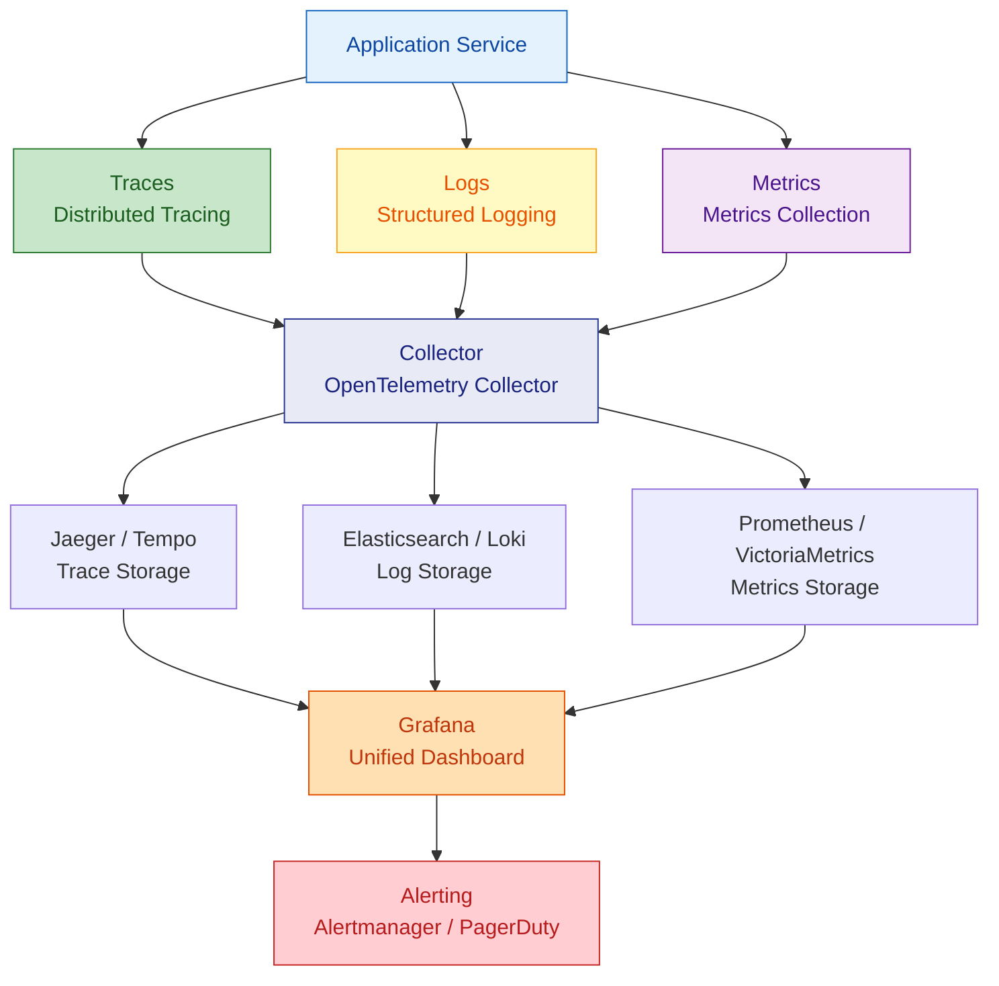

# Observability Design

Plan distributed tracing, structured logging, and metrics collection to ensure the system is monitorable, debuggable, and measurable.

---

## Three Pillars Architecture



---

## 1. Structured Logging

### Log Format (Unified JSON)

```json
{
  "timestamp": "2026-04-08T10:30:00.123Z",
  "level": "INFO",
  "service": "migration-service",
  "traceId": "abc123def456",
  "spanId": "789ghi",
  "module": "task",
  "action": "startTask",
  "userId": "user-001",
  "message": "Task started successfully",
  "data": {
    "taskId": 42,
    "taskName": "DB Migration"
  },
  "duration": 156
}
```

### Log Level Standards

| Level | Use Case | Production |
|--|--|--|
| ERROR | System exceptions, requires immediate attention | Always on + alerting |
| WARN | Recoverable exceptions, fallback triggered | Always on |
| INFO | Key business milestones | Always on |
| DEBUG | Debug info, parameter details | Off by default, dynamically enabled |
| TRACE | Extremely detailed tracking | Development only |

### Log Content Standards
- **Must log**: traceId, request path, user ID, operation result, duration
- **Must NOT log**: passwords, tokens, ID numbers, bank card numbers
- **Masked logging**: phone numbers (138****1234), email (a***@example.com)

### Spring Boot Configuration

```java
// Global traceId injection (MDC)
@Component
public class TraceFilter implements Filter {
    @Override
    public void doFilter(ServletRequest req, ServletResponse res,
                         FilterChain chain) throws IOException, ServletException {
        String traceId = Optional.ofNullable(
                ((HttpServletRequest) req).getHeader("X-Trace-Id"))
            .orElse(UUID.randomUUID().toString());
        MDC.put("traceId", traceId);
        try {
            chain.doFilter(req, res);
        } finally {
            MDC.clear();
        }
    }
}
```

### logback-spring.xml (JSON Output)

```xml
<appender name="JSON" class="ch.qos.logback.core.ConsoleAppender">
    <encoder class="net.logstash.logback.encoder.LoggingEventCompositeJsonEncoder">
        <providers>
            <timestamp/>
            <logLevel/>
            <loggerName/>
            <mdc/>
            <message/>
            <stackTrace/>
        </providers>
    </encoder>
</appender>
```

---

## 2. Distributed Tracing

### Tracing Granularity

| Layer | Span Name | Key Attributes |
|--|--|--|
| HTTP Entry | `HTTP {method} {path}` | status_code, user_id |
| Service Call | `{ServiceClass}.{method}` | Input summary |
| Database Op | `DB {operation} {table}` | sql, rows_affected |
| External HTTP | `HTTP {method} {host}{path}` | status_code, duration |
| Message Send | `MQ send {topic}` | message_id |
| Message Consume | `MQ receive {topic}` | message_id |

### OpenTelemetry Configuration (Spring Boot)

```yaml
# application.yml
management:
  tracing:
    sampling:
      probability: 1.0  # Full sampling in dev

otel:
  exporter:
    otlp:
      endpoint: http://otel-collector:4317
  service:
    name: migration-service
```

### Sampling Strategy

| Environment | Strategy | Sample Rate |
|--|--|--|
| Development | Full sampling | 100% |
| Testing | Full sampling | 100% |
| Production | Tail sampling (by error/latency) | 10% normal + 100% errors |

---

## 3. Metrics Collection

### Four Golden Signals

| Signal | Meaning | Measurement |
|--|--|--|
| Latency | Request processing time | Histogram percentiles |
| Traffic | Request volume | Counter |
| Errors | Failed request ratio | Counter (Error / Total) |
| Saturation | Resource utilization | Gauge |

### Business Metrics

| Metric | Type | Description |
|--|--|--|
| `task_created_total` | Counter | Total tasks created |
| `task_execution_duration` | Histogram | Task execution time distribution |
| `task_active_count` | Gauge | Currently running tasks |
| `migration_rows_processed` | Counter | Migrated data rows |

### Prometheus Metrics Exposure (Spring Boot)

```yaml
management:
  endpoints:
    web:
      exposure:
        include: health, prometheus, info
  metrics:
    tags:
      service: migration-service
      env: ${SPRING_PROFILES_ACTIVE:dev}
```

### Custom Metrics (Micrometer)

```java
@Component
public class TaskMetrics {
    private final Counter taskCreated;
    private final Timer taskExecution;
    private final AtomicInteger activeTasks;

    public TaskMetrics(MeterRegistry registry) {
        this.taskCreated = Counter.builder("task.created.total")
            .description("Total tasks created")
            .register(registry);
        this.taskExecution = Timer.builder("task.execution.duration")
            .description("Task execution duration")
            .register(registry);
        this.activeTasks = registry.gauge("task.active.count",
            new AtomicInteger(0));
    }
}
```

---

## 4. Health Checks

### Check Items

| Check | Endpoint | Meaning |
|--|--|--|
| Liveness | `/actuator/health/liveness` | Is the process alive |
| Readiness | `/actuator/health/readiness` | Can it accept traffic |

### Custom Health Check

```java
@Component
public class DatabaseHealthIndicator implements HealthIndicator {
    @Override
    public Health health() {
        try {
            // Execute simple query to validate DB connection
            jdbcTemplate.queryForObject("SELECT 1", Integer.class);
            return Health.up().build();
        } catch (Exception e) {
            return Health.down(e).build();
        }
    }
}
```

---

## 5. Alerting Strategy

### Alert Severity Levels

| Level | Trigger Condition | Notification Method | Response Time |
|--|--|--|--|
| P0 Critical | Service unavailable / data loss | Phone + SMS | < 15 minutes |
| P1 Major | Error rate > 5% / P99 > 2s | Instant messaging (Slack/Teams) | < 30 minutes |
| P2 Warning | Error rate > 1% / resource > 80% | Email / ticket | < 4 hours |
| P3 Info | Performance degradation trend | Daily/weekly report | Next iteration |

### Alert Rule Examples (Prometheus)

```yaml
groups:
  - name: api-alerts
    rules:
      - alert: HighErrorRate
        expr: rate(http_requests_total{status=~"5.."}[5m]) / rate(http_requests_total[5m]) > 0.05
        for: 5m
        labels:
          severity: P1
        annotations:
          summary: "5xx error rate exceeds 5%"

      - alert: HighLatency
        expr: histogram_quantile(0.99, rate(http_request_duration_seconds_bucket[5m])) > 2
        for: 5m
        labels:
          severity: P1
        annotations:
          summary: "P99 latency exceeds 2 seconds"
```

---

## 6. SLI / SLO Definition

### SLI (Service Level Indicator)

| SLI | Formula |
|--|--|
| Availability | Successful requests / Total requests |
| Latency | P99 response time |
| Throughput | Successful requests per second |
| Error Rate | Failed requests / Total requests |

### SLO (Service Level Objective)

| SLO | Target | Error Budget |
|--|--|--|
| Availability | 99.9% | 43 minutes downtime per month |
| P99 Latency | < 500ms | - |
| Error Rate | < 0.1% | - |

---

## 7. Output Checklist

| Deliverable | Description |
|--|--|
| Logging Standards Document | Format, levels, masking rules |
| Tracing Configuration | OpenTelemetry config + sampling strategy |
| Metrics Catalog | Four golden signals + business metrics definitions |
| Health Check Configuration | Liveness/readiness check endpoints |
| Alert Rules | Tiered alerting + Prometheus rules |
| SLI/SLO Definitions | Service level indicators and objectives |
| Grafana Dashboard | Monitoring dashboard JSON templates |

---

## References

See `references/` directory for detailed rules:
- `observability-rules.md` — Detailed observability rules and configuration templates
