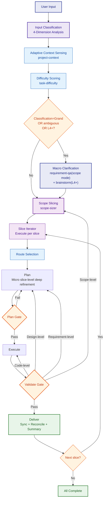
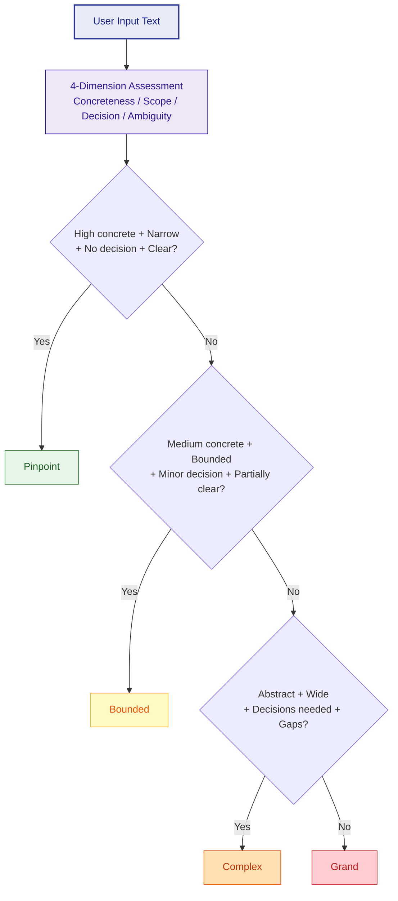
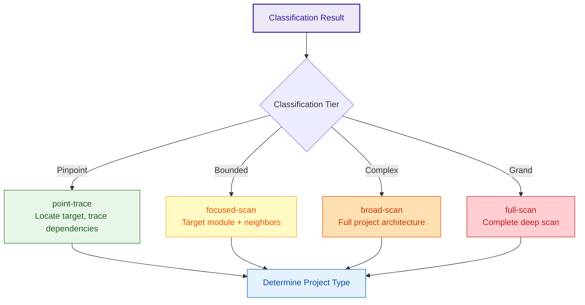
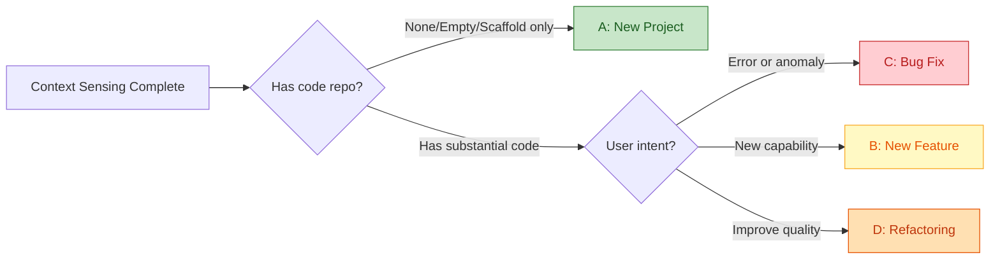
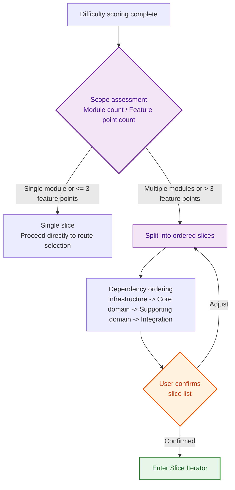
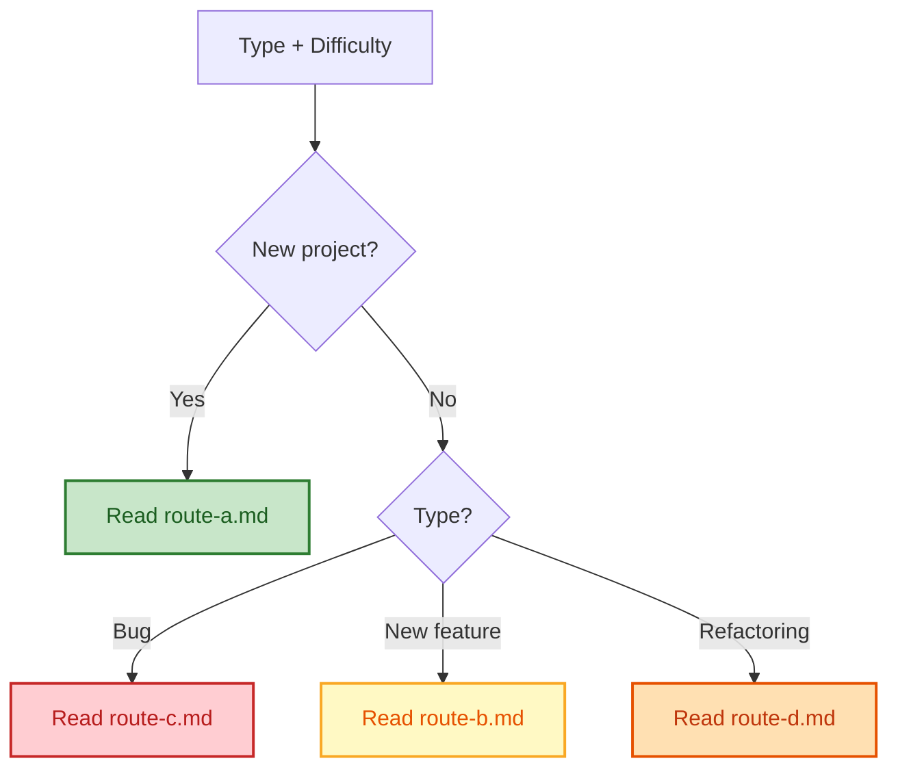
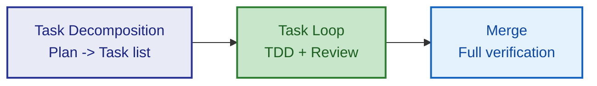

# Orchestrator — Flow Orchestrator

Receive user input → **Input Classification** → Adaptive context sensing → Score difficulty → **Macro clarification** (if needed) → **Scope slicing** → Select route → Orchestrate four phases per slice → Quality gates → Deliver.

---

## ⛔ Mandatory Execution Protocol (DO NOT SKIP)

**After receiving a development task, you must process it through this orchestration chain. Bypassing the chain to implement directly is forbidden.** Understanding the user's requirements is the first step, but after understanding, you must determine the execution approach through this flow:

1. **Input Classification** → Analyze user requirements, 4-dimension assessment, determine tier (Pinpoint / Bounded / Complex / Grand)
2. **project-context** → Sense project context (infrastructure skill, must not skip)
3. **task-difficulty** → Score difficulty (L1-L5), determine variant (lite / standard / plus)
4. **Macro clarification** (if needed) → For Grand, L4+, or ambiguous requirements, use requirement-qa + brainstorm
5. **Scope slicing** → Break task into ordered slices
6. **Route selection** → Choose Route A/B/C/D based on project type
7. **Per-slice execution** → Plan → Execute → Validate → Deliver, with quality gates at each transition
8. **docs-output** → Mandatory sync at end of Plan and during Deliver for every slice (infrastructure skill, must not skip)

**Violation check**: If you understood the requirements but skipped steps 1-3 and jumped directly to writing code, this is a violation. Stop immediately and restart from step 1.

---

## Global Constraints

The following two rules apply across all phases and skills, no exceptions:

1. **Evidence Anchoring**: Every design decision must cite at least one **project context fact** as justification. Using only "industry best practice" or "generally recommended" as the sole rationale is prohibited. If no supporting evidence exists in the project context, it must be explicitly marked as "**Assumption**".
2. **Reverse Challenge**: After recommending an architecture, technology choice, or design pattern, you must answer: **If this recommendation is wrong, what is the most likely reason?** If you cannot answer, your understanding is insufficient — gather more context before proceeding.

---

## Overall Flow



---

## 0. Input Classification

Before touching any skill, perform a 4-dimension analysis based solely on the **user's input text**, producing a classification result that drives all subsequent steps to choose the appropriate depth.

### 4-Dimension Assessment

| Dimension | Description | Low → High |
|-----------|-------------|------------|
| **Concreteness** | How precisely does the user point to a target | Specific file/function → A module → A system → Macro vision |
| **Scope Breadth** | How many modules are implicitly involved | Single point → Single module → Multi-module → Full system |
| **Decision Load** | Are architectural/strategic decisions required | None → Minor → Significant → Critical |
| **Ambiguity** | How much is still undefined | Fully clear → Some gaps → Major gaps → Mostly undefined |

### 4-Tier Classification



| Classification | Typical Input | Context Strategy | Difficulty Hint | CLARIFY |
|---------------|---------------|-----------------|----------------|---------|
| **Pinpoint** | "GET /api/users/123 returns 500"<br>"Change login button color to blue" | **point-trace** | L1-L2 | Skip |
| **Bounded** | "Add change-password feature to user module"<br>"Optimize order list query performance" | **focused-scan** | L2-L3 | As needed |
| **Complex** | "Add payment module integrating WeChat Pay and Alipay"<br>"Split monolith into frontend-backend separation" | **broad-scan** | L3-L4 | As needed |
| **Grand** | "Build an e-commerce platform like Amazon"<br>"Design a distributed transaction framework" | **full-scan** | L4-L5 | **Mandatory** |

### User Override

Users can override the classification at any time with natural language: "keep it simple" → downgrade, "do it thoroughly" → upgrade.

---

## 1. Adaptive Context Sensing

Based on the input classification result, use project-context's **corresponding mode** to gather project information.

### 4 Context Modes

| Mode | Triggered By | What It Does | Output |
|------|-------------|-------------|--------|
| **point-trace** | Pinpoint | Locate the target point (file/function/error) mentioned by user → trace import/caller dependencies → check same-module boundaries | Target point + directly related files + local dependency chain |
| **focused-scan** | Bounded | Scan target module + neighboring modules + interface boundaries | Target module details + neighbor summaries + API boundaries |
| **broad-scan** | Complex | Scan full project architecture + module relationships + tech stack | Complete project structure + module relationship map + tech stack summary |
| **full-scan** | Grand | Full project scan (if code repo exists) + domain analysis | Complete project context + architectural overview + domain analysis |



### Project Type Determination

After context sensing completes, determine project type (regardless of classification — all modes do this):



---

## 2. Difficulty Scoring

Use task-difficulty to score (1-10), mapped to three variant levels:

| Level | Score | Flow Variant |
|-------|-------|-------------|
| L1-L2 | 1-3 | lite/fast — Streamlined flow, skip non-essential skills |
| L3 | 4-6 | standard — Full flow |
| L4-L5 | 7-10 | + variant — Full + extra review + parallel strategy |

User can override: "keep it simple" → downgrade, "do it thoroughly" → upgrade.

---

## 2.5 Macro Clarification (CLARIFY)

After difficulty scoring and before scope slicing, determine whether the requirements need **macro-level clarification and architectural discussion**. The goal is to provide the scope-sizer with an accurate module list and architectural direction, avoiding blind slicing based on vague input.

### Trigger Conditions (any one triggers)

| Condition | Criteria |
|-----------|---------|
| Input classified as Grand | Already determined as Grand type in classification phase — **mandatory trigger** |
| Vague/broad requirements | User input doesn't explicitly list feature modules or specific scope |
| Difficulty L4+ | task-difficulty score ≥ 7, architectural direction affects slicing approach |

### Skip Conditions (all must be met to skip)

| Condition | Example |
|-----------|---------|
| Input classified as Pinpoint or Bounded | Already confirmed specific target and bounded scope in classification phase |
| Requirements already specific | "Add a change-password API to the user module", "GET /api/novels/123 returns 500" |
| Difficulty L1-L3 | Simple tasks, naturally narrow scope |

### Skills Used in CLARIFY

| Order | Skill | Mode | Purpose | Granularity |
|-------|-------|------|---------|-------------|
| 1 | requirement-qa | **scope mode** | Identify module list, main features, user roles, non-functional constraints | Macro — don't dive into feature details |
| 2 | brainstorm (L4+ only) | strategic | Architectural direction discussion: monolith/microservices, database direction, frontend-backend separation | Strategic — no detailed design |

### CLARIFY Differences by Route

| Route | Core Questions CLARIFY Must Answer |
|-------|----------------------------------|
| **A (New Project)** | What modules exist? What are the core features? Architectural direction? |
| **B (New Feature)** | Which existing modules are affected? Cross-module dependencies? Need new modules? |
| **C (Bug Fix)** | Usually skipped. Only triggered for "systemic bugs affecting multiple modules" |
| **D (Refactoring)** | Which modules does refactoring involve? What's the target architecture? |

### CLARIFY Output

```markdown
### Scope-Level Clarification Results

**Route**: A / B / C / D
**Module List**: [list identified modules]
**Core Features**: [list main features per module, 1-2 sentences each]
**Architectural Direction**: [if applicable — overall architecture decision]
**Non-functional Constraints**: [if applicable — performance/security/deployment requirements]
```

This output **feeds directly into scope-sizer**.

### Relationship with Same-Named Skills in Plan

- requirement-qa in Plan switches to **slice mode**: only asks about current slice's detailed features, doesn't repeat macro questions
- brainstorm in Plan is **skipped by default** (already done in CLARIFY), unless a new architectural controversy emerges within the slice

---

## 2.6 Scope Slicing (Scope Sizer)

After CLARIFY (or if CLARIFY was skipped), assess the task's **scope breadth** to decide whether to split into multiple slices.

Detailed rules → read `references/scope-sizer.md`



**Core Rules**:
- Each slice independently completes the full Plan→Execute→Validate→Deliver four-phase cycle
- Context is passed between slices via Deliver's docs-output + project-context
- Subsequent slices' Plan phase can read outputs from preceding slices
- Users can pause after any slice completes; the next session resumes from progress

---

## 3. Route Selection

Combine **project type × difficulty level** and read the corresponding route file:



⚠️ Only read the matched route-{x}.md, not the others.

---

## 4. Phase Navigation

### Slice Iterator

When multiple slices exist, execute them sequentially by dependency order. Each slice independently completes Plan→Execute→Validate→Deliver:

- **First slice**: Runs the complete Plan skill chain (including global skills: tech-stack, engineering-principles, etc.; global outputs are reused by subsequent slices)
- **Subsequent slices**: Plan phase skips global skills, only executes slice-level skills (requirement-qa targeting this slice's features, spec-writing only for this slice's docs, api-contract-design only for incremental endpoints)
- **Inter-slice handoff**: Previous slice's Deliver output (docs/ + .cache/context.db) becomes the next slice's Plan input

### Context Window Management

The Plan phase's sequential skill chain accumulates substantial intermediate output in the context window. To prevent window overflow and attention degradation, follow these rules:

- **Persist then release**: After each skill's output is written to docs/, subsequent skills should NOT rely on the full text being "remembered" in the window. When referencing prior output, **read from files** instead of relying on window memory
- **Keep only summaries**: Retain only each skill's output summary in the window (core conclusions, key decisions, module list); consult docs/ for full documents
- **Slice boundaries are reset points**: When entering a new Slice, load required context from docs/ + .cache/context.db rather than trying to "remember" everything from the previous Slice
- **Load SKILL.md on demand**: Each skill's SKILL.md is read when that skill is invoked; its detailed instructions do not need to persist in the window after use

### Plan

Read the matched route-{x}.md and execute Plan following its skill orchestration.

### Plan Gate / Validate Gate

Upon reaching a gate → read `references/gates.md`

### Execute

After Plan gate passes → read `references/execute.md` and follow its rules for coding.

Execute internal structure (three layers):



| Variant | Task Decomposition | TDD | Execution Mode | Review |
|---------|-------------------|-----|----------------|--------|
| lite/fast | No decomposition | Optional | Main agent codes directly | Quick self-check |
| standard | By module/feature | Mandatory | Main agent per task | Standard self-check |
| + variant | Strict separation by concern | Strict | SubAgent isolated execution | Two-stage review |

**Background process acceleration** (common to all routes):
- After scaffold generation → background `npm install` / `mvn resolve`, main thread starts coding
- After writing a batch of code → background `tsc --noEmit`, main thread continues next module
- After tests written → background `npm test` / `mvn test`, main thread continues writing integration tests
- Background process failures don't block, but results are confirmed before Validate

### Deliver

After Validate passes → read `references/deliver.md`

**Every slice's Deliver performs full sync** (not just the final slice), ensuring intermediate outputs are persisted and recoverable across sessions.

Deliver includes three mandatory steps:
1. **SubAgent parallel**: docs-output + project-context sync
2. **Reconcile**: Mechanically compare Plan/Execute output checklist vs actual on-disk state, immediately write anything missing
3. **Delivery summary**: Output this Slice's or final delivery summary

### Parallel Strategy (on demand)

When deciding on parallelization approach → read `references/parallel.md`
