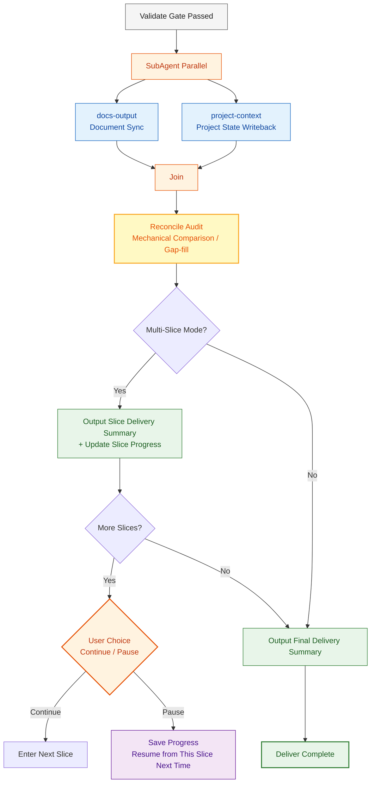

# Deliver Phase

After passing the Validate gate, enter Deliver. This phase includes **three mandatory steps** that cannot be skipped for any path. **Every Slice's Deliver performs a complete sync** — not just the final Slice. Intermediate Slices must also sync to ensure outputs are persistable and recoverable across sessions.



## docs-output (Mandatory)

- Sync all documents produced by this Slice iteration to the docs/ directory
- Includes: requirement docs, design docs, API contracts, test plans, etc.
- For Route A's first Slice, docs were initialized during Plan phase; this is the final-state update
- Subsequent Slices / B/C/D routes do incremental sync

## project-context (Mandatory)

- Write back key information from this Slice iteration to project context
- Includes: new modules, changed files, new technical decisions, known issues
- Ensures next conversation or next Slice can correctly perceive current project state

## Reconcile Audit (Mandatory)

After SubAgent parallel sync completes, before outputting delivery summary, perform a **mechanical comparison**. Don't rely on model memory — use comparison checklists to discover omissions.

### Reconcile Rules

| Comparison Dimension | Left Side (Plan/Execute Output List) | Right Side (Actual On-disk State) | Gap Handling |
|---------|------|------|---------|
| **Document Completeness** | Spec/design/API file list from Plan phase | Actual files in `docs/` directory | Missing -> write immediately |
| **Context Consistency** | Module/file list from Execute | Modules recorded in `.cache/context.db` | Missing -> incremental sync |
| **Decision Traceability** | Technical decisions made in this Slice | Corresponding decision records in `docs/` | Missing -> append to module docs |

### Reconcile Output Format

```markdown
### Reconcile Audit

| # | Dimension | Result | Notes |
|---|------|------|------|
| R1 | Document Completeness | Pass | Plan produced 4 files, all exist in docs/ |
| R2 | Context Consistency | Warning | Execute added user module, not in context.db -> synced |
| R3 | Decision Traceability | Pass | 2 technical decisions both recorded |

**Gap-fill Action**: Incrementally synced user module to context.db
```

### Execution Method

- **Main agent executes directly**, no SubAgent dispatch (comparison + gap-fill is lightweight)
- Gaps are directly written/synced, no backflow needed
- Reconcile must complete before entering delivery summary

## Slice Delivery Summary (Multi-Slice Mode)

After each Slice completes, output:
- What this Slice accomplished (scope)
- Which files/modules changed
- Preview of next Slice scope
- Whether to continue to next Slice or pause

## Final Delivery Summary

After all Slices complete (or single-Slice mode), output:
- What was accomplished (scope)
- Which files/modules changed
- Remaining issues or follow-up TODOs
- Next step recommendations

## Slice Progress Persistence

In multi-Slice mode, each Slice's Deliver also writes Slice progress to docs/progress/:

```markdown
## Slice Progress

| Slice | Status | Completion Time | Scope |
|-------|------|---------|------|
| S1 | Done | 2026-04-08 | Infrastructure + Auth |
| S2 | In Progress | - | Core Domain: Novel Management |
| S3 | Pending | - | Supporting Domain: User + Bookshelf |
| S4 | Pending | - | Integration: Search + Recommendations |
```

On next session resume, read this table to locate the continuation point.
