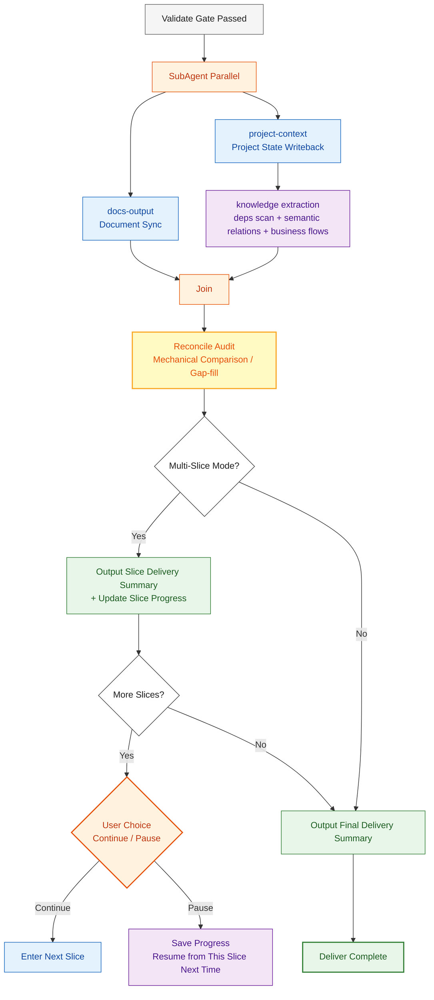

# Deliver Phase

After passing the Validate gate, enter Deliver. This phase includes **three mandatory steps** that cannot be skipped for any path. **Every Slice's Deliver performs a complete sync** — not just the final Slice. Intermediate Slices must also sync to ensure outputs are persistable and recoverable across sessions. The project-context writeback now includes **knowledge extraction** (dependency scanning + semantic relationships + business flow chains).



## docs-output (Mandatory)

Execute each step — no skipping:

### D1. Module Documentation Update

For **each business module** involved in this iteration, call the command to write/update detailed docs:

```bash
python scripts/docs_manager.py update \
  --root <project_root> \
  --module <module_name> \
  --name <doc_name> \
  --content "<detailed description for this module this iteration (Markdown)>" \
  --title "<document title>"
```

- **Content requirement**: Not a stub — include feature descriptions, interface definitions, key logic, technical decisions
- **Coverage**: All modules touched by this Slice, at least one doc per module
- If the doc already exists, update will overwrite — ensure content reflects the latest implementation

### D2. Progress Record

```bash
python scripts/docs_manager.py progress \
  --root <project_root> \
  --topic "<topic>" \
  --type "<需求开发|Bug修复|技术方案|重构|其他>" \
  --summary "<one-line summary>" \
  --files '[{"path":"<changed_file>","reason":"<change_reason>"}]' \
  --decisions "<technical decisions (if any)>" \
  --todos "<open issues (if any)>"
```

- First call returns `session_id`; subsequent calls in same session pass `--session-id` to append

## project-context (Mandatory)

Execute each step — no skipping:

### D3. File Tree Sync

```bash
python scripts/context_db.py sync --root <project_root>
```

### D4. Dependency Scan

```bash
python scripts/context_db.py deps --root <project_root>
```

### D5. Knowledge Extraction

Based on files and symbols involved in this task, extract semantic relationships:

```bash
python scripts/context_db.py knowledge \
  --root <project_root> \
  --type edges \
  --data '[{"source_file":"<source_file>","source_symbol":"<function/class>","target_file":"<target_file>","target_symbol":"<target_symbol>","relation":"<calls|extends|implements|triggers|reads|writes|validates|delegates>","context":"<one-line description>"}]'
```

If this task involved cross-module business flows:

```bash
python scripts/context_db.py knowledge \
  --root <project_root> \
  --type flows \
  --data '[{"flow_name":"<flow_name>","steps":[{"file":"<file>","symbol":"<symbol>","action":"<action_description>"}],"description":"<flow_description>"}]'
```

- **Judgment rule**: Review files actually touched — if function in file A calls function in file B → must record
- **Minimum**: When ≥2 files interacted this task, produce at least 1 edge
- **Uncertain relationships**: Set confidence to `inferred`

## Reconcile Audit (Mandatory)

After SubAgent parallel sync completes, before outputting delivery summary, perform a **mechanical comparison**. Don't rely on model memory — use comparison checklists to discover omissions.

### Reconcile Rules

| Comparison Dimension | Left Side (Plan/Execute Output List) | Right Side (Actual On-disk State) | Gap Handling |
|---------|------|------|---------|
| **Document Completeness** | Spec/design/API file list from Plan phase | Actual files in `docs/` directory | Missing -> write immediately |
| **Context Consistency** | Module/file list from Execute | Modules recorded in `.cache/context.db` | Missing -> incremental sync |
| **Decision Traceability** | Technical decisions made in this Slice | Corresponding decision records in `docs/` | Missing -> append to module docs |

### Reconcile Output Format

```markdown
### Reconcile Audit

| # | Dimension | Result | Notes |
|---|------|------|------|
| R1 | Document Completeness | Pass | Plan produced 4 files, all exist in docs/ |
| R2 | Context Consistency | Warning | Execute added user module, not in context.db -> synced |
| R3 | Decision Traceability | Pass | 2 technical decisions both recorded |

**Gap-fill Action**: Incrementally synced user module to context.db
```

### Execution Method

- **Main agent executes directly**, no SubAgent dispatch (comparison + gap-fill is lightweight)
- Gaps are directly written/synced, no backflow needed
- Reconcile must complete before entering delivery summary

## Slice Delivery Summary (Multi-Slice Mode)

After each Slice completes, output:
- What this Slice accomplished (scope)
- Which files/modules changed
- Preview of next Slice scope
- Whether to continue to next Slice or pause

## Final Delivery Summary

After all Slices complete (or single-Slice mode), output:
- What was accomplished (scope)
- Which files/modules changed
- Remaining issues or follow-up TODOs
- Next step recommendations

## Slice Progress Persistence

In multi-Slice mode, each Slice's Deliver also writes Slice progress to docs/progress/:

```markdown
## Slice Progress

| Slice | Status | Completion Time | Scope |
|-------|------|---------|------|
| S1 | Done | 2026-04-08 | Infrastructure + Auth |
| S2 | In Progress | - | Core Domain: Novel Management |
| S3 | Pending | - | Supporting Domain: User + Bookshelf |
| S4 | Pending | - | Integration: Search + Recommendations |
```

On next session resume, read this table to locate the continuation point.

---

## ⛔ Phase Chain Guard Integration

After Deliver completes all sync and reconciliation, you **must** execute the following closure:

```bash
# 1. Record Deliver phase gate pass
python3 skills/project-context/scripts/phase_guard.py gate \
  --root . --slice <SN> --phase deliver --result pass

# 2. Reconcile complete phase chain (plan→execute→validate→deliver, 4 gate-passes)
python3 skills/project-context/scripts/phase_guard.py reconcile \
  --root . --slice <SN>
```

reconcile verifies whether the Slice has traversed the complete `plan.enter → plan.gate-pass → execute.enter → execute.gate-pass → validate.enter → validate.gate-pass → deliver.enter → deliver.gate-pass` chain. If any link is missing, it outputs `INCOMPLETE` with the missing items.
