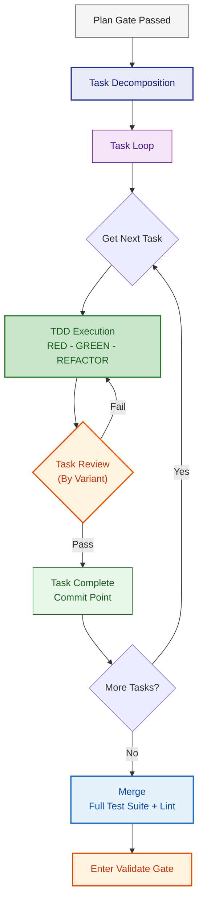
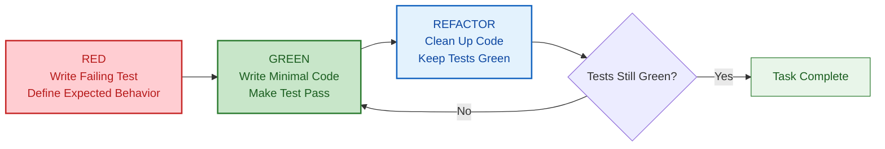
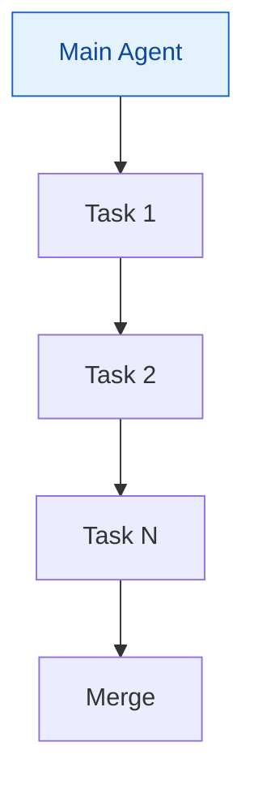
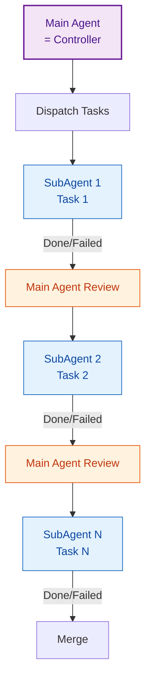
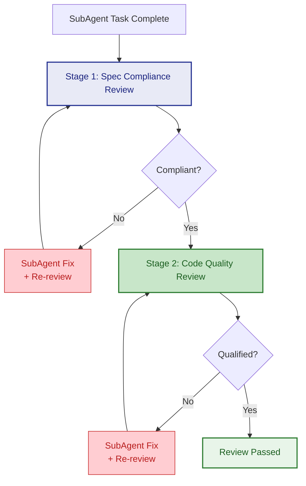
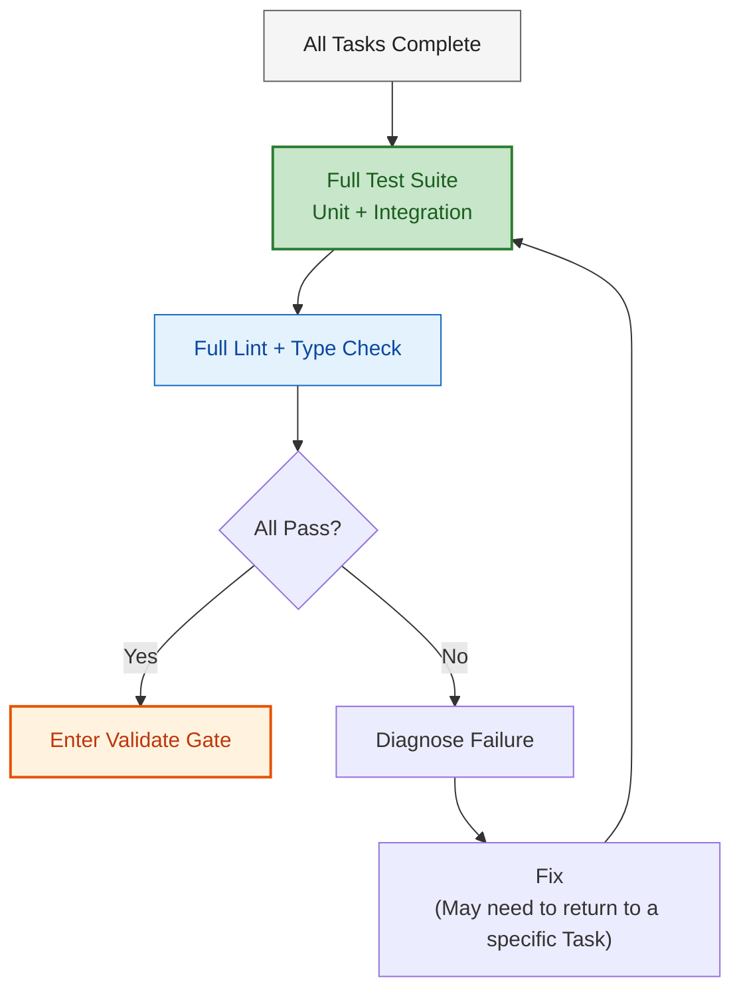

# Execute Phase Detailed Rules

After passing the Plan gate, enter Execute. This phase transforms Plan outputs (spec + API contract + design docs) into **runnable code**, completed through three layers: task decomposition -> TDD-driven task loop -> merge.



---

## 1. Task Decomposition

Transform Plan outputs into an ordered list of atomic tasks. This is the **bridge** from Plan (design layer) to Execute (code layer).

### Decomposition Principles

| Principle | Description |
|------|------|
| **Atomicity** | Each task focuses on a single concern: one function, one endpoint, one component |
| **Verifiable** | Each task has a clear verification method (test command / type check / manual verification) |
| **Ordered** | Tasks have explicit dependencies: infrastructure -> data layer -> service layer -> interface layer -> UI |
| **TDD-friendly** | Each task writes tests before implementation (tests and implementation can be in the same task) |

### Task Format

```markdown
### Task N: [Task Name]

**Goal**: [One-sentence description]
**Files**: [Precise file paths]
  - `src/domain/novel/Novel.java` — New
  - `src/domain/novel/NovelRepository.java` — New
  - `test/domain/novel/NovelTest.java` — New
**Dependencies**: Task N-1 (or none)
**Verification**: `mvn test -pl novel-domain` passes, 0 errors

#### Steps
1. Create `NovelTest.java`, write 3 test cases (RED)
2. Create `Novel.java` entity class, implement logic to make tests pass (GREEN)
3. Create `NovelRepository.java` interface
4. Review code, eliminate duplication (REFACTOR)
```

### Variant Differences

| Variant | Task Decomposition Method | Notes |
|------|------------|---------|
| **lite / fast** | **No decomposition**, main agent codes directly per Plan | Hot fix, simple features don't need splitting |
| **Standard** | **Decompose by module/feature**, each task may involve 2-5 files | Single task granularity ~5-10 minutes |
| **+ variant** | **Strict decomposition by concern**, each task focuses on a single concern | Single task granularity ~2-5 minutes, includes complete code |

---

## 2. TDD-Driven Task Execution

All standard and above variants enforce TDD. TDD is not "write tests after coding" — it's **test-first**.

### TDD Cycle



### RED Phase Rules

- Write tests first, describing **expected behavior** rather than implementation details
- Tests must **currently fail** (compilation error or assertion failure)
- Write only one test scenario at a time, don't write all cases at once

### GREEN Phase Rules

- Write the **minimum code** to make the test pass
- Don't pursue elegance, only correctness
- No premature optimization, no features not required by tests (YAGNI)

### REFACTOR Phase Rules

- Eliminate duplicate code (DRY)
- Improve naming and structure
- Run tests immediately after each refactoring to confirm green
- Refactoring does not change external behavior

### Variant Differences

| Variant | TDD Requirement |
|------|---------|
| **lite / fast** | **Optional** — main agent decides whether to write tests first |
| **Standard** | **Mandatory** — every task must follow RED->GREEN->REFACTOR |
| **+ variant** | **Strict** — each test scenario gets its own RED->GREEN round, no batching |

---

## 3. Execution Mode: Main Agent vs SubAgent

Select execution mode based on variant. The core difference is **context isolation**.

### Main Agent Execution (lite / fast / standard)



- Main agent executes tasks in order
- Shared context, previous task's code is visible to the next task
- Can directly reference spec and preceding code when issues arise
- **Suitable for**: tightly coupled tasks requiring frequent context reference

### SubAgent Isolated Execution (+ variant)



- Each task is executed by a **fresh SubAgent** to avoid context pollution
- SubAgent input package (precisely controlled):
  - Task description (from task decomposition)
  - Involved file contents (current version)
  - Spec summary (portions relevant to this task)
  - Predecessor task output summary (if any)
- **SubAgent does NOT receive**: complete Plan output, other tasks' code, session history
- **Suitable for**: relatively independent tasks requiring protection from attention drift

### SubAgent Status Reports

After completion, SubAgent reports status to Controller:

| Status | Meaning | Controller Action |
|------|------|----------------|
| **DONE** | Task complete, tests pass | Proceed to review |
| **DONE_WITH_CONCERNS** | Task complete, but has concerns | Focus review on concern areas |
| **NEEDS_CONTEXT** | Missing information, cannot complete | Re-dispatch with supplementary context |
| **BLOCKED** | Blocked by prerequisite dependency | Adjust task order or resolve blocker first |

---

## 4. Task Review

After each task completes, review is performed before moving to the next task. Review depth increases by variant.

### Quick Self-check (lite / fast)

Main agent does a quick check after coding:
- [ ] Code compiles, no new lint/type errors
- [ ] Core logic matches spec
- No formal review process needed

### Standard Self-check (standard variant)

Main agent does after each task:
- [ ] TDD three phases complete: test-first -> implementation passes -> refactoring done
- [ ] Code matches spec (interface signatures, data models, behavior logic)
- [ ] No new lint/type errors
- [ ] New code doesn't break existing tests

### Two-stage SubAgent Review (+ variant)



**Stage 1: Spec Compliance Review**

Executed by the Main Agent (Controller), comparing:

| Check Dimension | Comparison Target |
|---------|---------|
| Interface signatures | API contract docs vs actual code |
| Data models | Domain model design vs actual entity classes |
| Behavior logic | Business rules in spec vs actual implementation |
| Error handling | error-handling-strategy vs actual exception handling |

Fail -> SubAgent fixes -> re-review. **Max 2 fix rounds per task**; if still failing, escalate to Validate phase.

**Stage 2: Code Quality Review**

Executed after Stage 1 passes:

| Check Dimension | Focus Areas |
|---------|--------|
| Security | OWASP Top 10, input validation, output encoding |
| Readability | Naming, function length, complexity |
| DRY | Any duplicate code |
| YAGNI | Any code beyond requirements |
| Test quality | Tests cover behavior (not implementation), sufficient coverage |

Fail -> SubAgent fixes -> re-review. Also max 2 rounds.

---

## 5. Merge

After all tasks complete, run full verification:



The merge phase checks overall health after task integration:
- Whether tasks that passed individually still pass when combined
- Whether there are missing integration points (inter-module calls, event propagation, etc.)
- Full lint/type check with no new errors

---

## 6. Route-Specific Rules

Execute has special behaviors on different routes. Detailed rules are defined in corresponding `route-{x}.md` files.

**General principle**: This file (execute.md) defines **common mechanisms** for TDD, task decomposition, review, etc. Each route-{x}.md's Execute section defines **route-specific rules** (e.g., scaffold timing, regression test strategy, behavioral equivalence constraints). They complement each other; route files take precedence.

---

## 7. Model Selection Recommendations (Optional)

If the execution environment supports multi-model switching (e.g., SubAgent can specify a model), select by task type:

| Task Type | Recommended Model | Examples |
|---------|---------|------|
| **Mechanical** | Fast/economic model | Boilerplate code, CRUD endpoints, config files, repetitive pattern code |
| **Integration** | Standard model | Cross-module calls, middleware integration, database migration scripts |
| **Architectural** | Strongest model | New pattern introduction, complex state management, performance-critical paths, security-sensitive code |

If the environment doesn't support model switching, ignore this section and use the current model uniformly.

---

## Summary: Variant Strategy Quick Reference

| Dimension | lite / fast | Standard | + variant |
|------|-----------|------|--------|
| **Task decomposition** | No decomposition | By module/feature | Strict by concern |
| **TDD** | Optional | Mandatory | Strict (per scenario) |
| **Execution mode** | Main agent codes directly | Main agent executes by task | SubAgent isolated execution |
| **Task review** | Quick self-check | Standard self-check | Two-stage SubAgent review |
| **Model selection** | N/A | N/A | Select by task type |
| **Merge** | Manual confirmation | Full test + lint | Full test + lint + integration verification |
