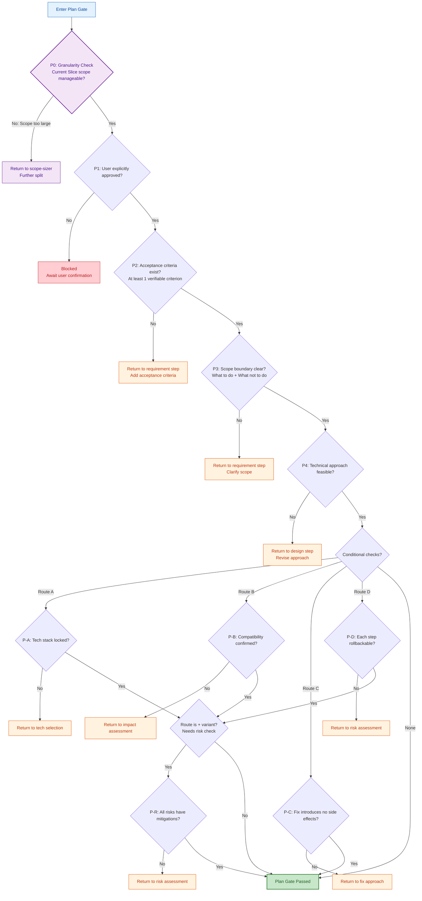
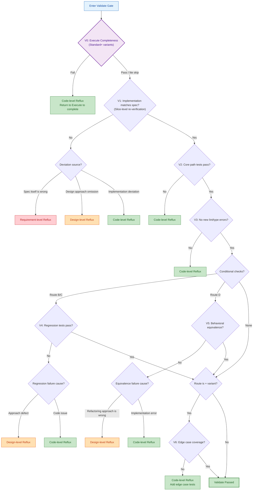
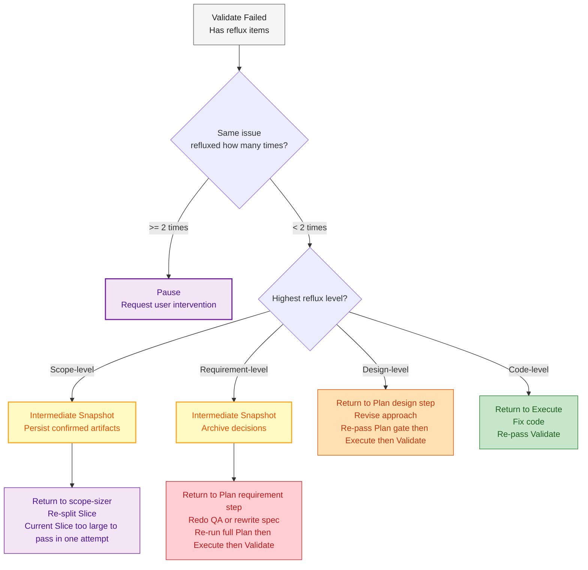

# Quality Gate Detailed Rules

## Plan Gate Evaluation Flow



### P0 Granularity Check Rules

A new first check added to the Plan gate — before user approval, determine whether the current Slice has **reasonable granularity**:

| Signal | Determination | Action |
|------|------|------|
| Current Slice involves > 3 modules | Scope too large | Return to scope-sizer for further splitting |
| Current Slice's spec docs > 5 files | Scope too large | Return to scope-sizer for further splitting |
| Current Slice estimates > 30 new files | Scope too large | Return to scope-sizer for further splitting |
| None of the above exceeded | Granularity normal | Continue to P1 |

P0 check is only performed on the first Plan gate. If already split by scope-sizer, P0 passes directly.

## Validate Gate Evaluation Flow



### V0 Execute Completeness Check

V0 is Validate's first check — verifying Execute phase **process quality** rather than just final results.

| Variant | V0 Check Content | Fail Action |
|------|-----------|----------|
| **lite / fast** | **Skip** V0, go directly to V1 | — |
| **Standard** | Every task completed TDD cycle (has test coverage); full test suite passes | Return to Execute to add tests |
| **+ variant** | Every task passed two-stage review (spec compliance + code quality); no tasks in BLOCKED/NEEDS_CONTEXT state | Return to Execute to complete review or resolve blockers |

V0 checks Execute process **completeness**, not code correctness (that's V1-V3's responsibility). If V0 fails, it means Execute phase had steps skipped that need to be completed.

### V1 Notes (Enhanced)

After integration, V1 serves as **Slice-level Spec compliance re-verification**. Differences from task-level Spec compliance review in Execute:

| Dimension | Execute Task Review | Validate V1 |
|------|-----------------|-------------|
| Granularity | Single task vs its corresponding spec fragment | All tasks in the entire Slice combined vs complete spec |
| Perspective | Local correctness | Global consistency — inter-task connections, omissions, conflicts |
| Scope | Within task | After cross-task integration |

## Reflux Level Determination



### Scope-Level Reflux Trigger Conditions

When the Validate phase discovers the following, scope-level reflux is triggered:
- During Execute, the actual modules or files involved in the current Slice far exceed expectations
- Test coverage scope is too large to complete in reasonable time
- Code generation volume exceeds context window capacity

After scope-level reflux, return to scope-sizer to further split the current Slice into smaller sub-Slices.

---

## Reflux Intermediate Snapshots (Mandatory)

When **scope-level** or **requirement-level** reflux is triggered, an intermediate snapshot must be output before jumping to the reflux target. This is part of the reflux action, not a separate step — the model directly attaches the snapshot when outputting reflux conclusions.

**Design-level** and **code-level** reflux have small impact scope and don't need snapshots.

### Trigger Rules

| Reflux Level | Snapshot Required | Reason |
|---------|---------|------|
| Scope-level | **Yes (mandatory)** | Current Slice will be split; completed partial outputs must be persisted, otherwise sub-Slices cannot perceive them |
| Requirement-level | **Yes (mandatory)** | Requirements may be overturned; previous design decisions need archiving for comparison |
| Design-level | No | Only revising approach; spec changes are covered when Plan is redone |
| Code-level | No | Only fixing code; no document/context changes |

### Snapshot Output Format

Directly attached after reflux conclusion, as part of the reflux output template:

```markdown
### Reflux Intermediate Snapshot

**Current Slice**: S2 — Core Domain
**Reflux Level**: Scope-level / Requirement-level
**Trigger Reason**: [Specific reason]

#### Confirmed Artifacts (Need Persistence)
| Artifact | Target Path | Status |
|--------|---------|------|
| Tech stack document | docs/tech-stack.md | Synced |
| S1 API contract | docs/api/auth.md | Synced |
| S2 requirement spec | docs/novel/spec.md | Needs writing |

#### Decisions to Persist
- [Decision 1]: ...
- [Decision 2]: ...

#### Actions
1. Write the files marked as needing writing above
2. Update .cache/context.db (incremental sync of involved modules)
3. Update docs/progress/ status (mark current Slice as "in reflux")
4. Jump to [reflux target]
```

### Snapshot Execution Method

- **No SubAgent dispatch**: Main agent writes files directly, reducing overhead
- **Only write changed parts**: No full sync, only write "confirmed but not yet persisted" artifacts
- **After snapshot completes**: Then execute reflux jump

---

## Gate Output Format

Output after each gate check:

```markdown
### Pass / Fail [Plan / Validate] Gate Check

| # | Check Item | Result | Notes |
|---|--------|------|------|
| P0 | Granularity check | Pass | Slice scope: 2 modules - 4 feature points |
| P1 | User approval | Pass | User replied "confirmed" |
| P2 | Acceptance criteria | Pass | 3 acceptance criteria |
| P3 | Scope boundary | Fail | Did not specify "what not to do" |
| P4 | Technical feasibility | Pass | — |

**Conclusion**: Fail
**Failure Reason**: P3 — Scope boundary unclear
**Recommended Action**: Return to requirement step, add "out of scope" list
**Reflux Target**: Plan -> Requirement QA
```

---

## ⛔ Phase Chain Guard Integration

After outputting the gate check result, you **must** call `phase_guard.py gate` to record it. This is the mechanical evidence chain and must not be skipped.

### After Plan Gate Pass

```bash
python3 skills/project-context/scripts/phase_guard.py gate \
  --root . --slice <SN> --phase plan --result pass \
  --outputs '[{"path":"docs/plan.md"},{"path":"docs/spec.md"}]'
```

### After Plan Gate Fail

```bash
python3 skills/project-context/scripts/phase_guard.py gate \
  --root . --slice <SN> --phase plan --result fail
```

### After Validate Gate Pass

```bash
python3 skills/project-context/scripts/phase_guard.py gate \
  --root . --slice <SN> --phase validate --result pass
```

### After Validate Gate Fail (triggers reflux)

```bash
python3 skills/project-context/scripts/phase_guard.py gate \
  --root . --slice <SN> --phase validate --result fail
```

After reflux repair, re-entering the corresponding phase via `phase_guard.py enter` will proceed normally (it checks the **prior** phase's gate-pass, not the current phase).
