# Parallel Execution Strategy

Four execution mechanisms, selected by applicable scenario:

```mermaid
graph TB
    PAR["Execution Strategy"] --> SA["SubAgent Parallel<br>Skill-level Independent Tasks"]
    PAR --> TASK_SA["Task SubAgent<br>Execute Task-level Isolation"]
    PAR --> BG["Background Process Parallel<br>Tool-level CLI Tasks"]
    PAR --> SEQ["Strict Sequential<br>Input/Output Dependencies"]

    SA --> SA1["A+ P2 Triple<br>performance + impl-complexity<br>+ observability"]
    SA --> SA2["Deliver Dual-write<br>docs-output + project-context"]
    SA --> SA3["brainstorm Multi-role<br>Has Built-in SubAgent Mechanism"]

    TASK_SA --> TSA1["+ Variant Execute<br>Each task by fresh SubAgent"]
    TASK_SA --> TSA2["Two-stage Review<br>Main Agent as Controller"]

    BG --> BG1["Dependency Install<br>npm install / mvn resolve"]
    BG --> BG2["Type Check<br>tsc --noEmit"]
    BG --> BG3["Test Execution<br>npm test / mvn test"]
    BG --> BG4["lint + format<br>eslint / prettier"]

    SEQ --> SEQ1["Plan Skill Chain<br>qa - spec - tech - eng - api - err"]
    SEQ --> SEQ2["Execute Task Chain<br>Sequential when tasks have dependencies"]
    SEQ --> SEQ3["Quality Gates<br>Sequential gate checks"]

    style PAR fill:#f5f5f5,stroke:#616161,color:#212121
    style SA fill:#f3e5f5,stroke:#6a1b9a,color:#4a148c
    style TASK_SA fill:#e8eaf6,stroke:#283593,color:#1a237e,stroke-width:2px
    style BG fill:#c8e6c9,stroke:#2e7d32,color:#1b5e20
    style SEQ fill:#e3f2fd,stroke:#1565c0,color:#0d47a1
    style SA1 fill:#f3e5f5,stroke:#6a1b9a,color:#4a148c
    style SA2 fill:#f3e5f5,stroke:#6a1b9a,color:#4a148c
    style SA3 fill:#f3e5f5,stroke:#6a1b9a,color:#4a148c
    style TSA1 fill:#e8eaf6,stroke:#283593,color:#1a237e
    style TSA2 fill:#e8eaf6,stroke:#283593,color:#1a237e
    style BG1 fill:#c8e6c9,stroke:#2e7d32,color:#1b5e20
    style BG2 fill:#c8e6c9,stroke:#2e7d32,color:#1b5e20
    style BG3 fill:#c8e6c9,stroke:#2e7d32,color:#1b5e20
    style BG4 fill:#c8e6c9,stroke:#2e7d32,color:#1b5e20
    style SEQ1 fill:#e3f2fd,stroke:#1565c0,color:#0d47a1
    style SEQ2 fill:#e3f2fd,stroke:#1565c0,color:#0d47a1
    style SEQ3 fill:#e3f2fd,stroke:#1565c0,color:#0d47a1
```

## SubAgent Parallel Rules

- Ensure input data is ready (design docs, context, etc.) before dispatching SubAgents
- Each SubAgent receives the same input, produces output independently; main thread joins results before continuing
- A+ P2: 3 SubAgents in parallel, join results then pass to docs-output
- Deliver: 2 SubAgents in parallel, join results then generate delivery summary

## Task SubAgent Rules (+ Variant Execute Only)

Used only in + variant Execute phase. Detailed rules -> read `references/execute.md`.

- Each task executed by a **fresh SubAgent**, context-isolated to prevent attention drift
- SubAgents dispatched sequentially (inter-task dependencies), not in parallel
- **Input package precisely controlled**: Only task description + involved files + spec summary + predecessor task summary
- Main Agent as Controller handles dispatch, review, state management
- SubAgent reports status: DONE / DONE_WITH_CONCERNS / NEEDS_CONTEXT / BLOCKED
- After each SubAgent completes, Main Agent does two-stage review (spec compliance + code quality) before dispatching next
- Difference from SubAgent parallel: SubAgent parallel runs **multiple agents simultaneously** on the same input; Task SubAgent runs **single agent sequentially**, each task with isolated context

## Background Process Rules

- Only for CLI tools requiring no AI involvement (install, compile, test execution, lint)
- After launching, main thread continues writing next module, checks background output later
- Background process failure doesn't block main thread, but results must be confirmed before Validate gate

## SubAgent Degradation Strategy

When the agent host environment does not support SubAgents (or has limited SubAgent capability), all SubAgent scenarios **fall back to main Agent sequential execution**. The architecture is designed to never depend on SubAgent parallelism — SubAgents are a performance optimization, not a functional prerequisite.

### Degradation Mapping

| SubAgent Scenario | Normal Mode | Degraded Mode |
|-------------------|-------------|---------------|
| brainstorm multi-role | 6 SubAgents in parallel playing different roles | Main Agent plays each role sequentially, outputting each perspective's analysis in turn |
| A+ Plan triple-skill | 3 SubAgents in parallel (performance + complexity + observability) | Main Agent executes all three skills sequentially |
| + variant Execute | Each task by fresh SubAgent with context isolation | Main Agent executes tasks sequentially, self-separating context between tasks (explicitly marking: "--- Task N Start ---") |
| Deliver dual-write | 2 SubAgents in parallel (docs-output + project-context) | Main Agent executes docs-output first, then project-context |

### Degradation Detection

The model detects the host environment when SubAgents are first needed:
- If the host provides SubAgent/fork/spawn capability → use SubAgent mode
- If not → switch to degraded mode; do not re-detect within the same session
- Degradation does not affect quality gates — Plan Gate / Validate Gate checks remain identical
