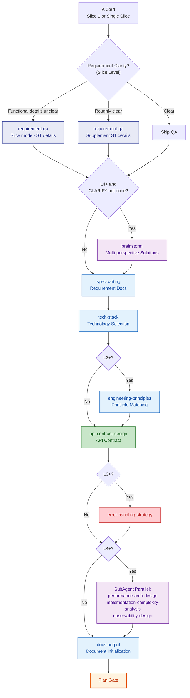
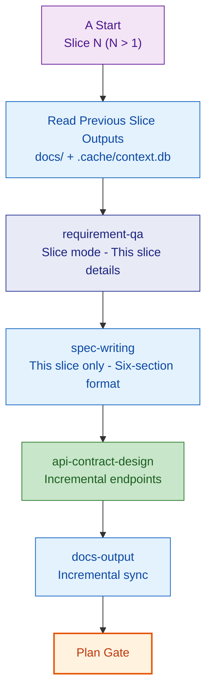
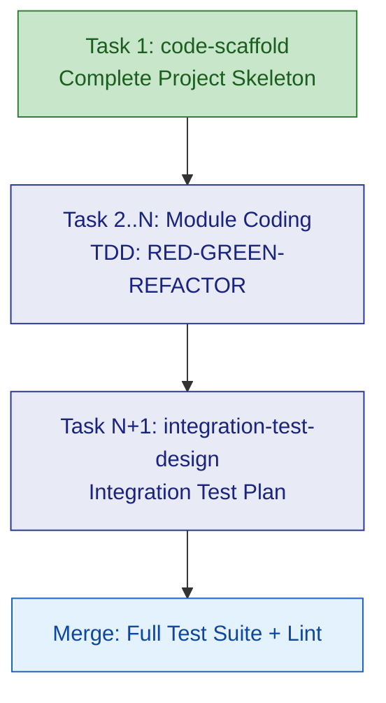
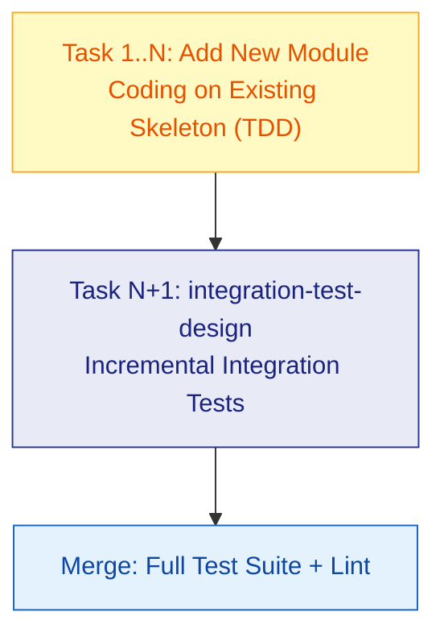

# A: New Project

⛔ **Path Lock**: The Mermaid flowcharts in this route are mandatory execution paths, not references. Every node must be executed in arrow order; conditional branches follow actual conditions. Do not skip any node or exit early. After completing each node, follow the arrow to the next.

---

## Plan

### First Slice (or Single-Slice Mode)

The first Slice executes the complete Plan skill chain, producing global documents (tech-stack, engineering-principles, etc.).

> **Note**: If the CLARIFY phase was already executed, requirement-qa in Plan switches to **slice mode** (only asking S1 specific functional details, not repeating macro-level questions); brainstorm defaults to **skip** (CLARIFY already covered architecture discussion), unless new architecture disputes arise within S1 that trigger it.

### Subsequent Slices (Multi-Slice Mode)

Subsequent Slices skip global skills (tech-stack, engineering-principles, error-handling-strategy), executing only slice-level incremental skills. requirement-qa is always in **slice mode**, brainstorm is **skipped** (CLARIFY already done).

### Variant Differences

| Skill | A-lite | A | A+ |
|-------|--------|---|-----|
| requirement-qa | Lightweight | Standard | Deep |
| brainstorm | Skip | Skip | Required if CLARIFY not done; skip if done |
| spec-writing | Bullet list | Six-section | Six-section |
| tech-stack | Default template | Full selection | Full selection |
| engineering-principles | Skip | Standard | Multi-mode matching |
| api-contract-design | Endpoint list | Full contract | Full contract |
| error-handling-strategy | Skip | Standard | Standard |
| SubAgent Triple | Skip | Skip | Parallel execution |
| docs-output | Minimal | Initialization | Full initialization |

> brainstorm is only required in A+ (L4-L5) variants when **CLARIFY phase was NOT executed**. If CLARIFY has completed architecture discussion, brainstorm in Plan is skipped.

---

## Execute

General execution flow (task decomposition -> TDD cycle -> review -> merge) -> read `references/execute.md`. Below are Route A **specialized rules**:

### First Slice

Task decomposition must follow:

| # | Mandatory Task | Description |
|---|---------|------|
| Task 1 | `code-scaffold` | Generate complete project skeleton (directory structure, build config, common modules) |
| Last | `integration-test-design` | Design integration test framework and strategy |
| Middle | This slice's module coding | Execute per task following TDD cycle |

### Subsequent Slices

- `code-scaffold` is **skipped** (skeleton already exists), Task 1 directly starts with module coding
- `integration-test-design` does incremental (only integration tests for new modules in this slice)

