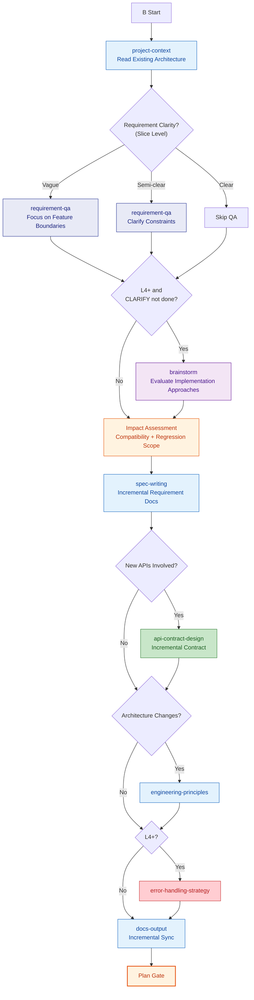
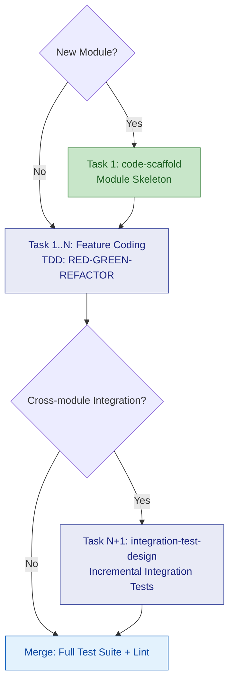

# B: New Feature for Existing Project

## Plan

> **Note**: If the CLARIFY phase was already executed, requirement-qa in Plan switches to **slice mode** (only asking about current slice's functional details and impact scope, not repeating macro-level questions); brainstorm defaults to **skip** (CLARIFY already covered architecture discussion), unless new implementation approach disputes arise within the slice that trigger it.

### Variant Differences

| Skill | B-lite | B | B+ |
|-------|--------|---|-----|
| project-context | Read | Read | Read |
| requirement-qa | Quick clarification | Standard | Deep |
| brainstorm | Skip | Skip | Required if CLARIFY not done; skip if done |
| Impact assessment | Skip | Standard | Deep |
| spec-writing | Incremental | Incremental | Incremental |
| api-contract-design | As needed | As needed | As needed |
| engineering-principles | Skip | As needed | As needed |
| error-handling-strategy | Skip | Skip | Standard |
| docs-output | Skip | Incremental sync | Incremental sync |

---

## Execute

General execution flow (task decomposition -> TDD cycle -> review -> merge) -> read `references/execute.md`. Below are Route B **specialized rules**:

| Condition | Task Decomposition Special Handling |
|------|----------------|
| **New module** | Task 1 = `code-scaffold` for that module (module-level, not project-level) |
| **Cross-module integration** | Must include `integration-test-design` incremental task |
| **Single module internal** | No special requirements, follow standard TDD flow |

