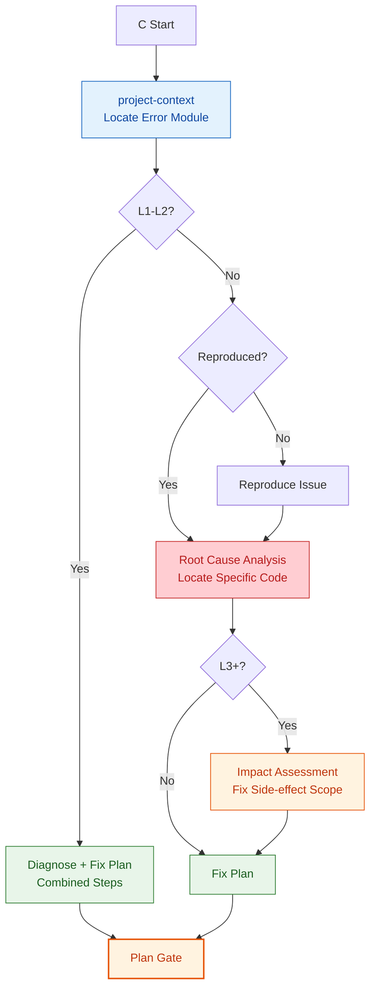
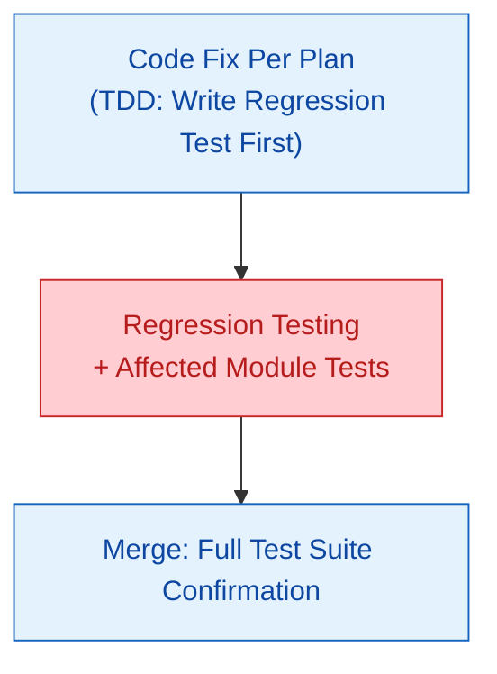

# C: Bug Fix

## Plan

### Variant Differences

| Step | C-fast | C | C+ |
|------|--------|---|-----|
| project-context | Locate module | Locate module | Locate module |
| Reproduction | Skip (quick diagnose) | Standard reproduction | Standard reproduction |
| Root cause analysis | Combined into diagnosis | Standard | Deep |
| Impact assessment | Skip | Skip | Required |
| Fix plan | Combined into diagnosis | Standard | Detailed |

---

## Execute

General execution flow -> read `references/execute.md`. Route C **specialized rules**:

- **No scaffold** — Bug fixes don't need project/module scaffolding
- **Regression testing mandatory** — Confirm fix doesn't introduce new issues

| Variant | Execute Strategy | TDD |
|------|------------|-----|
| **C-fast** | Skip task decomposition, main agent directly: diagnose -> fix -> regression test | Optional |
| **C** | Decompose fix plan into 1-3 tasks, execute via TDD flow | Mandatory |
| **C+** | Standard task decomposition + SubAgent isolation + two-stage review | Strict |

