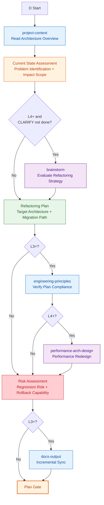
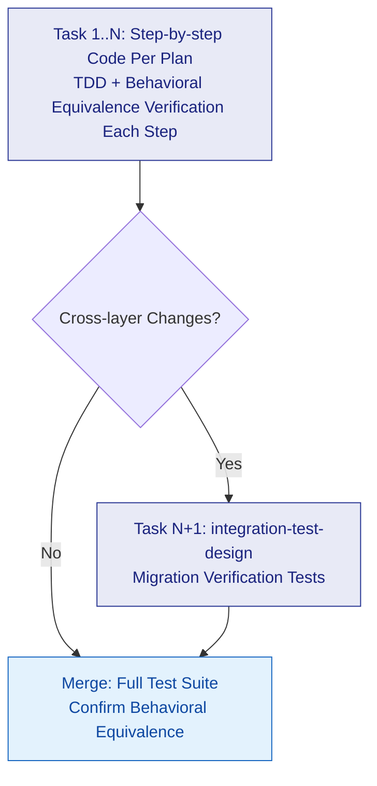

# D: Refactoring

## Plan

> **Note**: If the CLARIFY phase already covered architecture discussion, brainstorm in Plan defaults to **skip** unless new strategy disputes arise during refactoring.

### Variant Differences

| Skill | D-lite | D | D+ |
|-------|--------|---|-----|
| project-context | Read architecture | Read architecture | Read architecture |
| Current state assessment | Quick | Standard | Deep |
| brainstorm | Skip | Skip | Required if CLARIFY not done; skip if done |
| Refactoring plan | Brief | Standard | Detailed + migration plan |
| engineering-principles | Skip | Standard verification | Deep verification |
| performance-arch-design | Skip | Skip | Performance redesign |
| Risk assessment | Skip | Standard | Detailed + rollback plan |
| docs-output | Skip | Incremental sync | Incremental sync |

---

## Execute

General execution flow (task decomposition -> TDD cycle -> review -> merge) -> read `references/execute.md`. Route D **specialized rules**:

- **No scaffold** — Refactoring doesn't create new project/module scaffolding
- **Core principle**: After each task completes, **all existing tests must pass** (behavioral equivalence)
- `integration-test-design` **only triggered for cross-layer refactoring**
- **No accumulation**: Don't wait for multiple tasks to finish before testing collectively — verify equivalence immediately after each task

