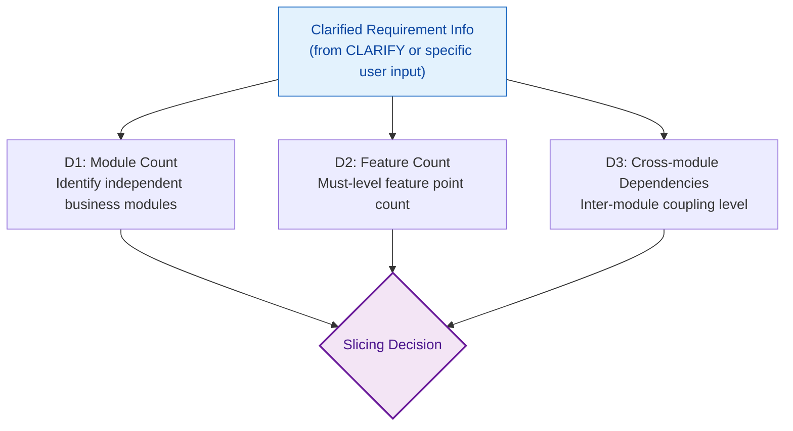
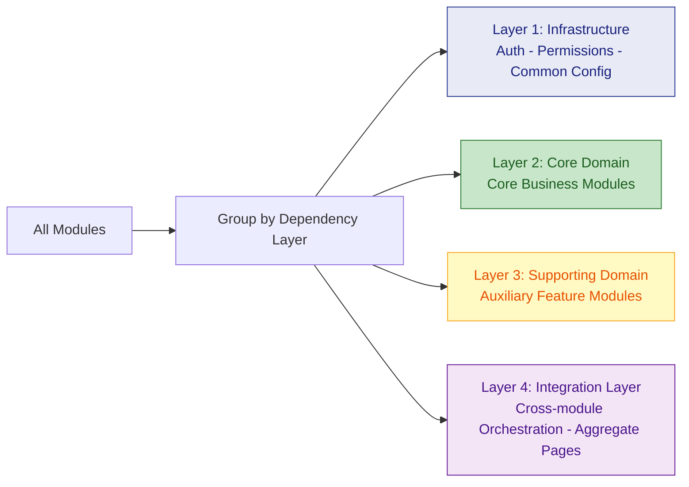
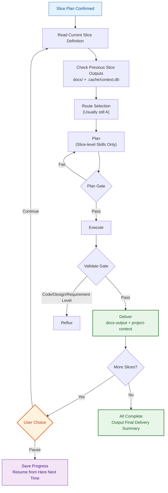

# Scope Sizer

Executed after CLARIFY (or after CLARIFY is skipped), before route selection. Evaluates the **breadth** of a task rather than depth, deciding whether to split a large requirement into multiple manageable slices.

## Prerequisites

scope-sizer requires **clarified requirement information** as input, not raw ambiguous user input:

| Source | Content | When Available |
|------|------|---------|
| CLARIFY output | Module list, core features, architecture direction | When CLARIFY is triggered |
| User input itself | Already specific enough (e.g., "add password change to user module") | When CLARIFY is skipped |
| project-context | Existing project's module structure (B/C/D routes) | When code repository exists |

---

## Why Slicing Is Needed

- **Limited context window**: A single conversation cannot complete Plan + Execute for 8 modules
- **Risk distribution**: Each slice is independently verified; problems surface and get fixed early
- **Interruptible recovery**: Users can pause after any slice; next session resumes from progress
- **Incremental delivery**: Each completed slice produces deployable incremental output

---

## Assessment Dimensions



| Dimension | Single Slice Criteria | Needs Splitting Criteria |
|------|-------------|-----------|
| **Module count** | <= 2 independent modules | > 2 independent modules |
| **Feature count** | <= 3 Must features | > 3 Must features |
| **Cross-module dependencies** | No dependencies or linear dependencies | Circular dependencies or complex weaving |

**Trigger condition**: Slicing is triggered when **any single** dimension reaches the "needs splitting" criteria.

Users can override: "Don't split, do it all at once" -> skip slicing, but risks must be noted in Plan.

---

## Slicing Strategies

Slicing strategies vary by route. The core idea is the same: **sort by risk and dependencies; each slice can be independently verified**.

### Route A (New Project) — Group by Dependency Layers



1. **Infrastructure first**: Auth, permissions, database initialization, project skeleton, etc. go in Slice 1
2. **Core domain next**: The system's most critical business modules (e.g., "novel management + reading" for a novel system) go in Slice 2
3. **Supporting domain follows**: Nice-to-have but non-MVP-core modules (e.g., comments, bookshelf, recommendations) in subsequent slices
4. **Integration layer last**: Aggregate features requiring multi-module collaboration (e.g., homepage dashboard, search aggregation) go last

### Per-Slice Granularity Controls

| Constraint | Target |
|------|------|
| Max module count | No more than 2-3 modules per slice |
| Max feature points | No more than 5 Must features per slice |
| Max estimated files | No more than ~30 new/modified files per slice |
| Independently runnable | Project should compile and run after each slice completes |

### Global vs Slice-Level Skills

| Skill | First Slice | Subsequent Slices |
|-------|-----------|-----------|
| requirement-qa | Global + Slice 1 details | Slice N details only |
| brainstorm | Global architecture approach | **Skip by default** (CLARIFY already done); trigger only on new architecture disputes |
| spec-writing | Global overview + Slice 1 six-section | Slice N six-section only |
| tech-stack | **Full output** (global) | **Skip** (reuse Slice 1 output) |
| engineering-principles | **Full matching** (global) | **Skip** (reuse) |
| api-contract-design | Endpoints for Slice 1 | Slice N incremental endpoints |
| error-handling-strategy | **Full design** (global) | **Skip** (reuse) |
| code-scaffold | **Full skeleton** (Slice 1 only) | **Skip** (skeleton already exists) |
| docs-output | Initialization + Slice 1 sync | **Slice N incremental sync** |
| project-context | Initialization + Slice 1 writeback | **Slice N incremental writeback** |

### Route B (New Feature) — Group by Implementation Stages

When adding new features to an existing project, the slicing dimension shifts from "module count" to "implementation stages" and "impact scope":

| Dimension | Single Slice Criteria | Needs Splitting Criteria |
|------|-------------|-----------|
| **Affected module count** | Only 1 module internal | Across 2+ modules |
| **Implementation layers** | Single layer (backend only / frontend only) | Frontend + backend + data migration |
| **Data changes** | No schema changes | Requires data migration |

**Grouping principles**:

1. **Data layer first**: If schema changes or data migration needed, make it a separate slice
2. **Backend API next**: New/modified backend interfaces
3. **Frontend UI follows**: Frontend pages/components dependent on backend APIs
4. **Integration last**: End-to-end integration tests + regression

Example: "Add search functionality to a novel system"
| Slice | Scope | Content |
|-------|------|------|
| S1 | Data layer | ES index design - Data sync pipeline - Schema migration |
| S2 | Backend | SearchService - Search API - Pagination/Sorting |
| S3 | Frontend + Integration | Search UI - Integration testing - Regression tests |

### Route C (Bug Fix) — Usually Single Slice

Bug fixes are naturally narrow in scope, **no slicing by default**. Only triggered when:

| Signal | Determination |
|------|------|
| Systemic bug affecting 3+ modules | Need to fix and verify module by module |
| Fix requires data correction + code fix | Split into "data correction slice" + "code fix slice" |
| Other cases | **Single slice, skip slicing** |

### Route D (Refactoring) — Split by Safety Boundaries

The slicing principle for refactoring is **each step is rollbackable with behavioral equivalence**:

| Dimension | Single Slice Criteria | Needs Splitting Criteria |
|------|-------------|-----------|
| **Affected modules** | Only 1 module internal refactoring | Across 2+ modules or common layer |
| **API changes** | Internal implementation changes, API unchanged | API signature/protocol changes |
| **Data model changes** | No schema changes | Requires data migration |

**Grouping principles**:

1. **Internal refactoring first**: Module-internal refactoring that doesn't change external APIs (safest)
2. **Interface refactoring next**: API signature changes + caller adaptation
3. **Data migration last**: Schema changes + data transformation (highest risk)

Example: "Refactor auth module into a microservice"
| Slice | Scope | Content |
|-------|------|------|
| S1 | Internal abstraction | Extract AuthService interface - Decouple direct calls |
| S2 | Service split | Independent service deployment - gRPC/HTTP communication |
| S3 | Data migration | User table migration - Dual-write transition - Legacy code cleanup |

---

## Slice Plan Output Format

After assessment, output the slice plan for user confirmation:

```markdown
### Slice Plan

**Requirement**: [Requirement Name]
**Assessment Result**: [Module Count] modules - [Feature Count] Must features -> Split into [N] slices

| Slice | Scope | Included Modules | Key Features | Dependencies |
|-------|------|---------|---------|------|
| S1 | Infrastructure + Core Skeleton | auth, common | Project init - Auth - Permissions | None |
| S2 | Core Domain | novel, chapter | Novel CRUD - Chapter mgmt - Reader | S1 |
| S3 | Supporting Domain | user, bookshelf | User profiles - Bookshelf - Favorites | S1, S2 |
| S4 | Integration | search, dashboard | Full-text search - Homepage recommendations | S1-S3 |

**Each Slice independently goes through Plan -> Execute -> Validate -> Deliver.**
**After each Slice completes, sync docs/ and .cache/context.db.**

Confirm this slice plan? (Can adjust order, merge, or split slices)
```

---

## Slice Iterator Behavior



### Pause and Resume

- Each Slice's Deliver phase mandatorily syncs docs/ and .cache/context.db
- If user pauses (or session interrupts), on next Orchestrator startup:
  1. project-context reads .cache/context.db -> discovers project already has code and docs
  2. Reads docs/progress/ -> discovers last completed up to Slice N
  3. Automatically continues from Slice N+1, no need to re-evaluate global context
