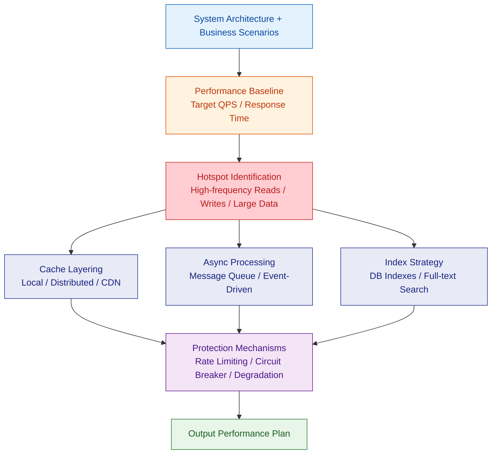
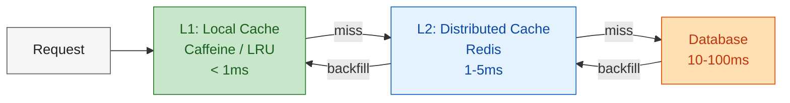
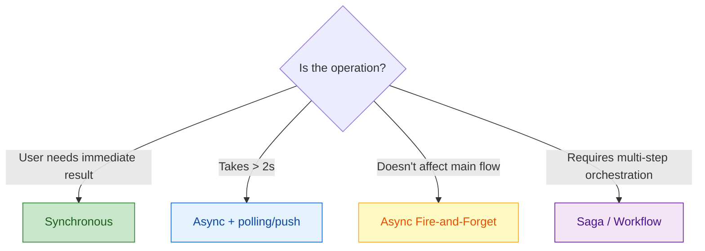

# Performance-First Design

Identify performance bottlenecks at the architecture level before coding: design caching layers, async processing, index strategies, and rate limiting.

---

## Design Flow



---

## 1. Performance Baseline Definition

### Target Template

| Metric | Target | Measurement |
|--|--|--|
| P99 Response Time | < 200ms (read) / < 500ms (write) | APM tools |
| QPS | Estimate based on business | Load testing tools |
| Error Rate | < 0.1% | Monitoring & alerting |
| DB Query | < 50ms (single table) / < 200ms (join) | Slow query log |

### Estimation Formula

```
Estimated QPS = DAU x Avg requests per user / Active hours (seconds)
Peak QPS = Estimated QPS x 3 (peak factor)
```

---

## 2. Hotspot Identification

### Read Hotspots

| Pattern | Example | Optimization |
|--|--|--|
| Same data requested heavily | Product details, config | Cache |
| Frequent list queries | Homepage data, leaderboards | Pre-compute + cache |
| Full table scan on large data | Search, reports | Index / full-text search / materialized views |

### Write Hotspots

| Pattern | Example | Optimization |
|--|--|--|
| High-concurrency writes to same row | Inventory deduction, counters | Optimistic lock / bucketed counters |
| Bulk data writes | Log writing, data import | Async + batching |
| Large transactions | Multi-table cascading ops | Split transactions / Saga |

---

## 3. Cache Layering



### Cache Strategy Selection

| Scenario | Strategy | TTL | Description |
|--|--|--|--|
| Rarely changing data | Cache-Aside | 24h | Config, dictionary tables |
| Frequent reads, few writes | Cache-Aside + write-invalidate | 1h | User info, product details |
| Balanced read-write | Write-Through | 30min | Session data |
| Write-heavy, read-light | Write-Behind | N/A | Logs, statistics |
| Leaderboards / counters | Native Redis structures | Persistent | SortedSet / HyperLogLog |

### Cache Problem Prevention

| Problem | Cause | Solution |
|--|--|--|
| Cache Penetration | Querying non-existent data | Bloom filter / cache null values (short TTL) |
| Cache Breakdown | Hot key expires | Mutex lock loading / never-expire + async refresh |
| Cache Avalanche | Mass key expiration | TTL with random offset / multi-level cache |

---

## 4. Async Processing

### Scenario Decision



### Message Queue Selection

| Queue | Use Case | Characteristics |
|--|--|--|
| Redis Stream | Lightweight, single-node | Simple, non-persistent |
| RabbitMQ | Small-medium, routing needed | Flexible routing, reliable delivery |
| Kafka | High volume, log streaming | High throughput, persistent, partitioned |

---

## 5. Database Index Strategy

### Index Design Principles

| Principle | Description |
|--|--|
| High-selectivity columns first | Columns with many unique values work best |
| Query conditions = indexes | Columns in WHERE / ORDER BY / JOIN |
| Composite index leftmost prefix | Arrange column order to match query patterns |
| Covering index | Index includes all queried columns, avoids table lookups |
| Avoid over-indexing | Each additional index degrades write performance |

### N+1 Query Prevention

| Scenario | ORM Solution | SQL Solution |
|--|--|--|
| Associated queries | Eager Loading / Join Fetch | LEFT JOIN |
| Batch queries | `findAllById(ids)` | `WHERE id IN (...)` |
| Pagination + association | Query IDs first, then batch load | Subquery pagination |

### Slow Query Prevention Checklist
- [ ] All WHERE conditions covered by indexes
- [ ] No full-table COUNT(*) (use approximate counts or cache)
- [ ] No `SELECT *` (query only needed columns)
- [ ] Pagination uses cursor/Keyset instead of OFFSET
- [ ] Large IN lists split into batches (< 1000 items)

---

## 6. Rate Limiting Strategy

| Algorithm | Use Case | Characteristics |
|--|--|--|
| Fixed Window | Simple limiting | Has boundary burst issues |
| Sliding Window | General APIs | Smooth, slightly more memory |
| Token Bucket | Allow bursts | Accumulates tokens for bursts |
| Leaky Bucket | Strict even rate | Smooths traffic |

### Rate Limiting Dimensions

| Dimension | Example |
|--|--|
| Per-user | 100 requests/min per user |
| Per-IP | 200 requests/min per IP |
| Per-API | 1000 requests/sec globally for an endpoint |
| Per-service | Upstream caller quotas |

---

## 7. Output Checklist

| Deliverable | Description |
|--|--|
| Performance Baseline Doc | Target QPS, response time, error rate |
| Hotspot Analysis Table | Read hotspots + write hotspots + optimization strategies |
| Cache Design Plan | Layering strategy, TTL, protection measures |
| Async Processing Plan | Scenario list + queue selection |
| Index Design Checklist | Index definitions per table |
| Rate Limiting Config | Dimensions + algorithms + thresholds |

---

## References

See `references/` directory for detailed rules:
- `performance-rules.md` — Detailed performance design rules and anti-patterns
