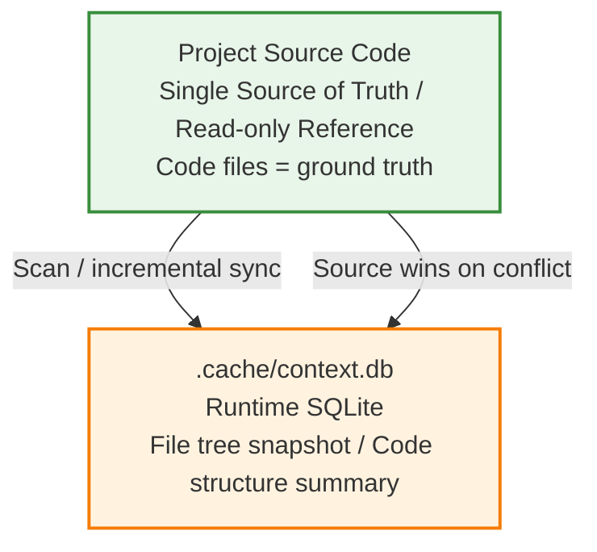

# Project Structure Awareness

This Skill solves a core problem: **AI models lose understanding of project structure across sessions**. Every new session requires re-scanning directories, re-understanding code organization — inefficient and prone to omissions.

This Skill maintains a **SQLite database** (`.ai/context.db`) in the project to persist file tree and code structure summaries, enabling rapid cross-session project cognition recovery.

## Data Model



**Source code is the single source of truth.** The db is a cache of source structure — users may modify code without using this skill, so db info can become stale.

## Principles

- **Passively invoked**: This skill never auto-triggers; only activated when externally requested.
- **Source-first**: The db is a cache, not the truth. Incremental validation on relevant scope should precede each query.
- **Incremental sync**: No full scans — uses file modification time (mtime) + file hash for incremental detection, syncing only changed parts.
- **Minimal storage**: Stores only structural info and exported symbol signatures, not source code content itself.

## Database Location and Git Strategy

- Path: `{project_root}/.cache/context.db`
- `.cache/` directory should be added to `.gitignore` (db is a local runtime artifact)

## Core Capabilities (Passive API)

### 1. init — Initialize

Called on first use in a project. Scans project file structure, generates initial snapshot.

- Scan: directory tree, file types, file sizes, modification times
- Identify: package.json, tsconfig, entry files and other key configs
- Ignore: node_modules, dist, .git, binary files, etc. (follows .gitignore)
- Write to: `file_tree` table + `project_meta` table

### 2. sync — Incremental Sync

Compares current file system with db snapshot, detects added/modified/deleted files, updates db.

- Change detection based on mtime + file hash
- For changed code files, can extract structure summaries (exported function/class/interface signatures)

### 3. query — Query Structure

Query project structure info by path or keyword:

- Project structure overview (project_meta)
- File list and classification for a module/directory
- Exported symbol summary for a file

### 4. validate — Consistency Check

Compares db info with actual source code, marks stale entries:

- File deleted -> marked as `deleted`
- File content changed but summary not updated -> marked as `stale`

## Database Schema Overview

| Table | Purpose |
|------|------|
| `project_meta` | Project metadata (name, root path, monorepo structure, Node version, etc.) |
| `file_tree` | File tree snapshot (path, type, size, mtime, hash, status, classification) |
| `code_summary` | Code structure summary (file -> exported function/class/interface signatures) |

> Full schema (including field definitions and indexes) → `references/schema.md`

## Vectorization Extension (Optional Upgrade)

For large projects (> 500 files), vectorization can be enabled for semantic search. Current version uses keyword full-text search (SQLite FTS5) as primary; vectorization is a future upgrade path.

## Python Script

```bash
python scripts/context_db.py init     --root <project_root>
python scripts/context_db.py sync     --root <project_root>
python scripts/context_db.py query    --root <project_root> --scope structure|meta [--module <path>] [--keyword <term>]
python scripts/context_db.py validate --root <project_root>
```

> Script implementation → `scripts/context_db.py`

## Common Issues

- **db and source out of sync**: Call `validate` to mark stale entries, then `sync` to update. Source is always truth.
- **db file corrupted/missing**: Re-run `init` — the db is a rebuildable cache.
- **Project too large, init too slow**: `init` first scans only file tree (seconds-level); code summaries can be deferred to first query for on-demand generation.
