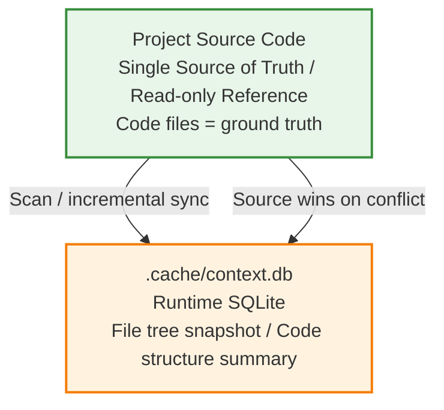
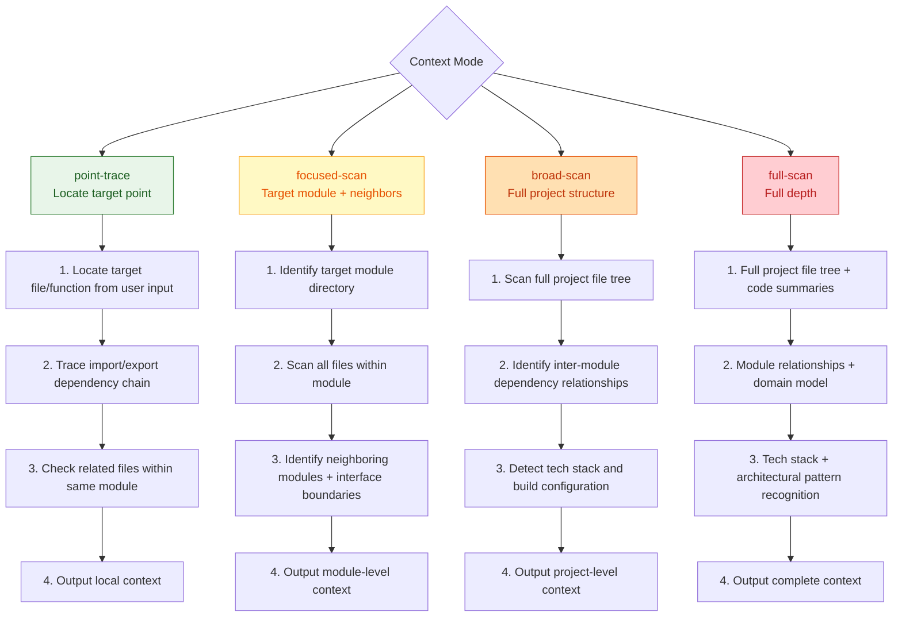

# Project Structure Awareness

This Skill solves a core problem: **AI models lose understanding of project structure across sessions**. Every new session requires re-scanning directories, re-understanding code organization — inefficient and prone to omissions.

This Skill maintains a **SQLite database** (`.cache/context.db`) in the project to persist file tree and code structure summaries, enabling rapid cross-session project cognition recovery.

> **Applies to new projects**: Even when no source code exists yet (Route A new project during Plan phase), `init` should still be executed to create the db and record existing structure (config files, document outputs, etc.). The `file_tree` tracks all files by category (source/config/doc/test/asset/other), not just source code. Documents produced by Plan-phase skills (docs/, specs/) are captured by `sync`.

## Data Model



**Source code is the single source of truth.** The db is a cache of source structure — users may modify code without using this skill, so db info can become stale.

## Principles

- **Mandatory orchestrator invocation**: This is an infrastructure skill, mandatorily invoked by the orchestrator during context awareness (before route selection) and Deliver stages. Must not be skipped.
- **Source-first**: The db is a cache, not the truth. Incremental validation on relevant scope should precede each query.
- **Incremental sync**: No full scans — uses file modification time (mtime) + file hash for incremental detection, syncing only changed parts.
- **Minimal storage**: Stores only structural info and exported symbol signatures, not source code content itself.

## Database Location and Git Strategy

- Path: `{project_root}/.cache/context.db`
- `.cache/` directory should be added to `.gitignore` (db is a local runtime artifact)

## Core Capabilities

### 0. Context Mode Selection

When called by the orchestrator, selects the corresponding context acquisition mode based on the input classification result:

| Mode | Description | Scan Scope | Output |
|------|-------------|-----------|--------|
| **point-trace** | Locate first, then expand | Target point mentioned by user → trace import/caller → same-module files | Target point + directly related files + local dependency chain |
| **focused-scan** | Focus on module | Target module full scan + neighboring module summaries + API boundaries | Module details + neighbor summaries + interface boundaries |
| **broad-scan** | Wide-area scan | Full project file tree + inter-module dependencies + tech stack | Complete structure + module relationships + tech stack |
| **full-scan** | Full deep scan | Full project + code summaries + domain analysis | Complete context + architectural overview |



When not called by the orchestrator (standalone usage), defaults to broad-scan mode.

### 1. init — Initialize

Called on first use in a project. Scans project file structure, generates initial snapshot.

- Scan: directory tree, file types, file sizes, modification times
- Identify: package.json, tsconfig, entry files and other key configs
- Ignore: node_modules, dist, .git, binary files, etc. (follows .gitignore)
- Write to: `file_tree` table + `project_meta` table

### 2. sync — Incremental Sync

Compares current file system with db snapshot, detects added/modified/deleted files, updates db.

- Change detection based on mtime + file hash
- For changed code files, can extract structure summaries (exported function/class/interface signatures)

### 3. query — Query Structure

Query project structure info by path or keyword:

- Project structure overview (project_meta)
- File list and classification for a module/directory
- Exported symbol summary for a file

### 4. validate — Consistency Check

Compares db info with actual source code, marks stale entries:

- File deleted -> marked as `deleted`
- File content changed but summary not updated -> marked as `stale`

### 5. deps — Dependency Scanning

Scans all source code files, extracts import/require static dependencies, writes to `dependencies` table:

- TypeScript/JavaScript: ES import, CJS require, dynamic import, re-export
- Python: import / from...import (prefers `ast` module, falls back to regex on syntax error)
- Java: import statements
- Only records dependencies between project-internal files (external packages skipped)

> Implementation → `scripts/dep_extractor.py`

### 6. stale-check — Sampling Freshness Check

Quick assessment of whether db needs a sync:

- Randomly samples 20 active files from `file_tree`
- Compares mtime for changes
- If >20% files stale → returns `recommendation: "sync"`
- Agent runs stale-check first during context awareness stage; if sync needed, syncs before continuing

### 7. Knowledge Extraction (Deliver Stage)

After each Deliver completes, the AI agent extracts semantic-level knowledge discovered during the task:

**knowledge_edges (relationship graph)**:
- Reviews files and symbols involved in the current task
- Extracts call relationships (calls), inheritance (extends), event triggers (triggers), data reads/writes (reads/writes), etc.
- Writes to `knowledge_edges` table via INSERT OR REPLACE
- Confidence rules: task completed and user did not challenge → `validated`; inferred → `inferred`

**knowledge_flows (business flows)**:
- If the current task involves cross-module business processes (e.g., user registration, order creation)
- Extracts complete step chain (file → symbol → action)
- Writes to `knowledge_flows` table

## Database Schema Overview

| Table | Purpose |
|------|------|
| `project_meta` | Project metadata (name, root path, monorepo structure, Node version, etc.) |
| `file_tree` | File tree snapshot (path, type, size, mtime, hash, status, classification) |
| `code_summary` | Code structure summary (file -> exported function/class/interface signatures) |
| `dependencies` | Inter-file static dependencies (import/require relationships, auto-extracted by script) |
| `knowledge_edges` | Semantic relationship graph (function calls, inheritance, event triggers, etc., extracted by AI at Deliver stage) |
| `knowledge_flows` | Business flow chains (cross-module business process steps, extracted by AI at Deliver stage) |

> Full schema (including field definitions and indexes) → `references/schema.md`

## Vectorization Extension (Optional Upgrade)

For large projects (> 500 files), vectorization can be enabled for semantic search. Current version uses keyword full-text search (SQLite FTS5) as primary; vectorization is a future upgrade path.

## Python Scripts

### context_db.py — Context Database Management

```bash
python scripts/context_db.py init        --root <project_root>
python scripts/context_db.py sync        --root <project_root>
python scripts/context_db.py deps        --root <project_root>
python scripts/context_db.py stale-check --root <project_root> [--sample <n>]
python scripts/context_db.py knowledge   --root <project_root> --type edges|flows --data <JSON> [--session <hash>]
python scripts/context_db.py query       --root <project_root> --scope structure|meta [--module <path>] [--keyword <term>]
python scripts/context_db.py validate    --root <project_root>
```

> Script implementations → `scripts/context_db.py`, `scripts/dep_extractor.py`

### phase_guard.py — Phase Chain Guard

Provides mechanical checkpoints at Plan→Execute→Validate→Deliver phase transitions. Records enter/gate events to the `phase_log` table, ensuring phase chain integrity is verifiable after the fact.

```bash
# Enter phase (verifies prior phase has gate-passed)
python scripts/phase_guard.py enter     --root <project_root> --slice <SN> --phase <plan|execute|validate|deliver>

# Record gate result
python scripts/phase_guard.py gate      --root <project_root> --slice <SN> --phase <phase> --result <pass|fail> [--outputs '<JSON>']

# Reconcile complete chain (call after Deliver)
python scripts/phase_guard.py reconcile --root <project_root> --slice <SN>

# Query current status
python scripts/phase_guard.py status    --root <project_root> [--slice <SN>]
```

> Script implementation → `scripts/phase_guard.py`

## Common Issues

- **db and source out of sync**: Call `validate` to mark stale entries, then `sync` to update. Source is always truth.
- **db file corrupted/missing**: Re-run `init` — the db is a rebuildable cache.
- **Project too large, init too slow**: `init` first scans only file tree (seconds-level); code summaries can be deferred to first query for on-demand generation.
