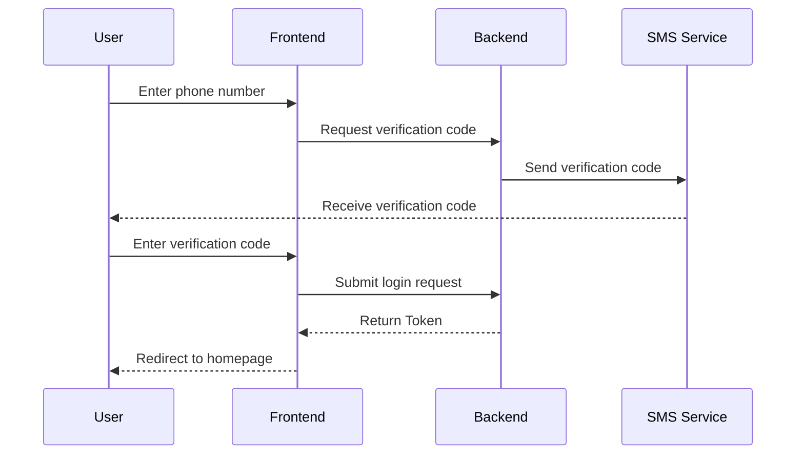
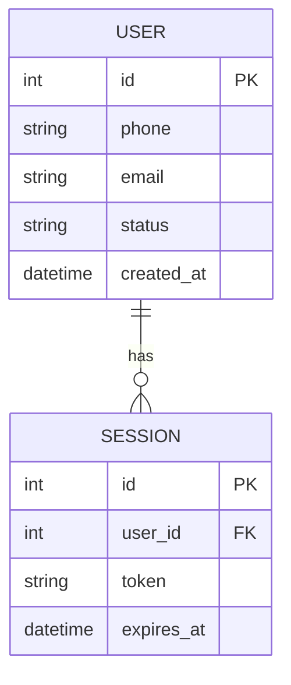

# Mermaid Diagram Quick Reference

For any visualization needed in requirement documents, always use Mermaid.

## Common Types

| Type | Typical Use | Mermaid Syntax |
|------|------------|----------------|
| Module diagram | Dependencies or boundaries between features/subsystems/packages | `graph TD` / `graph LR` |
| Flowchart | Operation steps, state machines, business branches | `flowchart` |
| Sequence diagram | Interaction sequence between users, frontend, backend, third parties | `sequenceDiagram` |
| Architecture diagram | Position of this feature in the overall system, data flow | `flowchart` / `flowchart LR` |
| **ER diagram** | **Persisted entities for this feature**, fields, relationships | **`erDiagram`** |

## When to Draw Diagrams

- Involves **more than two roles or system interactions** → Sequence diagram
- Has **3+ process branches** → Flowchart
- Involves **new/changed entities** → ER diagram
- **Inter-module calls or dependencies** → Module diagram
- Prefer drawing multiple concise diagrams over writing lengthy text descriptions of complex interactions

## Embedding Method

Diagrams are embedded within Markdown ` ```mermaid ` code blocks. For complex scenarios, split into multiple diagrams, each focusing on a single concern.

## Examples

### Sequence Diagram (Login Flow)



### ER Diagram (User and Session)


