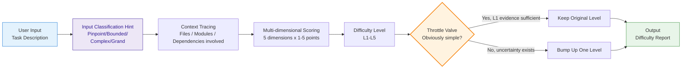

# Task Difficulty Assessment

This Skill solves a core problem: **AI models tend to underestimate task complexity**. Given a one-line requirement, models may jump straight into coding, ignoring hidden tech debt, cross-module coupling, and boundary conditions — leading to rework or quality issues.

This Skill serves as a **throttle valve**: assess difficulty before execution, provide classification and context analysis, preventing "looks simple but is actually complex" tasks from being handled carelessly.

## Core Mechanism



### Input Classification Hint

When called by the orchestrator, receives the input classification result as a scoring calibration reference (does not replace scoring):

| Input Classification | Expected Score Range | Notes |
|---------------------|---------------------|-------|
| Pinpoint | L1-L2 (1-4) | Hint is low-difficulty range, but scoring may exceed (e.g., target involves complex dependency chain) |
| Bounded | L2-L3 (2-6) | Hint is low-to-mid range |
| Complex | L3-L4 (4-8) | Hint is mid-to-high range |
| Grand | L4-L5 (7-10) | Hint is high-difficulty range |

If actual score deviates from the classification hint's expected range by > 2 levels, the deviation reason must be noted in the difficulty report.

## Difficulty Levels

| Level | Name | Typical Characteristics | Example |
|------|------|---------|------|
| **L1** | Trivial | Single file, no logic change, config/copy edit | Change button text, update version number |
| **L2** | Simple | Single module, clear logic, no cross-module impact | Add a utility function, fix a located bug |
| **L3** | Medium | Multiple files, involves 2-3 modules, requires design decisions | Add CRUD page, refactor component API |
| **L4** | Complex | Cross-module coordination, architecture impact, requires design review | Add permission system, integrate third-party payment |
| **L5** | Major | System-level changes, breaking changes, data migration | Microservice split, DB schema migration, framework upgrade |

## Upward Bias Rules (Throttle)

This is the skill's core differentiating mechanism — **weighted score bias**, not direct level jumping:

1. **Bias bump**: Weighted score +0.5 (on a 10-point scale), which may or may not cross a level boundary
2. **L1 exemption conditions**: Bias is NOT applied only when ALL of the following are met:
   - Change scope <= 1 file
   - No business logic involved
   - No cross-module imports/exports
   - No test coverage requirements
3. **Capped at 10**: Score after bias never exceeds 10
4. **Bias can be overridden**: If context analysis clearly indicates no risk (e.g., pure copy edit), bias can be removed, but reasoning must be stated in the report

## Assessment Dimensions

Score each dimension **1-10**, then compute weighted average mapped to L1-L5.

| Dimension | Weight | Assessment Content |
|------|------|---------|
| **Scope** | 30% | How many files/modules, change surface area |
| **Depth** | 25% | Technical complexity, algorithm difficulty, architecture layers |
| **Coupling** | 20% | Cross-module dependencies, cascading effects of interface changes |
| **Risk** | 15% | Cost of errors, reversibility, data safety |
| **Cognition** | 10% | Domain knowledge required, implicit business rules |

### Weighted Score to Level Mapping

| Weighted Score Range | Level |
|-----------|------|
| 1.0 - 2.0 | L1 (Trivial) |
| 2.1 - 4.0 | L2 (Simple) |
| 4.1 - 6.0 | L3 (Medium) |
| 6.1 - 8.0 | L4 (Complex) |
| 8.1 - 10.0 | L5 (Major) |

> Full scoring guidelines → `references/scoring-guide.md`

## Context Tracing

Scoring is not done in a vacuum — context must be traced first:

### Tracing Steps

```
1. Parse input → extract key entities (module names, file names, features, technical concepts)
2. Explore code → find related files, import chains, dependency relationships
3. Identify boundaries → determine direct and indirect impact scope
4. Discover risks → check test coverage, type safety, error handling, etc.
```

### Context Sources

- Project file structure (directory tree, file classification)
- Code dependency relationships (import/export chains)
- Config files (package.json, tsconfig, etc.)
- Existing test coverage
- Git history (change frequency of the affected area)

> Note: When used standalone, this skill reads project files directly for context.

## Input/Output

### Input

A task description text. Can be:
- Natural language requirement ("Add a login feature")
- Bug report ("Page goes blank after clicking submit")
- Refactoring request ("Split this component into three")
- Technical task ("Upgrade to Vue 3.5")

### Output: Difficulty Report

```markdown
# Difficulty Assessment Report

## Basic Information

- **Task**: {one-line description}
- **Original Rating**: L{n}
- **Final Rating**: L{m} {bias explanation or keep reason}

## Score Breakdown

| Dimension | Score (1-5) | Rationale |
|------|----------|------|
| Scope | {n} | {brief explanation} |
| Depth | {n} | {brief explanation} |
| Coupling | {n} | {brief explanation} |
| Risk | {n} | {brief explanation} |
| Cognition | {n} | {brief explanation} |
| **Weighted** | **{avg}** | |

## Context Analysis

### Impact Scope
- Direct impact: {files/modules list}
- Indirect impact: {potentially affected areas}

### Key Risk Points
- {risk 1}
- {risk 2}

## Execution Recommendations

{Execution strategy recommendations based on difficulty level}
```

## Python Script

```bash
python scripts/difficulty_scorer.py assess --input <task description text> [--root <project_root>] [--format json|markdown]
```

- `--root`: When project path is provided, automatically traces code context for scoring
- `--format`: Default `markdown`, `json` format for programmatic consumption

> Script implementation → `scripts/difficulty_scorer.py`
