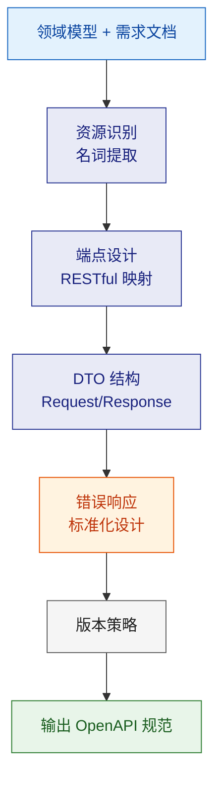
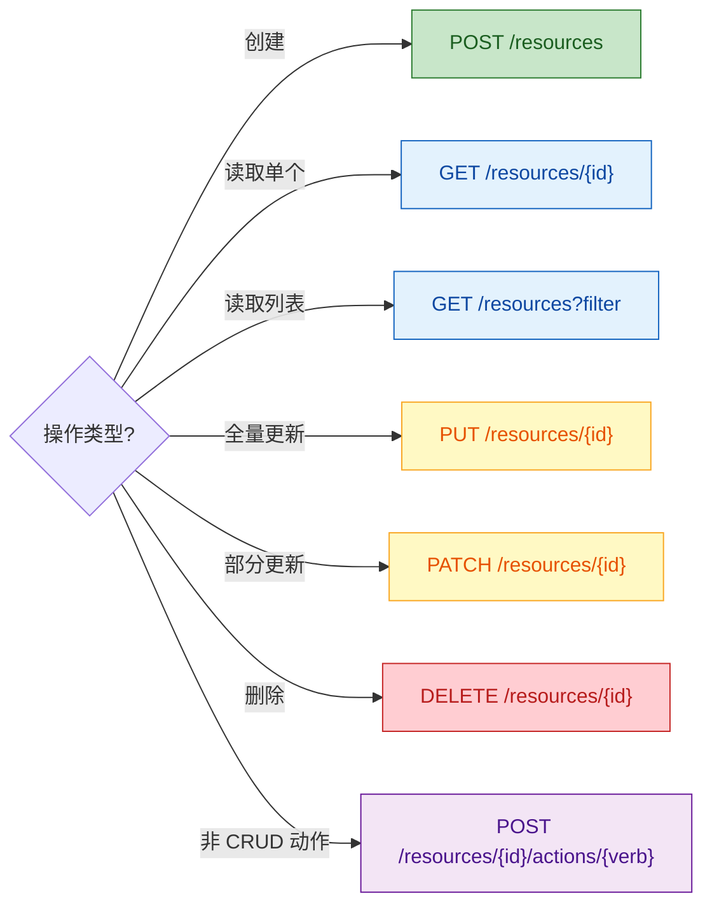
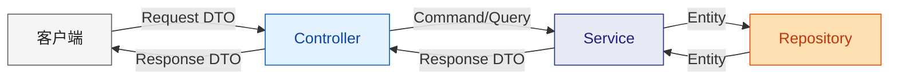
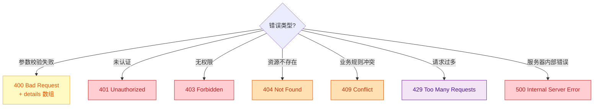
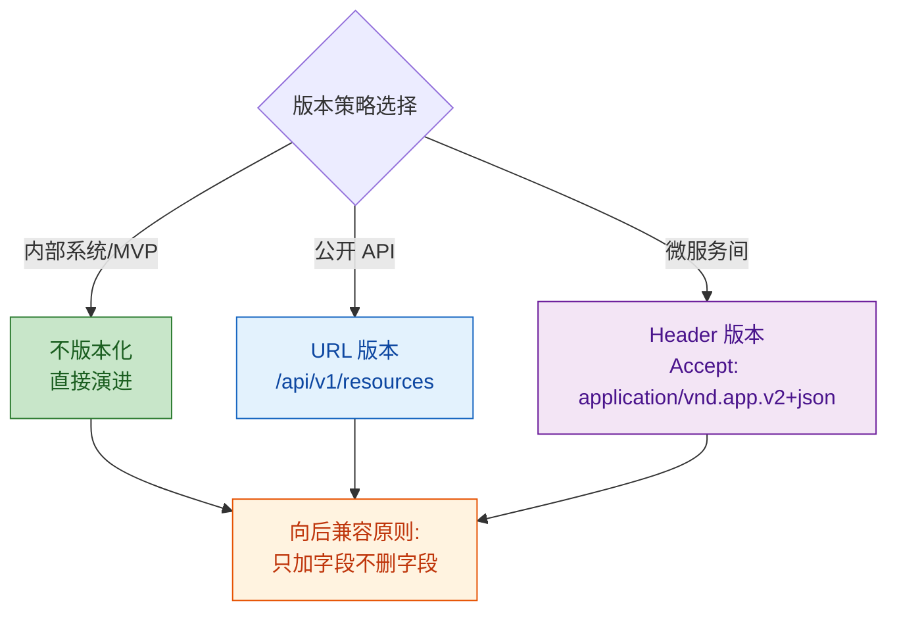

# API 契约设计

从领域模型 + 需求文档出发，产出完整的 API 接口契约。所有设计决策以 Mermaid 流程图表达。

---

## 设计流程



---

## 1. 资源识别

从领域模型中提取 API 资源：

| 领域概念 | API 资源 | 说明 |
|--|--|--|
| 聚合根 | 顶级资源 `/resources` | 直接暴露为 RESTful 资源 |
| 实体(非聚合根) | 子资源 `/resources/{id}/sub` | 通过父资源访问 |
| 值对象 | 内嵌在 DTO 中 | 不单独暴露 |
| 领域服务 | 动作端点 `/resources/{id}/actions/do` | 非 CRUD 操作 |

---

## 2. 端点设计规范

### RESTful 映射规则



### 命名规范
- 资源名：复数形式（`/users` 非 `/user`）
- 路径：kebab-case（`/migration-tasks`）
- 查询参数：camelCase（`?pageSize=20&sortBy=createdAt`）
- 嵌套不超过 2 层：`/resources/{id}/sub-resources/{subId}`

### 幂等性要求

| 方法 | 幂等? | 安全? | 说明 |
|--|--|--|--|
| GET | 是 | 是 | 只读，无副作用 |
| PUT | 是 | 否 | 全量替换，重复执行结果相同 |
| DELETE | 是 | 否 | 删除后再删返回 404/204 |
| POST | **否** | 否 | 需要额外机制保证幂等（Idempotency-Key） |
| PATCH | **否** | 否 | 视具体操作 |

---

## 3. DTO 设计规范

### 分层结构



### DTO 设计原则
- **Request DTO ≠ Entity**：不暴露内部字段（如 id、createdAt 由服务端生成）
- **Response DTO ≠ Entity**：按需裁剪字段，避免过度暴露
- **列表 DTO 精简**：列表接口返回摘要，详情接口返回完整
- **嵌套扁平化**：避免 > 3 层嵌套，可用 ID 引用代替

### 分页标准

```typescript
// 请求
interface PaginationQuery {
  page?: number;       // 默认 1
  pageSize?: number;   // 默认 20，最大 100
  sortBy?: string;
  sortOrder?: 'asc' | 'desc';
}

// 响应
interface PaginatedResponse<T> {
  data: T[];
  pagination: {
    page: number;
    pageSize: number;
    total: number;
    totalPages: number;
  };
}
```

---

## 4. 错误响应标准化

### 统一错误格式

```typescript
interface ErrorResponse {
  code: string;        // 业务错误码: "RESOURCE_NOT_FOUND"
  message: string;     // 人类可读信息
  details?: Array<{    // 字段级错误（验证失败时）
    field: string;
    message: string;
  }>;
  traceId?: string;    // 链路追踪 ID
}
```

### HTTP 状态码映射



### 错误码命名规范
- 全大写 + 下划线：`RESOURCE_NOT_FOUND`
- 前缀按模块：`USER_NOT_FOUND`、`ORDER_ALREADY_PAID`
- 不用数字编码，用语义化字符串

---

## 5. 版本管理策略



### 弃用期管理
- 新版本上线后，旧版本至少保留 **6 个月**
- 响应头添加 `Deprecation: true` + `Sunset: <date>`
- 文档标注弃用状态

---

## 6. 输出清单

设计完成后产出以下制品：

| 制品 | 格式 | 说明 |
|--|--|--|
| API 端点清单 | Markdown 表格 | 路径、方法、说明、是否幂等 |
| Request/Response DTO | TypeScript/Java 接口定义 | 每个端点的 DTO |
| 错误码目录 | Markdown 表格 | code + HTTP status + 使用场景 |
| OpenAPI 规范 | YAML | 可导入 Swagger UI |
| 契约测试用例 | 描述 | Consumer-Provider 验证点 |

---

## 参考

详细规范参见 `references/` 目录：
- `api-design-rules.md` — RESTful 设计详细规则与反模式
