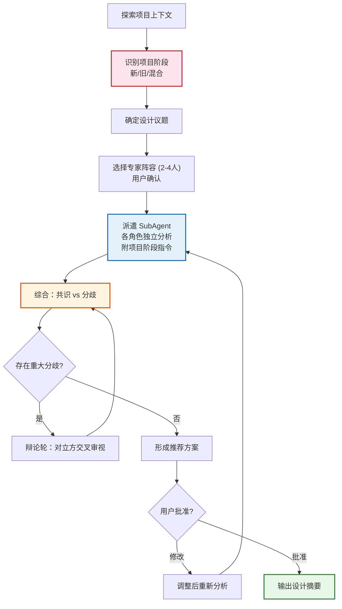

# 多视角头脑风暴（Multi-Perspective Brainstorming）

通过多个 SubAgent 扮演不同专家角色，对同一问题进行独立分析，然后综合辩论形成共识方案。解决的核心问题：单一视角容易陷入思维盲区——多视角对抗性思考能暴露隐含假设、发现遗漏风险、对比权衡方案。

<HARD-GATE>
禁止在设计方案获得用户批准之前进行任何代码实现、文件创建或脚手架搭建。无论项目看起来多简单，都必须经过至少一轮多视角分析。
</HARD-GATE>

## 反模式："这个问题很简单不需要讨论"

每个设计决策都经过本流程。即使是"简单"问题，也至少需要两个视角。简单问题的讨论可以很短（每个视角几句话），但必须存在。"简单"项目恰恰是未被检验的假设造成最多返工的地方。

## 项目阶段识别

在探索项目上下文后，主持人首先判断项目阶段，不同阶段的讨论策略截然不同：

### 新项目（Greenfield）

**识别信号**：无代码仓库 / 仓库为空 / 只有初始化脚手架

**讨论策略**：
- SubAgent 基于需求描述和领域知识分析，**不受既有架构约束**
- 方案空间完全开放——鼓励提出多种截然不同的架构/技术路线
- 风险分析聚焦：方案本身的固有缺陷、团队能力匹配、技术成熟度
- 输出侧重：初始设计决策、技术选型建议、MVP 边界

**SubAgent 额外指令**：
```
这是一个全新项目，没有现有代码约束。请大胆提出你认为最佳的方案，
不需要考虑向后兼容。重点说明：为什么选这个方案而不是其他。
```

### 旧项目（Brownfield）

**识别信号**：有实质代码 / 已有架构和技术栈 / 有技术债

**讨论策略**：
- 主持人先用 Explore SubAgent 扫描项目：目录结构、package.json/pom.xml、核心模块、近期变更
- SubAgent 收到的背景信息**必须包含现有架构摘要**
- 方案必须评估与现有系统的兼容性——直接替换 vs 渐进迁移 vs 共存
- 风险分析聚焦：改动影响范围（blast radius）、破坏性变更、迁移成本
- 输出侧重：演进策略、兼容性评估、迁移路径

**SubAgent 额外指令**：
```
这是一个已有 {技术栈} 的项目。你的方案必须考虑：
1. 与现有架构的兼容性（能否渐进引入？）
2. 改动的影响范围（会破坏哪些现有功能？）
3. 迁移路径（如需迁移，分几步？每步的风险？）
当现有方案"够用"时，不要为了架构优雅而推翻重写。
```

### 混合项目

对于"已有部分代码但要新增独立模块"的场景，新模块部分按新项目策略，与旧模块的集成部分按旧项目策略。

## 流程检查清单

按顺序执行，每步完成后标记：

1. **探索项目上下文** — 检查文件、文档、近期变更
2. **识别项目阶段** — 新项目 / 旧项目 / 混合，决定讨论策略
3. **确定议题** — 将用户问题拆分为可独立讨论的设计议题
4. **选择专家阵容** — 根据场景模板选 2-4 个角色，用户确认
5. **派遣 SubAgent** — 每个角色一个 SubAgent，附带项目阶段额外指令
6. **综合分析** — 收集各方观点，识别共识与分歧
7. **辩论轮**（如有分歧）— 针对分歧点，让对立方交叉审视
7. **形成推荐方案** — 综合权衡，明确推荐及理由
8. **用户审批** — 展示方案，获得用户确认或修改意见
9. **输出设计摘要** — 记录最终决策（可交给 spec-writing 落文档）

## 流程图



## 主持人规则

你是**主持人（Moderator）**，而非辩论参与者。你的职责：

1. **构建问题**：将模糊问题转化为 SubAgent 可独立分析的清晰命题
2. **选择阵容**：根据议题性质从 `agents/` 目录选择合适角色
3. **控制节奏**：每轮只讨论一个议题，不要贪多
4. **综合而非拼接**：各方观点需要被权衡和整合，而不是简单罗列
5. **暴露分歧**：当专家意见冲突时，明确指出冲突点和各方理由
6. **追问细节**：如果某个角色的分析过于笼统，追加一轮要求具体化

### 议题构建模板

向 SubAgent 派遣时，每个议题需包含：
- **背景**：项目上下文、已有约束、已做的决策
- **问题**：需要回答的具体设计问题（一个问题，不是多个）
- **要求回答的维度**：优势、劣势、风险、替代方案、推荐

### SubAgent 派遣模板

```
你是一位 {角色名称}。

背景：{项目上下文和约束}

设计问题：{一个具体的设计问题}

请从你的专业角度分析：
1. 你推荐的方案是什么？为什么？
2. 这个方案的主要风险和缺陷是什么？
3. 有没有更好的替代方案？
4. 如果其他人反对你的方案，最可能的理由是什么？

保持简洁，每点 2-3 句话。总字数不超过 300 字。
```

## 专家角色

角色系统采用**场景模板 + 自由组合**模式。没有"必须参与"的固定角色——由主持人根据项目场景选择最合适的阵容。

### 预置角色库

`agents/` 目录中的预置角色，按需加载：

| 角色 | 核心视角 | 典型场景 |
|------|---------|---------|
| **产品经理** (product-manager) | 用户价值、需求优先级、商业模型、MVP 范围 | 产品设计、功能规划 |
| **架构师** (architect) | 系统设计、可扩展性、技术选型、长期维护 | 技术架构决策 |
| **UI/UX 设计师** (ux-designer) | 用户体验、交互流程、信息架构、可用性 | 涉及用户界面的产品 |
| **领域专家** (domain-expert) | 业务逻辑、行业惯例、合规要求 | 有明确业务领域 |
| **务实派** (pragmatist) | 实现成本、团队能力、工期评估 | 技术可行性评估 |
| **挑战者** (challenger) | 风险、安全、失败模式、隐含假设 | 需要对抗性审视 |

### 场景模板

主持人根据项目类型选择推荐阵容，用户可调整：

| 项目场景 | 推荐阵容（3-4 人） | 说明 |
|---------|-------------------|------|
| **软件产品开发** | 产品经理 + 架构师 + UI/UX 设计师 + 领域专家 | 覆盖"做什么 + 怎么做 + 好不好用 + 对不对" |
| **技术架构决策** | 架构师 + 务实派 + 挑战者 | 纯技术方案评估 |
| **业务流程优化** | 产品经理 + 领域专家 + 挑战者 | 关注流程合理性和风险 |
| **重构/技术债** | 架构师 + 务实派 + 挑战者 | 评估改造方案可行性 |
| **新市场/新领域** | 产品经理 + 领域专家 + 挑战者 + 务实派 | 不确定性高，需多维验证 |

### 动态角色生成

当预置角色不能覆盖项目领域时，主持人**动态生成角色**：

1. **识别需要的视角**：当前阵容缺少什么维度的分析？
2. **构造角色 prompt**：

```
角色名称：{领域 + 专业方向}
你是一位 {领域} 领域的专家，拥有 {具体经验描述}。
你关注的核心维度：
- {维度1}：{一句话说明}
- {维度2}：{一句话说明}
- {维度3}：{一句话说明}
你的偏好：{2-3条}
你的盲点：{1-2条，自我意识}
输出要求：同标准模板，总字数 ≤ 300。
```

**动态生成示例**：

| 项目场景 | 动态角色 | 替换/补充谁 |
|---------|---------|------------|
| 小说创作软件 | **创作者体验专家** | 替换 领域专家 |
| 电商平台 | **增长/运营专家** | 替换 领域专家 |
| 游戏开发 | **玩家体验设计师** | 替换 UI/UX 设计师 |
| 教育产品 | **教学设计师** | 替换 领域专家 |
| 金融系统 | **合规/风控专家** | 补充到阵容中 |
| 医疗软件 | **临床工作流专家** | 替换 领域专家 |

### 选择规则

- 最少 2 人，最多 4 人
- 主持人根据场景模板推荐阵容，**派遣前向用户确认**
- 用户可替换、增减任何角色
- 每个角色自带"盲点自省"，减少对专职挑战者的依赖
- 当无专职挑战者时，主持人在综合阶段**主动补充风险审视**

## 综合与辩论

### 综合报告格式

每次 SubAgent 分析完成后，主持人输出：

```markdown
### 议题：{问题描述}

**共识**：
- {各方一致同意的要点}

**分歧**：
| 观点 | 支持方 | 反对方 | 核心理由 |
|------|--------|--------|---------|
| ... | ... | ... | ... |

**主持人推荐**：{推荐方案} — 理由：{综合权衡}
```

### 辩论轮触发条件

当且仅当满足以下任一条件时进入辩论轮：
- 两个以上角色推荐了完全不同的方案
- 某个角色指出了他人方案的 P0 级风险
- 主持人无法从当前信息判断哪个方案更优

辩论轮格式：将对立方的核心论点交叉发给对方，要求回应。最多 2 轮辩论，避免无限循环。

## 设计摘要输出

最终输出格式：

```markdown
# 设计决策摘要

## 议题
{讨论的核心问题}

## 背景与约束
{项目上下文}

## 讨论的方案
| 方案 | 支持者 | 优势 | 劣势 |
|------|--------|------|------|
| A | 架构师 | ... | ... |
| B | 务实派 | ... | ... |

## 最终决策
**选定方案**：{方案名}
**理由**：{综合理由}
**已知风险**：{接受的风险及缓解措施}
**否决方案**：{未选方案及否决理由}

## 待进一步明确
- {遗留问题，需要更多信息才能决策的点}
```

## 关键原则

- **每轮一个议题** — 不要同时讨论多个问题
- **独立分析优先** — SubAgent 先独立思考，再看他人观点
- **分歧是价值** — 一致同意可能意味着思考不够深入
- **300 字限制** — 每个角色每轮回答控制在 300 字内，防止冗长
- **用户始终有最终决定权** — 主持人推荐但不替用户做决定
- **YAGNI** — 毫不留情地删除不必要的功能和过度设计
