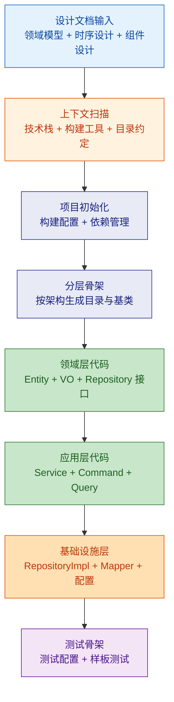
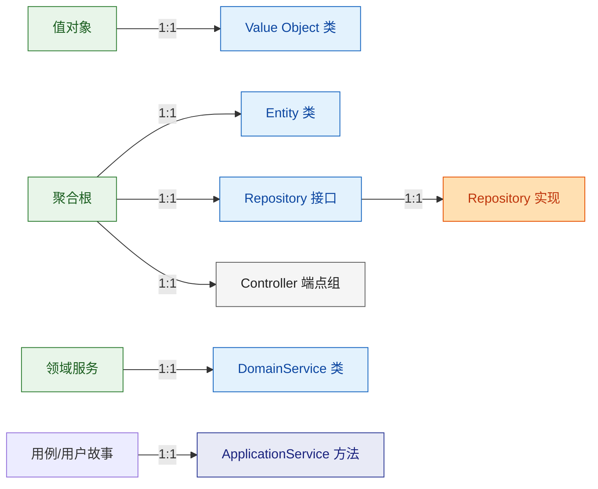

# 代码骨架生成

从领域模型 + 时序设计 + 组件设计出发，产出可编译运行的分层项目骨架。

---

## 生成流程



---

## 1. 上下文扫描

生成前先确认以下信息（从 project-context / tech-stack 获取或询问用户）：

| 扫描项 | 影响 | 示例 |
|--|--|--|
| 语言 / 框架 | 目录结构模板 | Java + Spring Boot / TypeScript + NestJS |
| 构建工具 | 配置文件 | Gradle / Maven / pnpm / npm |
| 架构模式 | 分层策略 | 分层架构 / 六边形 / 模块化单体 |
| ORM / 数据访问 | Repository 实现 | MyBatis / JPA / Prisma / TypeORM |
| 测试框架 | 测试目录与配置 | JUnit5 / Vitest / Pytest |
| Monorepo? | 顶层布局 | 单模块 / apps+packages |

---

## 2. 目录结构模板

### Java + Spring Boot（模块化单体）

```
src/
├── main/java/com/example/project/
│   ├── common/                   # 公共工具
│   │   ├── exception/            # 统一异常
│   │   ├── response/             # 统一响应
│   │   └── config/               # 全局配置
│   ├── module1/                  # 业务模块
│   │   ├── controller/
│   │   ├── dto/
│   │   │   ├── request/
│   │   │   └── response/
│   │   ├── application/          # 应用服务
│   │   ├── domain/
│   │   │   ├── entity/
│   │   │   ├── vo/
│   │   │   └── repository/       # 接口
│   │   └── infrastructure/
│   │       ├── repository/       # 实现
│   │       └── mapper/           # MyBatis Mapper
│   └── module2/
│       └── ...
├── main/resources/
│   ├── application.yml
│   ├── mapper/                   # MyBatis XML
│   └── db/migration/             # 数据库迁移脚本
└── test/java/com/example/project/
    ├── module1/
    │   ├── controller/           # Controller 测试
    │   ├── application/          # Service 测试
    │   └── domain/               # 领域逻辑测试
    └── common/
        └── BaseIntegrationTest.java
```

### TypeScript + NestJS（Monorepo）

```
apps/
├── api/
│   └── src/
│       ├── modules/
│       │   ├── module1/
│       │   │   ├── module1.module.ts
│       │   │   ├── module1.controller.ts
│       │   │   ├── module1.service.ts
│       │   │   ├── dto/
│       │   │   ├── entities/
│       │   │   └── __tests__/
│       │   └── module2/
│       ├── common/
│       │   ├── filters/
│       │   ├── guards/
│       │   └── interceptors/
│       └── main.ts
packages/
├── shared/
│   └── src/
│       ├── types/
│       └── utils/
```

---

## 3. 分层骨架生成规则

### 从领域模型到代码的映射



### 各层职责与约束

| 层级 | 职责 | 允许依赖 | 禁止依赖 |
|--|--|--|--|
| Controller | HTTP 入口、参数校验、DTO 转换 | Application 层 | Domain 直接操作 |
| Application | 用例编排、事务控制 | Domain 层、Repository 接口 | Infrastructure 具体实现 |
| Domain | 核心业务规则、不变量约束 | 仅自身（无外部依赖） | 任何框架注解 |
| Infrastructure | 持久化实现、外部集成 | Domain 层(实现接口) | Controller / Application |

---

## 4. Entity 骨架生成

每个聚合根生成以下内容：

### Java 示例

```java
// domain/entity/MigrationTask.java
public class MigrationTask {
    private Long id;
    private String name;
    private TaskStatus status;
    private LocalDateTime createdAt;
    private LocalDateTime updatedAt;

    // 领域行为（从用例提取）
    public void start() {
        if (this.status != TaskStatus.CONFIGURED) {
            throw new TaskNotExecutableException(this.id);
        }
        this.status = TaskStatus.RUNNING;
    }
}
```

### TypeScript 示例

```typescript
// entities/migration-task.entity.ts
export class MigrationTask {
  constructor(
    public readonly id: string,
    public name: string,
    public status: TaskStatus,
    public readonly createdAt: Date,
    public updatedAt: Date,
  ) {}

  start(): void {
    if (this.status !== TaskStatus.CONFIGURED) {
      throw new TaskNotExecutableError(this.id);
    }
    this.status = TaskStatus.RUNNING;
  }
}
```

### 生成要素
- 从领域模型提取**所有字段**（属性名、类型、约束）
- 从时序设计提取**领域行为方法**（方法签名 + 前置校验）
- 值对象用不可变类/`readonly` 表达
- 状态字段用枚举

---

## 5. Repository + Service 骨架

### Repository 接口（领域层）

```java
public interface MigrationTaskRepository {
    Optional<MigrationTask> findById(Long id);
    List<MigrationTask> findByStatus(TaskStatus status);
    MigrationTask save(MigrationTask task);
    void deleteById(Long id);
}
```

### ApplicationService（应用层）

```java
@Service
@Transactional
public class MigrationTaskAppService {

    private final MigrationTaskRepository taskRepository;

    // 从用例 US001~US008 提取方法
    public MigrationTaskResponse createTask(CreateTaskCommand command) {
        // TODO: 实现
        throw new UnsupportedOperationException();
    }

    public void startTask(Long taskId) {
        // TODO: 实现
        throw new UnsupportedOperationException();
    }
}
```

### 生成原则
- 每个 `TODO` 对应一个用户故事
- Repository 方法从时序设计的数据库调用提取
- Service 方法签名从时序设计的调用链提取
- 骨架代码可编译但抛出 `UnsupportedOperationException`

---

## 6. 测试骨架

### 测试配置

```java
// BaseIntegrationTest.java
@SpringBootTest
@Transactional
@Rollback
public abstract class BaseIntegrationTest {
    // 集成测试基类，自动回滚
}
```

### 单元测试骨架

```java
class MigrationTaskTest {

    @Test
    void should_start_task_when_status_is_configured() {
        // TODO: 实现
    }

    @Test
    void should_throw_when_starting_non_configured_task() {
        // TODO: 实现
    }
}
```

### 生成原则
- 每个 Entity 领域行为 → 至少 1 个正向 + 1 个异常测试骨架
- 每个 Service 方法 → 1 个集成测试骨架
- 测试命名：`should_[行为]_when_[条件]`

---

## 7. 输出清单

| 制品 | 说明 |
|--|--|
| 项目目录结构 | 完整目录树，含 README |
| 构建配置 | build.gradle / pom.xml / package.json |
| Entity 类 | 所有聚合根 + 值对象 |
| Repository 接口 + 实现 | 数据访问层 |
| Service 骨架 | 所有用例对应的方法(TODO) |
| Controller 骨架 | RESTful 端点 |
| DTO 类 | Request + Response |
| 测试骨架 | 单元测试 + 集成测试基类 |
| 配置文件 | application.yml / .env |

---

## 参考

详细模板与规则参见 `references/` 目录：
- `scaffold-rules.md` — 各技术栈骨架生成详细规则与检查清单
