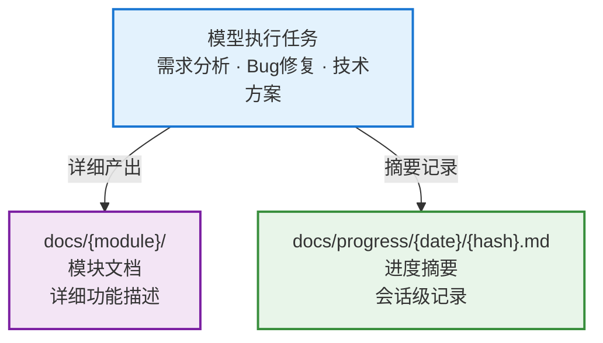

# 文档产出管理

本 Skill 解决两个核心问题：

1. **文档产出缺乏统一组织**：模块文档散落、分类混乱
2. **缺少任务进度记录**：模型处理需求/修复 Bug 后没有简要摘要，回溯困难

本 Skill 管理 `docs/` 目录的两类内容：模块详细文档 + 进度摘要记录。

## 数据模型



## 原则

- **被动调用**：本 skill 不会自动触发，仅在需要创建/管理文档或记录进度时被调用。
- **模块化组织**：模块文档按业务维度分目录。
- **一会话一文件**：进度记录按日期/会话hash独立存放，多人不冲突。
- **只管结构不管内容格式**：文档内容格式由调用方决定。
- **Git 账号标识**：进度记录头部包含开发者 Git 账号。

## 目录结构

```
docs/
├── auth/                              # 业务模块 — 详细文档
│   ├── login.md
│   └── register.md
├── user/
│   ├── profile.md
│   └── settings.md
├── progress/                          # 进度记录
│   ├── 2024-01-15/
│   │   ├── a3f8c1.md                  # 会话hash
│   │   └── b7d2e4.md
│   ├── 2024-01-16/
│   │   └── c9e5f0.md
│   └── archive/                       # 归档（>30天）
│       └── 2024-01/
│           └── ...
```

### 模块文档规则

- 一级目录 = 业务模块（如 `auth`、`user`、`dashboard`）
- 二级文件 = 页面/功能点（如 `login.md`、`register.md`）
- 模块名和文件名使用 kebab-case
- 中文项目可用中文命名

### 进度记录规则

- 路径：`docs/progress/{YYYY-MM-DD}/{会话hash}.md`
- 会话hash：6位随机十六进制（如 `a3f8c1`），保证唯一
- 同一天可有多个会话文件（不同人/不同任务）

> 完整命名规则见 → `references/naming-rules.md`

## 进度记录模板

```markdown
# {主题}

- **日期**: YYYY-MM-DD
- **开发者**: {git user.name} <{git user.email}>
- **类型**: 需求开发 | Bug修复 | 技术方案 | 重构 | 其他

## 任务摘要

（一两句话描述本次会话完成了什么）

## 变更文件

- `path/to/file1.ts` — 修改原因

## 决策记录

（简要记录重要的技术决策）

## 遗留问题

（未完成的事项或待跟进的问题）
```

## 核心能力（被动 API）

### 1. create — 创建模块文档

在指定模块目录下创建新文档。

- 自动创建模块目录（如不存在）
- 生成空白文档（仅包含一级标题）

### 2. progress — 记录进度

创建一份会话进度摘要。

- 自动获取 Git 账号信息
- 生成日期目录和会话hash文件
- 填充进度模板

### 3. list — 列出文档

按模块和进度分别列出 docs/ 下所有内容。

### 4. validate — 校验目录

检查文档目录的基本健康状态。

### 5. archive — 归档旧进度

将超过 30 天的进度记录移入 `progress/archive/YYYY-MM/`。

## 多人协作

- **模块粒度隔离**：不同开发者负责不同模块目录，天然避免文件冲突
- **进度无冲突**：每个会话独立文件（日期+hash），多人同时工作不会冲突
- **分支工作流**：每人在独立 Git 分支上工作，通过 PR 合入
- **Git 账号追溯**：进度记录头部包含 `git user.name` 和 `git user.email`，可追溯到具体开发者

## Python 脚本

```bash
python scripts/docs_manager.py create   --root <project_root> --module <模块名> --name <文档名> [--title <一级标题>]
python scripts/docs_manager.py progress --root <project_root> --topic <主题> --type <类型> --summary <摘要> [--files <变更文件JSON>] [--decisions <决策>] [--todos <遗留>]
python scripts/docs_manager.py list     --root <project_root>
python scripts/docs_manager.py validate --root <project_root>
python scripts/docs_manager.py archive  --root <project_root> [--older-than <天数>]
```

> 输出均为 JSON 格式，便于模型解析。
