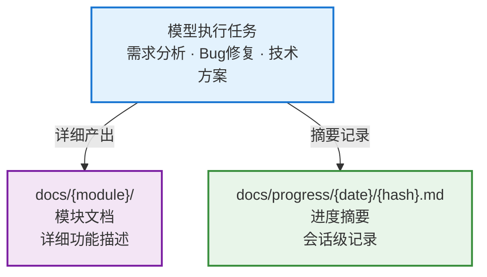

# 文档产出管理

本 Skill 解决两个核心问题：

1. **文档产出缺乏统一组织**：模块文档散落、分类混乱
2. **缺少任务进度记录**：模型处理需求/修复 Bug 后没有简要摘要，回溯困难

本 Skill 管理 `docs/` 目录的两类内容：模块详细文档 + 进度摘要记录。

## 数据模型



## 原则

- **编排器强制调用**：本 skill 是基础设施，由 orchestrator 在 Plan 末尾和 Deliver 阶段强制调用，禁止跳过。
- **模块化组织（强制）**：模块文档必须按业务维度分目录（如 `docs/auth/login.md`）。**禁止扁平输出**（如 `docs/login.md`）。
- **一会话一文件**：进度记录按日期/会话hash独立存放，多人不冲突。
- **只管结构不管内容格式**：文档内容格式由调用方决定。
- **Git 账号标识**：进度记录头部包含开发者 Git 账号。

## 禁止事项

- **禁止**将文档直接放在 `docs/` 根目录下（如 `docs/login.md`）。必须放在业务模块子目录下（如 `docs/auth/login.md`）。
- **禁止**跳过本 skill。如果任务产生了文档，必须通过本 skill 组织存放。
- **禁止**省略进度记录。每次任务完成必须写入 `docs/progress/{date}/{username}_{hash}.md`。

## 目录结构

```
docs/
├── auth/                              # 业务模块 — 详细文档
│   ├── login.md
│   └── register.md
├── user/
│   ├── profile.md
│   └── settings.md
├── progress/                          # 进度记录
│   ├── 2024-01-15/
│   │   ├── zhangsan_a3f8c1.md         # 用户名_会话hash
│   │   └── lisi_b7d2e4.md
│   ├── 2024-01-16/
│   │   └── zhangsan_c9e5f0.md
│   └── archive/                       # 归档（>30天）
│       └── 2024-01/
│           └── ...
```

### 模块文档规则

- 一级目录 = 业务模块（如 `auth`、`user`、`dashboard`）
- 二级文件 = 页面/功能点（如 `login.md`、`register.md`）
- 模块名和文件名使用 kebab-case
- 中文项目可用中文命名

### 进度记录规则

- 路径：`docs/progress/{YYYY-MM-DD}/{username}_{会话hash}.md`
- username：取 `git config user.name`（空格替换为 `-`，全小写）
- 会话hash：6位随机十六进制（如 `a3f8c1`），保证唯一
- **同会话持续追加**：同一个 Agent 会话窗口内，所有进度记录追加到同一个文件中，不新建文件。只有切换到新会话窗口时才生成新的会话hash。
- 同一天可有多个会话文件（不同人/不同任务）

> 完整命名规则见 → `references/naming-rules.md`

## 进度记录模板

每个文件包含一个或多个**记录条目**。同会话中每完成一个任务，追加一个 `---` 分隔的条目。**仅包含有内容的段落**，空段落不输出：

```markdown
# 会话进度：{username}_{hash}

> huyongle <568055454@qq.com> · 2026-04-09 10:38:13 起

---

## [10:38:13] 用户认证模块需求分析 · 需求开发

完成登录/注册流程的领域模型设计

- `docs/auth/login.md` — 新增登录流程文档

> **决策**: 采用 JWT + Refresh Token 双令牌方案

---

## [10:52:40] 修复 Token 刷新竞态 · Bug修复

并发 refresh 导致旧 token 覆盖新 token，用互斥锁解决

> **遗留**: 补充 refresh token 过期降级方案

---

## [11:05:22] 代码审查 · 其他

Review PR #42，无变更
```

> 规则：类型合并到标题（`[时间] 主题 · 类型`）；变更文件直接列在摘要后；决策/遗留用 `>` 引用块；无内容的段落不输出。

## 核心能力

### 1. create — 创建模块文档

在指定模块目录下创建新文档。

- 自动创建模块目录（如不存在）
- 生成空白文档（仅包含一级标题）

### 2. progress — 记录进度

创建或追加会话进度记录。

- 首次调用：新建 `{username}_{hash}.md`，写入头部（Git 信息）+ 首条记录
- 传入 `--session-id`：追加条目到已有文件，每条记录带 `[HH:mm:ss]` 秒级时间
- 返回 `session_id`，后续调用复用

### 3. list — 列出文档

按模块和进度分别列出 docs/ 下所有内容。

### 4. validate — 校验目录

检查文档目录的基本健康状态。

### 5. archive — 归档旧进度

将超过 30 天的进度记录移入 `progress/archive/YYYY-MM/`。

## 多人协作

- **模块粒度隔离**：不同开发者负责不同模块目录，天然避免文件冲突
- **进度无冲突**：每个会话独立文件（日期+hash），多人同时工作不会冲突
- **分支工作流**：每人在独立 Git 分支上工作，通过 PR 合入
- **Git 账号追溯**：进度记录头部包含 `git user.name` 和 `git user.email`，可追溯到具体开发者

## Python 脚本

```bash
python scripts/docs_manager.py create   --root <project_root> --module <模块名> --name <文档名> [--title <一级标题>]
python scripts/docs_manager.py progress --root <project_root> --topic <主题> --type <类型> --summary <摘要> [--session-id <会话ID>] [--files <变更文件JSON>] [--decisions <决策>] [--todos <遗留>]
python scripts/docs_manager.py list     --root <project_root>
python scripts/docs_manager.py validate --root <project_root>
python scripts/docs_manager.py archive  --root <project_root> [--older-than <天数>]
```

> 输出均为 JSON 格式，便于模型解析。
