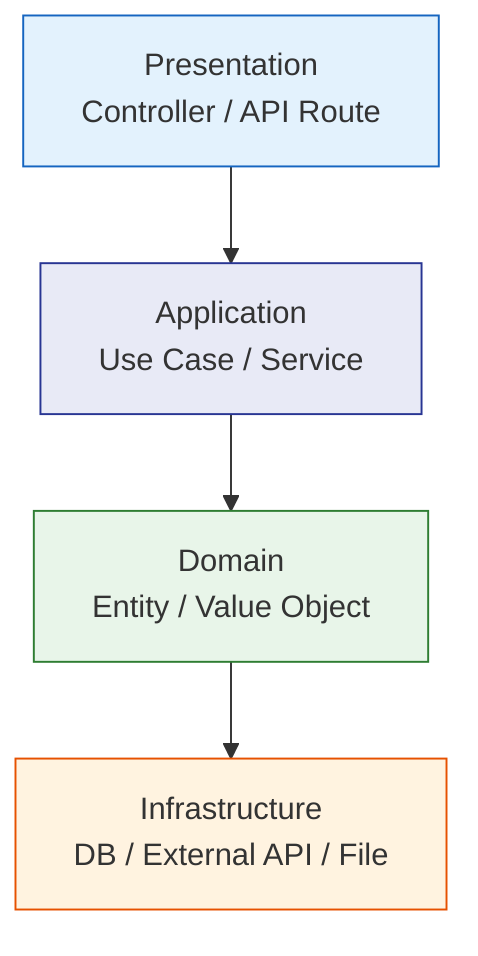
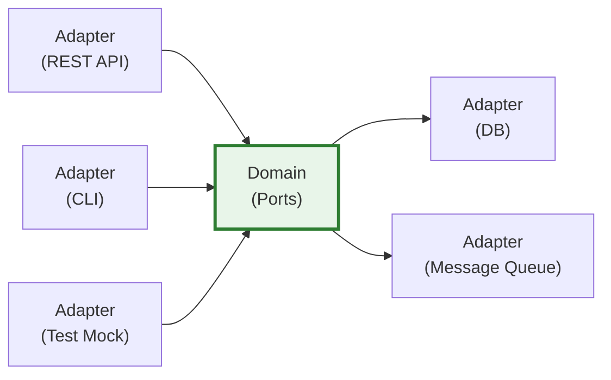
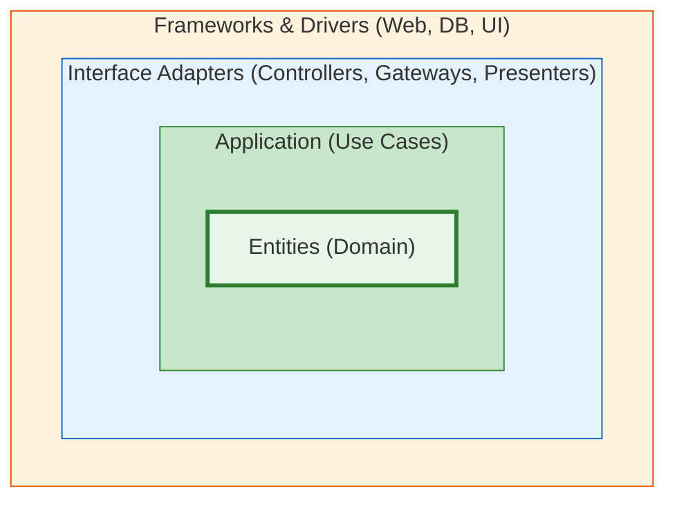
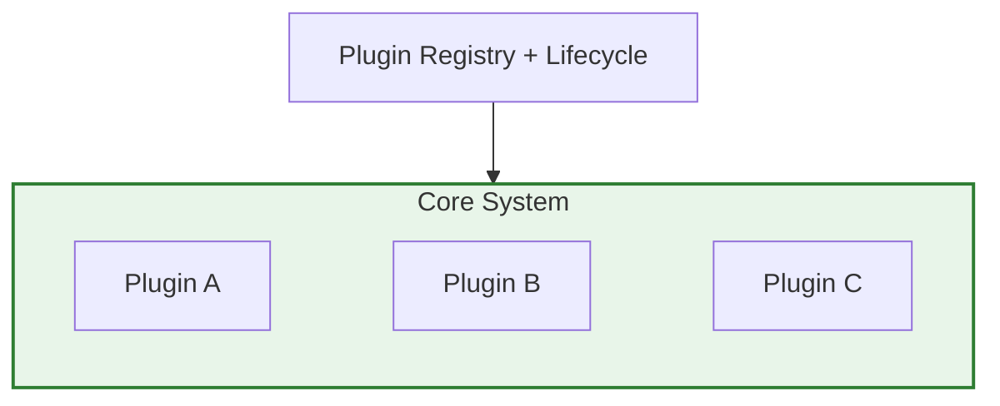
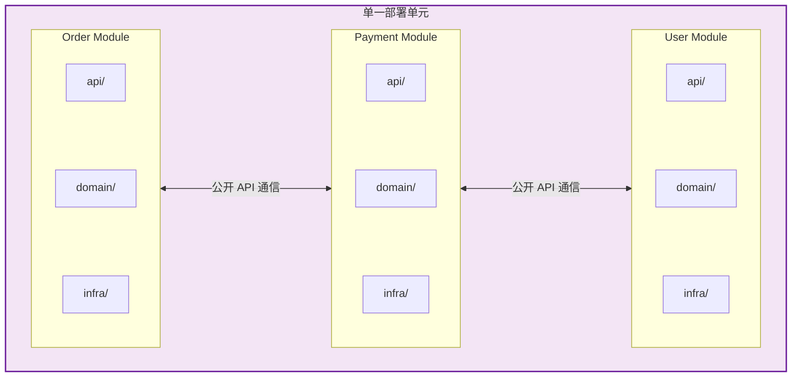
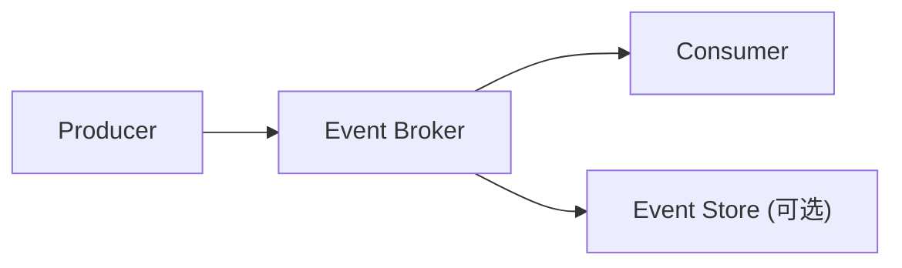
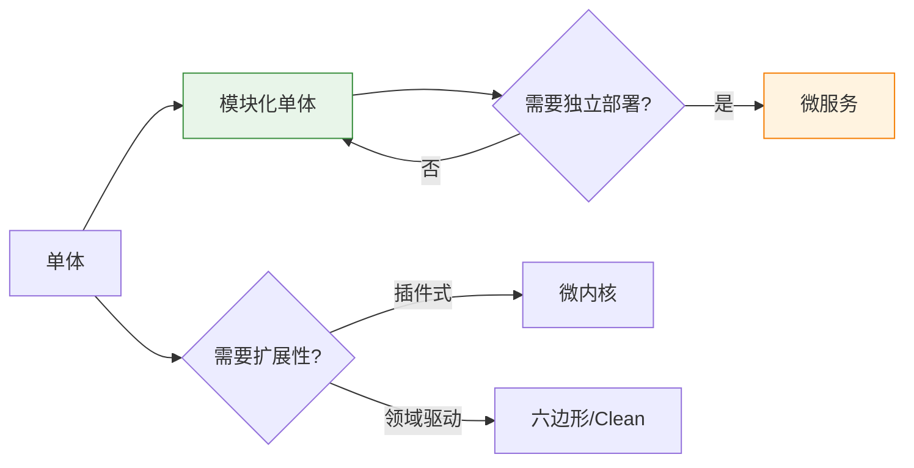

# 架构模式（系统级）

系统或应用级别的架构决策。选择架构前先回答：**团队规模、部署约束、业务复杂度、变化频率**。

## 架构选型决策表

| 场景 | 推荐架构 | 不推荐 |
|------|---------|--------|
| 小团队，业务简单，快速上线 | **模块化单体** | 微服务（运维成本高） |
| 业务逻辑复杂，领域边界清晰 | **六边形 / Clean Architecture** | 传统分层（领域逻辑泄漏） |
| 需要第三方扩展，核心稳定 | **微内核（插件架构）** | 硬编码扩展点 |
| 团队 > 30 人，独立部署需求 | **微服务** | 单体（团队协作瓶颈） |
| 高吞吐，异步处理为主 | **事件驱动架构** | 同步 RPC 链 |
| 流量波动大，按需计费 | **Serverless** | 长连接/有状态服务 |
| 遗留系统渐进重构 | **模块化单体 → 渐进拆分** | 全量重写 |

---

## 分层架构 (Layered / N-Tier)

最基础的架构，适合大多数中小项目。



**核心规则**: 依赖只能向下，不能跨层或向上依赖。

**适用**: 业务逻辑不复杂、团队对 DDD 不熟悉的项目。

**注意**: 容易退化为"所有逻辑都写在 Service 层"的贫血架构。

---

## 六边形架构 / 端口与适配器 (Hexagonal / Ports & Adapters)

领域逻辑在中心，外部依赖通过端口/适配器接入。



**核心概念**:
- **Port**: 领域定义的接口（如 `UserRepository`、`PaymentGateway`）
- **Adapter**: 外部实现（如 `PostgresUserRepository`、`StripePaymentAdapter`）
- 领域层不依赖任何框架或基础设施

```typescript
// Port（领域定义）
interface OrderRepository {
  save(order: Order): Promise<void>
  findById(id: OrderId): Promise<Order | null>
}

// Adapter（基础设施实现）
class TypeORMOrderRepository implements OrderRepository {
  async save(order: Order) { /* TypeORM 实现 */ }
  async findById(id: OrderId) { /* TypeORM 实现 */ }
}

// 领域服务只依赖 Port，不知道具体实现
class PlaceOrderUseCase {
  constructor(
    private orderRepo: OrderRepository,   // Port
    private payment: PaymentGateway,      // Port
  ) {}
}
```

**适用**: 业务逻辑复杂、需要高可测试性、可能更换基础设施（换数据库、换消息队列）。

---

## Clean Architecture（整洁架构）

同心圆依赖规则：内层不知道外层的存在。



**依赖规则**: 依赖方向只能从外向内。内层定义接口，外层实现。

**与六边形的区别**: Clean Architecture 更强调 Use Case 层的独立性，明确区分 Entity（领域规则）和 Use Case（应用规则）。

**适用**: 大型项目、长期维护、多团队协作。引入成本较高，小项目慎用。

---

## 微内核 / 插件架构 (Microkernel / Plugin)

稳定核心 + 可插拔扩展。



**核心结构**:

```typescript
// 插件契约
interface Plugin {
  name: string
  version: string
  install(core: CoreAPI): void
  destroy?(): void
}

// 核心系统
class PluginManager {
  private plugins = new Map<string, Plugin>()

  register(plugin: Plugin) {
    plugin.install(this.coreAPI)
    this.plugins.set(plugin.name, plugin)
  }

  unregister(name: string) {
    this.plugins.get(name)?.destroy?.()
    this.plugins.delete(name)
  }
}

// 核心 API（暴露给插件的受控接口）
interface CoreAPI {
  registerRoute(path: string, handler: Handler): void
  registerHook(event: string, callback: Function): void
  getConfig(key: string): unknown
}
```

**适用场景**:
- IDE / 编辑器（VS Code 就是微内核）
- 低代码平台（组件即插件）
- 工具链（Webpack/Vite 的 Plugin 系统）
- 需要第三方扩展但核心保持稳定

**关键决策**: 核心 API 的粒度——太粗则插件无法做有用的事，太细则核心变动会破坏所有插件。

---

## 模块化单体 (Modular Monolith)

单部署单元，但内部模块边界清晰。微服务的前序架构。



**核心规则**:
- 每个模块有独立的 `api/`（对外接口）、`domain/`、`infra/`
- 模块间只通过公开 API 或事件通信，**禁止直接 import 另一个模块的内部类**
- 可共享数据库，但表归属明确（或每个模块独立 schema）

```typescript
// 模块公开 API
// modules/order/api/order.facade.ts
export class OrderFacade {
  async createOrder(dto: CreateOrderDto): Promise<OrderId> { ... }
  async getOrderStatus(id: OrderId): Promise<OrderStatus> { ... }
}

// 其他模块通过 Facade 调用，不直接访问 Order 的 domain/infra
// modules/payment/domain/payment.service.ts
class PaymentService {
  constructor(private orderFacade: OrderFacade) {} // 通过 API 而非内部类
}
```

**适用**: 大多数项目的最佳起点。比单体有更好的边界，比微服务少运维负担。未来可按模块拆分为微服务。

---

## 微服务 (Microservices)

独立部署、独立数据存储、通过网络通信。

**引入条件**（全部满足才考虑）:
- 团队 > 30 人，需要独立发布节奏
- 不同服务有显著不同的扩展需求（如搜索需要弹性扩容）
- 已验证过模块化单体，边界足够清晰

**关键决策**:

| 决策点 | 选项 |
|-------|------|
| 通信 | 同步 REST/gRPC vs 异步消息队列 |
| 数据 | 每服务独立数据库 vs 共享数据库（不推荐） |
| 事务 | Saga vs 最终一致性 |
| 发现 | 服务注册 vs DNS vs API Gateway |
| 观测 | 分布式追踪 + 集中日志 + 健康检查 |

**常见陷阱**:
- 分布式单体：服务间强依赖，改一个要发多个
- 过度拆分：每个 CRUD 一个服务
- 忽略运维成本：CI/CD、监控、日志、链路追踪的复杂度

---

## 事件驱动架构 (Event-Driven Architecture)

以事件为核心的异步通信模式。



**两种模式**:

| 模式 | 描述 | 适用 |
|------|------|------|
| **Event Notification** | 事件只携带 ID，消费者回查详情 | 简单通知，不关心历史 |
| **Event-Carried State Transfer** | 事件携带完整数据 | 消费者需要自治，减少回查 |

**适用**: 高吞吐异步处理、服务间解耦、审计日志、实时数据管道。

**注意**: 事件顺序、幂等性、最终一致性是必须解决的问题。

---

## Serverless / FaaS

函数即服务，按调用计费。

**适用场景**:
- Webhook 处理、定时任务、文件处理
- 流量极不均匀（高峰/低谷差异大）
- 无状态计算

**不适用**:
- 长时间运行的任务（超时限制）
- 需要 WebSocket/长连接
- 冷启动敏感的低延迟场景

---

## 架构演进路径



> **默认推荐路径**: 单体 → 模块化单体 → 按需拆微服务。不要跳过模块化单体直接上微服务。
