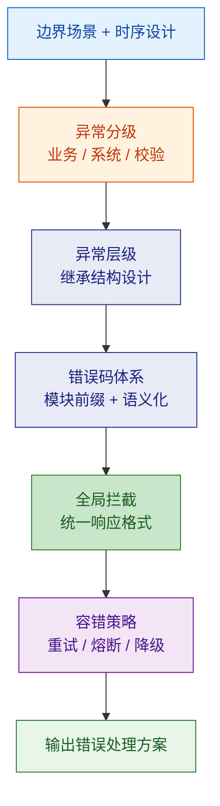
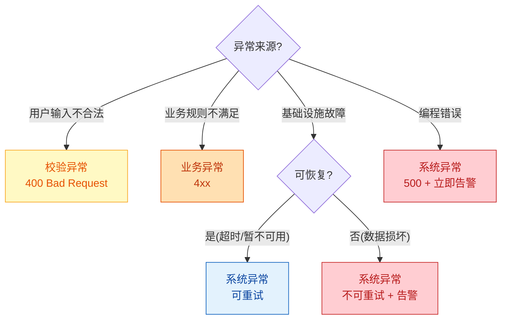
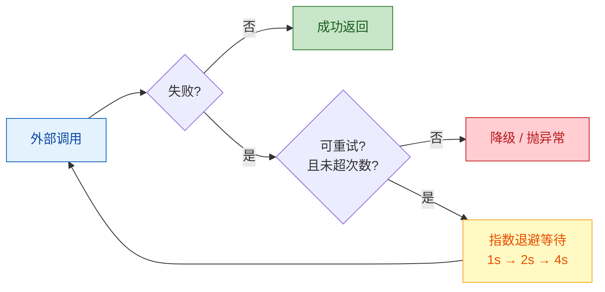

# 错误处理与容错设计

从边界场景出发，产出完整的异常体系 + 错误码规范 + 容错策略。

---

## 设计流程



---

## 1. 异常分级

所有异常分为三大类，处理策略不同：

| 异常级别 | 含义 | HTTP 状态码 | 是否记日志 | 是否告警 |
|--|--|--|--|--|
| 业务异常 | 可预期的业务规则违反 | 400/404/409 | INFO | 否 |
| 校验异常 | 参数不合法 | 400 | WARN | 累积告警 |
| 系统异常 | 不可预期的技术故障 | 500 | ERROR | 立即告警 |

### 判定流程



---

## 2. 异常层级设计

### Java 异常继承结构

```java
// 基础异常
public abstract class BaseException extends RuntimeException {
    private final String errorCode;
    private final int httpStatus;

    protected BaseException(String errorCode, int httpStatus, String message) {
        super(message);
        this.errorCode = errorCode;
        this.httpStatus = httpStatus;
    }
}

// 业务异常基类
public class BusinessException extends BaseException {
    public BusinessException(String errorCode, String message) {
        super(errorCode, 400, message);
    }
    public BusinessException(String errorCode, int httpStatus, String message) {
        super(errorCode, httpStatus, message);
    }
}

// 系统异常基类
public class SystemException extends BaseException {
    private final boolean retryable;

    public SystemException(String errorCode, String message, boolean retryable) {
        super(errorCode, 500, message);
        this.retryable = retryable;
    }
}

// 校验异常
public class ValidationException extends BaseException {
    private final List<FieldError> fieldErrors;

    public ValidationException(List<FieldError> fieldErrors) {
        super("VALIDATION_ERROR", 400, "参数校验失败");
        this.fieldErrors = fieldErrors;
    }
}
```

### 模块级业务异常

```java
// 每个模块继承 BusinessException
public class TaskNotFoundException extends BusinessException {
    public TaskNotFoundException(Long taskId) {
        super("TASK_NOT_FOUND", 404,
              "迁移任务不存在: " + taskId);
    }
}

public class TaskNotExecutableException extends BusinessException {
    public TaskNotExecutableException(Long taskId) {
        super("TASK_NOT_EXECUTABLE", 409,
              "任务状态不允许执行: " + taskId);
    }
}
```

### TypeScript 异常结构

```typescript
export abstract class BaseError extends Error {
  constructor(
    public readonly code: string,
    public readonly httpStatus: number,
    message: string,
  ) {
    super(message);
    this.name = this.constructor.name;
  }
}

export class BusinessError extends BaseError {
  constructor(code: string, message: string, httpStatus = 400) {
    super(code, httpStatus, message);
  }
}

export class SystemError extends BaseError {
  constructor(
    code: string,
    message: string,
    public readonly retryable: boolean = false,
  ) {
    super(code, 500, message);
  }
}
```

---

## 3. 错误码体系

### 命名规则
- 全大写 + 下划线
- 格式：`{MODULE}_{NOUN}_{VERB/STATE}`
- 示例：`TASK_NOT_FOUND`、`ORDER_ALREADY_PAID`、`DATASOURCE_CONNECTION_FAILED`

### 错误码注册表

| 错误码 | HTTP | 模块 | 含义 |
|--|--|--|--|
| VALIDATION_ERROR | 400 | 公共 | 参数校验失败 |
| UNAUTHORIZED | 401 | 公共 | 未认证 |
| FORBIDDEN | 403 | 公共 | 无权限 |
| RESOURCE_NOT_FOUND | 404 | 公共 | 通用资源不存在 |
| RATE_LIMITED | 429 | 公共 | 请求过多 |
| INTERNAL_ERROR | 500 | 公共 | 未知内部错误 |
| TASK_NOT_FOUND | 404 | 任务 | 任务不存在 |
| TASK_NOT_EXECUTABLE | 409 | 任务 | 任务状态不允许执行 |
| TASK_NOT_DELETABLE | 409 | 任务 | 运行中任务不可删除 |

### 错误码设计规则
- **不用数字编码**：用语义化字符串，可读性强
- **每个模块维护自己的错误码**：避免全局编号冲突
- **错误码不暴露实现细节**：不出现表名、字段名

---

## 4. 全局错误拦截

### Spring Boot

```java
@RestControllerAdvice
public class GlobalExceptionHandler {

    @ExceptionHandler(BusinessException.class)
    public ResponseEntity<ErrorResponse> handleBusiness(BusinessException e) {
        return ResponseEntity.status(e.getHttpStatus())
            .body(new ErrorResponse(e.getErrorCode(), e.getMessage()));
    }

    @ExceptionHandler(ValidationException.class)
    public ResponseEntity<ErrorResponse> handleValidation(ValidationException e) {
        return ResponseEntity.badRequest()
            .body(new ErrorResponse(e.getErrorCode(), e.getMessage(),
                                    e.getFieldErrors()));
    }

    @ExceptionHandler(SystemException.class)
    public ResponseEntity<ErrorResponse> handleSystem(SystemException e) {
        log.error("系统异常: {}", e.getErrorCode(), e);
        // 不暴露内部错误详情
        return ResponseEntity.internalServerError()
            .body(new ErrorResponse("INTERNAL_ERROR", "服务暂时不可用"));
    }

    @ExceptionHandler(Exception.class)
    public ResponseEntity<ErrorResponse> handleUnexpected(Exception e) {
        log.error("未预期异常", e);
        return ResponseEntity.internalServerError()
            .body(new ErrorResponse("INTERNAL_ERROR", "服务暂时不可用"));
    }
}
```

### NestJS

```typescript
@Catch()
export class GlobalExceptionFilter implements ExceptionFilter {
  catch(exception: unknown, host: ArgumentsHost) {
    const ctx = host.switchToHttp();
    const response = ctx.getResponse();

    if (exception instanceof BaseError) {
      response.status(exception.httpStatus).json({
        code: exception.code,
        message: exception.message,
      });
    } else {
      response.status(500).json({
        code: 'INTERNAL_ERROR',
        message: '服务暂时不可用',
      });
    }
  }
}
```

---

## 5. 容错策略

### 重试策略



| 参数 | 默认值 | 说明 |
|--|--|--|
| 最大重试次数 | 3 | 含首次调用 |
| 初始等待 | 1 秒 | 首次重试间隔 |
| 退避乘数 | 2 | 指数退避 |
| 最大等待 | 30 秒 | 单次等待上限 |
| 可重试异常 | 超时、503、网络错误 | 不重试 4xx |

### 熔断器

| 状态 | 行为 | 进入条件 |
|--|--|--|
| CLOSED | 正常放行 | 默认状态 |
| OPEN | 快速失败 | 连续失败 >= 5 次 或 错误率 > 50% |
| HALF_OPEN | 试探放行 | 熔断持续 30 秒后 |

### 降级策略

| 场景 | 降级方案 |
|--|--|
| 缓存服务不可用 | 直接查数据库 |
| 第三方 API 超时 | 返回缓存数据 + 标记"非实时" |
| 非核心功能异常 | 返回默认值/静默跳过 |
| 写入失败 | 投入死信队列，后续补偿 |

---

## 6. 防御式编程

### 边界校验原则
- **Controller 层**：@Valid 注解校验请求参数
- **Service 层**：业务前置条件校验（Guard Clause）
- **Domain 层**：不变量校验（状态机合法性）

### Guard Clause 模式

```java
public void startTask(Long taskId) {
    var task = taskRepository.findById(taskId)
        .orElseThrow(() -> new TaskNotFoundException(taskId));

    if (task.getStatus() != TaskStatus.CONFIGURED) {
        throw new TaskNotExecutableException(taskId);
    }

    task.start();
    taskRepository.save(task);
}
```

---

## 7. 输出清单

| 制品 | 说明 |
|--|--|
| 异常类层级图 | 继承结构 Mermaid classDiagram |
| 异常基类代码 | BaseException + BusinessException + SystemException |
| 模块异常类 | 每个模块的具体异常 |
| 错误码注册表 | Markdown 表格或 Enum |
| 全局异常处理器 | @RestControllerAdvice / ExceptionFilter |
| 重试配置 | 重试参数 + 可重试异常列表 |
| 熔断配置 | 熔断参数 + 降级方案 |

---

## 参考

详细规则参见 `references/` 目录：
- `error-handling-rules.md` — 错误处理详细规则与反模式
