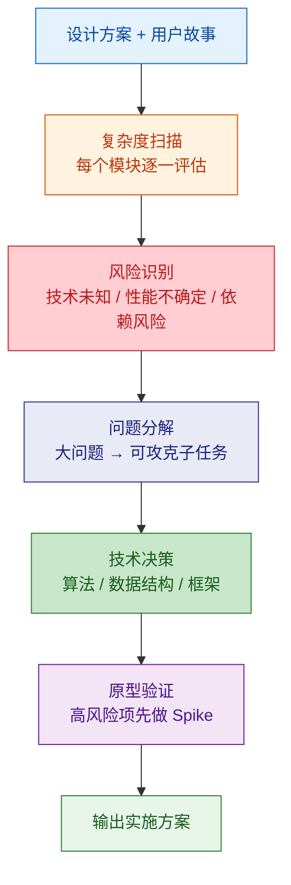
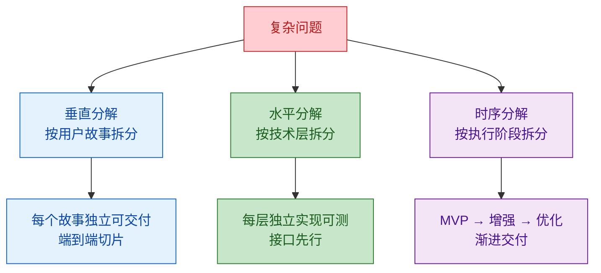

# 实现复杂度分析

评估设计方案的实现难度，识别技术风险，分解复杂问题为可攻克的子任务。

---

## 分析流程



---

## 1. 复杂度维度评估

对每个模块/功能从五个维度打分：

| 维度 | 说明 | 低(1-3) | 中(4-6) | 高(7-10) |
|--|--|--|--|--|
| 算法复杂度 | 核心算法难度 | CRUD | 规则引擎 / 状态机 | 图算法 / 优化问题 |
| 数据复杂度 | 数据模型与量级 | 单表 < 10 万 | 多表关联 < 百万 | 大数据量 / 实时流 |
| 集成复杂度 | 外部依赖数量与稳定性 | 无外部依赖 | 1-2 个稳定 API | 多个不稳定 API |
| 并发复杂度 | 并发控制难度 | 无并发 | 乐观锁 / 简单队列 | 分布式锁 / 事务 |
| 领域复杂度 | 业务规则复杂度 | 简单流程 | 多分支 + 校验规则 | 复杂工作流 / 合规 |

### 综合评分

```
总复杂度 = max(各维度分数)  // 木桶原则，取最高分
```

| 评分 | 策略 |
|--|--|
| 1-3 | 可直接编码，无需额外设计 |
| 4-6 | 需要详细设计，可能需要技术选型 |
| 7-10 | 需要 Spike / POC 验证，建议分拆 |

---

## 2. 技术风险识别

### 风险等级

| 等级 | 定义 | 处理策略 |
|--|--|--|
| 已知-已知 | 清楚问题和解法 | 正常估时 |
| 已知-未知 | 知道有挑战但不确定解法 | 技术预研 + Buffer |
| 未知-未知 | 完全未预见的问题 | 预留应急时间 + 降级方案 |

### 常见风险类型

| 风险类型 | 示例 | 缓解措施 |
|--|--|--|
| 性能风险 | 数据量超出预期 | 压测验证 + 分库方案备选 |
| 兼容性风险 | 第三方 API 变更 | 防腐层 + 契约测试 |
| 安全风险 | 数据泄漏可能 | 安全审查 + 渗透测试 |
| 依赖风险 | 库/框架无维护 | 评估替代方案 |
| 领域风险 | 业务规则频繁变更 | 规则引擎 + 配置化 |

---

## 3. 问题分解策略

### 分解原则



### 分解检查
- 每个子任务 **可独立测试**
- 每个子任务 **工作量 < 1 天**
- 子任务间 **接口明确**
- 高风险子任务 **优先执行**

---

## 4. 算法与数据结构选择

### 常见场景决策

| 场景 | 推荐方案 | 时间 | 空间 | 备选 |
|--|--|--|--|--|
| 精确查找 | HashMap / HashSet | O(1) | O(n) | B-Tree(持久化) |
| 范围查询 | TreeMap / B-Tree | O(log n) | O(n) | Skip List |
| 排序 | Arrays.sort (TimSort) | O(n log n) | O(n) | 基数排序(整数) |
| 去重 | HashSet / Bloom Filter | O(1) / 概率 | O(n) / O(m) | 数据库唯一约束 |
| Top-K | 最小堆 | O(n log k) | O(k) | QuickSelect |
| 图遍历 | BFS / DFS | O(V+E) | O(V) | - |
| 最短路径 | Dijkstra / A* | O(E log V) | O(V) | Floyd(全源) |
| 模式匹配 | 正则 / Trie | - | - | Aho-Corasick(多模式) |
| 状态管理 | 有限状态机(FSM) | O(1) 转换 | O(状态数) | 状态模式 |
| 工作流 | DAG + 拓扑排序 | O(V+E) | O(V+E) | 工作流引擎 |

### 权衡框架

```
选择 = f(数据规模, 查询模式, 一致性要求, 运维成本)
```

| 权衡维度 | 取舍 |
|--|--|
| 时间 vs 空间 | 缓存/索引换时间；压缩换空间 |
| 一致性 vs 可用性 | CP 选 ZooKeeper；AP 选 Redis |
| 简单 vs 灵活 | 硬编码快但难改；配置化灵活但复杂 |
| 自建 vs 第三方 | 自建可控但成本高；第三方快但有依赖 |

---

## 5. Spike / POC 策略

### 何时需要 Spike

- 复杂度评分 >= 7 的模块
- 首次使用的技术/框架
- 性能不确定的核心路径
- 第三方 API 的真实行为验证

### Spike 模板

```markdown
## Spike: [名称]

**目标**: 验证 [具体技术问题]
**时间盒**: [1-3 天]
**成功标准**: [可测量的标准]

### 验证步骤
1. ...
2. ...

### 结论
- 可行 / 不可行
- 选定方案: [...]
- 遗留风险: [...]
```

---

## 6. 输出清单

| 制品 | 说明 |
|--|--|
| 模块复杂度评分表 | 五维度打分 + 综合评分 |
| 技术风险清单 | 风险 + 等级 + 缓解措施 |
| 分解任务列表 | 子任务 + 依赖关系 + 优先级 |
| 算法决策记录 | 场景 + 方案 + 权衡理由 |
| Spike 计划 | 高风险项的 POC 方案 |
| 实施路线图 | 分阶段交付计划 |

---

## 参考

详细规则参见 `references/` 目录：
- `complexity-rules.md` — 复杂度评估详细规则与分解模板
