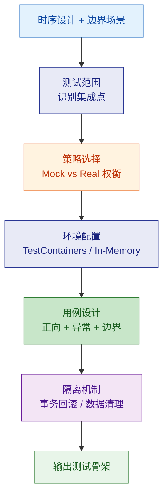
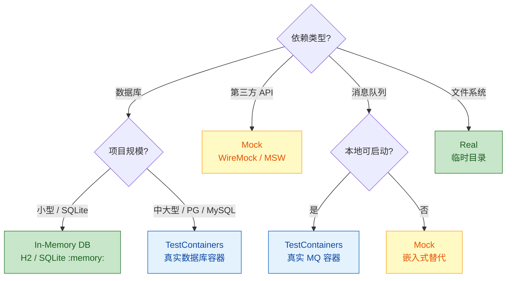

# 集成测试方案设计

从时序设计 + 边界场景出发，产出可执行的集成测试策略与测试用例骨架。

---

## 设计流程



---

## 0. TDD 适用性判断

在设计测试策略之前，根据项目成熟度决定 TDD 的应用范围：

| 项目状态 | TDD 策略 | 原因 |
|--|--|--|
| 新项目（从零开始） | **全面 TDD** — 所有新代码先写测试 | 成本最低、收益最高，测试基础设施一次搭好 |
| 成熟项目 — 已有代码 | **不追溯补测试** | ROI 太低，除非该模块即将重构 |
| 成熟项目 — 新增/修改代码 | **新代码用 TDD** | 唯一低成本引入安全网的机会，渐进式提升覆盖率 |
| Bug 修复 | **必须写回归测试** | 回归测试是 bug fix 的核心产出，防止复现 |

> **原则**：不在遗留代码上做无意义的补测试运动，但每次改动都带测试，几个月后覆盖率自然上来。

---

## 1. 识别集成点

从时序设计中提取所有跨层/跨模块调用，标记测试级别：

| 集成点类型 | 示例 | 测试级别 |
|--|--|--|
| Controller → Service | HTTP 请求到业务逻辑 | API 测试 |
| Service → Repository | 业务逻辑到数据持久化 | 仓储集成测试 |
| Service → 外部 API | 调用第三方服务 | 契约测试 / Mock |
| 模块 A → 模块 B | 跨模块方法调用 | 模块集成测试 |
| 消息生产者 → 消费者 | 事件驱动通信 | 消息集成测试 |

---

## 2. Mock vs Real 策略



### 策略选择原则

| 场景 | 选择 | 原因 |
|--|--|--|
| 本地开发快速反馈 | In-Memory / Mock | 启动快 (<2s) |
| CI 流水线 | TestContainers | 贴近生产环境 |
| 第三方 API | WireMock / MSW | 不依赖外部服务可用性 |
| 数据库 Schema 验证 | TestContainers | 确保真实 DDL 兼容 |
| 跨模块调用 | 真实调用 | 验证完整链路 |

---

## 3. 测试环境配置

### Spring Boot + TestContainers

```java
@SpringBootTest
@Testcontainers
public abstract class BaseIntegrationTest {

    @Container
    static PostgreSQLContainer<?> postgres =
        new PostgreSQLContainer<>("postgres:16")
            .withDatabaseName("testdb");

    @DynamicPropertySource
    static void configureProperties(DynamicPropertyRegistry registry) {
        registry.add("spring.datasource.url", postgres::getJdbcUrl);
        registry.add("spring.datasource.username", postgres::getUsername);
        registry.add("spring.datasource.password", postgres::getPassword);
    }
}
```

### Spring Boot + SQLite In-Memory

```java
@SpringBootTest
@Transactional
@Rollback
public abstract class BaseIntegrationTest {
    // application-test.yml: jdbc:sqlite::memory:
    // 每个测试自动回滚
}
```

### NestJS + Vitest

```typescript
// test/setup.ts
import { Test } from '@nestjs/testing';
import { AppModule } from '../src/app.module';

export async function createTestApp() {
  const moduleRef = await Test.createTestingModule({
    imports: [AppModule],
  }).compile();

  const app = moduleRef.createNestApplication();
  await app.init();
  return app;
}
```

---

## 4. 测试用例设计

### 三要素覆盖

每个集成测试必须覆盖：

| 要素 | 数量 | 说明 |
|--|--|--|
| 正向路径 | >= 1 | 主流程正常完成 |
| 异常路径 | >= 1 | 业务异常和系统异常 |
| 边界场景 | >= 1 | 空数据、极值、并发 |

### API 测试骨架（Spring Boot）

```java
@AutoConfigureMockMvc
class MigrationTaskControllerTest extends BaseIntegrationTest {

    @Autowired
    private MockMvc mockMvc;

    @Test
    void should_create_task_successfully() throws Exception {
        mockMvc.perform(post("/api/migration-tasks")
                .contentType(MediaType.APPLICATION_JSON)
                .content("""
                    {"name": "test-task", "sourceId": 1, "targetId": 2}
                    """))
            .andExpect(status().isCreated())
            .andExpect(jsonPath("$.data.name").value("test-task"));
    }

    @Test
    void should_return_400_when_name_is_blank() throws Exception {
        mockMvc.perform(post("/api/migration-tasks")
                .contentType(MediaType.APPLICATION_JSON)
                .content("""
                    {"name": "", "sourceId": 1, "targetId": 2}
                    """))
            .andExpect(status().isBadRequest())
            .andExpect(jsonPath("$.code").value("VALIDATION_ERROR"));
    }

    @Test
    void should_return_404_when_task_not_found() throws Exception {
        mockMvc.perform(get("/api/migration-tasks/99999"))
            .andExpect(status().isNotFound());
    }
}
```

### 仓储集成测试骨架

```java
class MigrationTaskRepositoryTest extends BaseIntegrationTest {

    @Autowired
    private MigrationTaskRepository taskRepository;

    @Test
    void should_save_and_find_task() {
        var task = new MigrationTask("test", TaskStatus.DRAFT);
        var saved = taskRepository.save(task);

        var found = taskRepository.findById(saved.getId());
        assertThat(found).isPresent();
        assertThat(found.get().getName()).isEqualTo("test");
    }

    @Test
    void should_return_empty_when_not_found() {
        var found = taskRepository.findById(-1L);
        assertThat(found).isEmpty();
    }
}
```

---

## 5. 测试隔离机制

| 机制 | 适用场景 | 实现方式 |
|--|--|--|
| 事务回滚 | 单数据库 | `@Transactional @Rollback` |
| 数据清理 | 多数据源 / NoSQL | `@AfterEach` 手动清理 |
| 容器重建 | Schema 变更测试 | `@Container` 静态 / 非静态 |
| 命名空间隔离 | 共享外部服务 | 测试前缀 / 唯一 ID |

### 测试数据管理

- **不依赖共享测试数据**：每个测试自建数据
- **Builder 模式**：复杂对象用 TestDataBuilder 构造
- **最小化数据**：只创建测试所需的最少数据

```java
// TestDataBuilder 示例
public class TaskBuilder {
    private String name = "default-task";
    private TaskStatus status = TaskStatus.DRAFT;

    public TaskBuilder withName(String name) {
        this.name = name;
        return this;
    }

    public TaskBuilder withStatus(TaskStatus status) {
        this.status = status;
        return this;
    }

    public MigrationTask build() {
        return new MigrationTask(name, status);
    }
}
```

---

## 6. 契约测试

当存在跨服务调用时：

| 角色 | 职责 | 工具 |
|--|--|--|
| Provider（提供方） | 验证自己满足契约 | Spring Cloud Contract / Pact |
| Consumer（消费方） | 定义期望的契约 | Pact / WireMock |
| Broker（中介） | 存储和版本管理契约 | Pact Broker |

### 契约测试用例模板

```
Given: [前置状态]
When:  [Consumer 发起请求 / Provider 接收请求]
Then:  [响应结构和状态码]
```

---

## 7. 输出清单

| 制品 | 说明 |
|--|--|
| 集成点清单 | 所有跨层/跨模块调用列表 |
| Mock/Real 决策矩阵 | 每个依赖的策略选择 |
| 测试环境配置 | TestContainers / In-Memory 配置文件 |
| 测试基类 | BaseIntegrationTest |
| API 测试骨架 | 每个 Controller 的正向/异常/边界测试 |
| 仓储测试骨架 | 每个 Repository 的 CRUD 测试 |
| 测试数据 Builder | 复杂对象构造器 |
| 契约定义（可选） | Consumer-Provider 契约文件 |

---

## 参考

详细规则参见 `references/` 目录：
- `test-strategy-rules.md` — 集成测试策略详细规则与反模式
