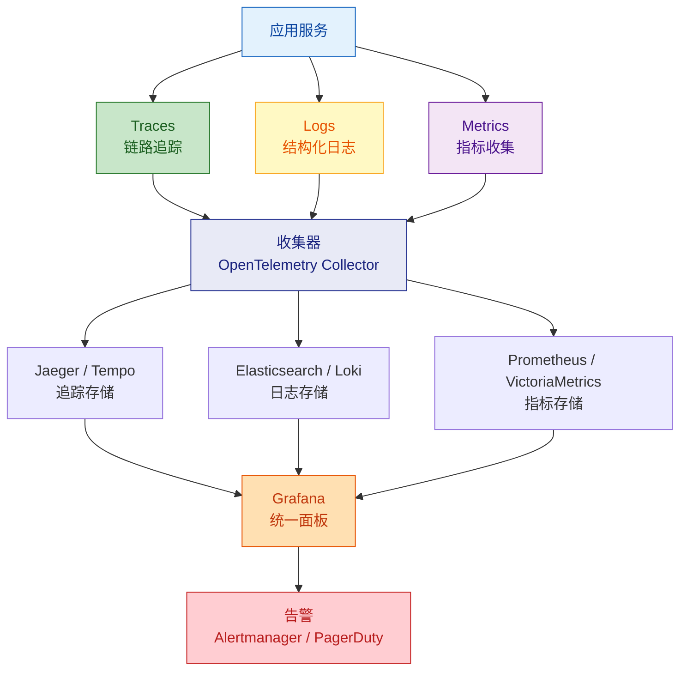

# 可观测性设计

规划分布式追踪、结构化日志和指标收集，确保系统可监控、可排查、可度量。

---

## 三支柱架构



---

## 1. 结构化日志

### 日志格式（统一 JSON）

```json
{
  "timestamp": "2026-04-08T10:30:00.123Z",
  "level": "INFO",
  "service": "migration-service",
  "traceId": "abc123def456",
  "spanId": "789ghi",
  "module": "task",
  "action": "startTask",
  "userId": "user-001",
  "message": "任务启动成功",
  "data": {
    "taskId": 42,
    "taskName": "DB迁移"
  },
  "duration": 156
}
```

### 日志级别规范

| 级别 | 使用场景 | 生产环境 |
|--|--|--|
| ERROR | 系统异常、需要立即处理 | 始终开启 + 告警 |
| WARN | 可恢复异常、降级触发 | 始终开启 |
| INFO | 业务关键节点 | 始终开启 |
| DEBUG | 调试信息、参数详情 | 默认关闭，动态开启 |
| TRACE | 极详细跟踪 | 仅开发环境 |

### 日志内容规范
- **必须记录**：traceId、请求路径、用户 ID、操作结果、耗时
- **禁止记录**：密码、Token、身份证号、银行卡号
- **脱敏记录**：手机号（138****1234）、邮箱（a***@example.com）

### Spring Boot 配置

```java
// 全局 traceId 注入（MDC）
@Component
public class TraceFilter implements Filter {
    @Override
    public void doFilter(ServletRequest req, ServletResponse res,
                         FilterChain chain) throws IOException, ServletException {
        String traceId = Optional.ofNullable(
                ((HttpServletRequest) req).getHeader("X-Trace-Id"))
            .orElse(UUID.randomUUID().toString());
        MDC.put("traceId", traceId);
        try {
            chain.doFilter(req, res);
        } finally {
            MDC.clear();
        }
    }
}
```

### logback-spring.xml（JSON 输出）

```xml
<appender name="JSON" class="ch.qos.logback.core.ConsoleAppender">
    <encoder class="net.logstash.logback.encoder.LoggingEventCompositeJsonEncoder">
        <providers>
            <timestamp/>
            <logLevel/>
            <loggerName/>
            <mdc/>
            <message/>
            <stackTrace/>
        </providers>
    </encoder>
</appender>
```

---

## 2. 链路追踪

### 追踪粒度

| 层级 | Span 名称 | 关键属性 |
|--|--|--|
| HTTP 入口 | `HTTP {method} {path}` | status_code, user_id |
| Service 调用 | `{ServiceClass}.{method}` | 入参摘要 |
| 数据库操作 | `DB {operation} {table}` | sql, rows_affected |
| 外部 HTTP | `HTTP {method} {host}{path}` | status_code, duration |
| 消息发送 | `MQ send {topic}` | message_id |
| 消息消费 | `MQ receive {topic}` | message_id |

### OpenTelemetry 配置（Spring Boot）

```yaml
# application.yml
management:
  tracing:
    sampling:
      probability: 1.0  # 开发环境全量采样

otel:
  exporter:
    otlp:
      endpoint: http://otel-collector:4317
  service:
    name: migration-service
```

### 采样策略

| 环境 | 策略 | 采样率 |
|--|--|--|
| 开发 | 全量采样 | 100% |
| 测试 | 全量采样 | 100% |
| 生产 | 尾部采样(按错误/延迟) | 10% 正常 + 100% 异常 |

---

## 3. 指标收集

### 四大黄金指标

| 指标 | 含义 | 度量方式 |
|--|--|--|
| 延迟(Latency) | 请求处理时间 | Histogram 分位数 |
| 流量(Traffic) | 请求量 | Counter |
| 错误(Errors) | 失败请求比例 | Counter (Error / Total) |
| 饱和度(Saturation) | 资源使用程度 | Gauge |

### 业务指标

| 指标 | 类型 | 说明 |
|--|--|--|
| `task_created_total` | Counter | 任务创建总数 |
| `task_execution_duration` | Histogram | 任务执行耗时分布 |
| `task_active_count` | Gauge | 当前运行中任务数 |
| `migration_rows_processed` | Counter | 迁移数据行数 |

### Prometheus 指标暴露（Spring Boot）

```yaml
management:
  endpoints:
    web:
      exposure:
        include: health, prometheus, info
  metrics:
    tags:
      service: migration-service
      env: ${SPRING_PROFILES_ACTIVE:dev}
```

### 自定义指标（Micrometer）

```java
@Component
public class TaskMetrics {
    private final Counter taskCreated;
    private final Timer taskExecution;
    private final AtomicInteger activeTasks;

    public TaskMetrics(MeterRegistry registry) {
        this.taskCreated = Counter.builder("task.created.total")
            .description("任务创建总数")
            .register(registry);
        this.taskExecution = Timer.builder("task.execution.duration")
            .description("任务执行耗时")
            .register(registry);
        this.activeTasks = registry.gauge("task.active.count",
            new AtomicInteger(0));
    }
}
```

---

## 4. 健康检查

### 检查项

| 检查 | 端点 | 含义 |
|--|--|--|
| 存活检查 | `/actuator/health/liveness` | 进程是否存活 |
| 就绪检查 | `/actuator/health/readiness` | 是否可接收流量 |

### 自定义健康检查

```java
@Component
public class DatabaseHealthIndicator implements HealthIndicator {
    @Override
    public Health health() {
        try {
            // 执行简单查询验证数据库连接
            jdbcTemplate.queryForObject("SELECT 1", Integer.class);
            return Health.up().build();
        } catch (Exception e) {
            return Health.down(e).build();
        }
    }
}
```

---

## 5. 告警策略

### 告警分级

| 级别 | 触发条件 | 通知方式 | 响应时间 |
|--|--|--|--|
| P0 紧急 | 服务不可用 / 数据丢失 | 电话 + 短信 | < 15 分钟 |
| P1 严重 | 错误率 > 5% / P99 > 2s | 即时消息(钉钉/Slack) | < 30 分钟 |
| P2 警告 | 错误率 > 1% / 资源 > 80% | 邮件 / 工单 | < 4 小时 |
| P3 提示 | 性能下降趋势 | 日报/周报 | 下个迭代 |

### 告警规则示例（Prometheus）

```yaml
groups:
  - name: api-alerts
    rules:
      - alert: HighErrorRate
        expr: rate(http_requests_total{status=~"5.."}[5m]) / rate(http_requests_total[5m]) > 0.05
        for: 5m
        labels:
          severity: P1
        annotations:
          summary: "5xx 错误率超过 5%"

      - alert: HighLatency
        expr: histogram_quantile(0.99, rate(http_request_duration_seconds_bucket[5m])) > 2
        for: 5m
        labels:
          severity: P1
        annotations:
          summary: "P99 延迟超过 2 秒"
```

---

## 6. SLI / SLO 定义

### SLI（Service Level Indicator）

| SLI | 计算公式 |
|--|--|
| 可用性 | 成功请求数 / 总请求数 |
| 延迟 | P99 响应时间 |
| 吞吐量 | 每秒成功请求数 |
| 错误率 | 失败请求数 / 总请求数 |

### SLO（Service Level Objective）

| SLO | 目标 | 允许故障预算 |
|--|--|--|
| 可用性 | 99.9% | 每月 43 分钟停机 |
| P99 延迟 | < 500ms | - |
| 错误率 | < 0.1% | - |

---

## 7. 输出清单

| 制品 | 说明 |
|--|--|
| 日志规范文档 | 格式、级别、脱敏规则 |
| 追踪配置 | OpenTelemetry 配置 + 采样策略 |
| 指标清单 | 四大黄金指标 + 业务指标定义 |
| 健康检查配置 | 存活/就绪检查端点 |
| 告警规则 | 分级告警 + Prometheus 规则 |
| SLI/SLO 定义 | 服务水平指标和目标 |
| Grafana Dashboard | 监控面板 JSON 模板 |

---

## 参考

详细规则参见 `references/` 目录：
- `observability-rules.md` — 可观测性详细规则与配置模板
