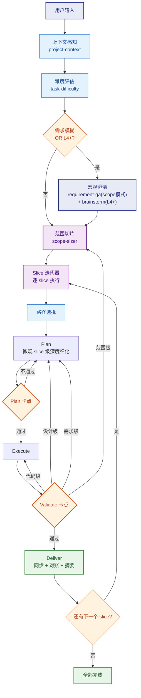
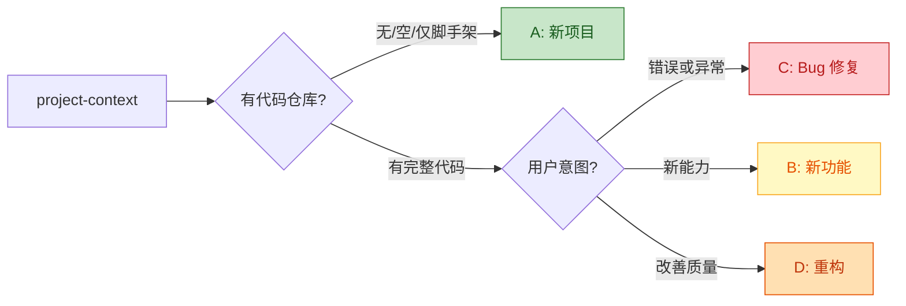
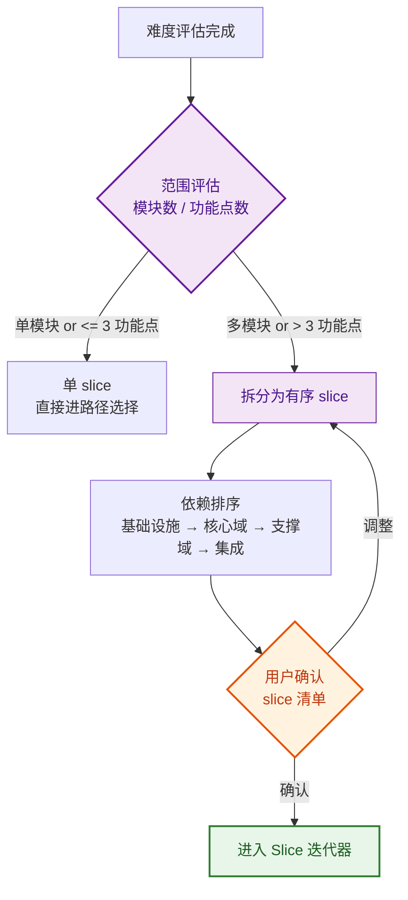
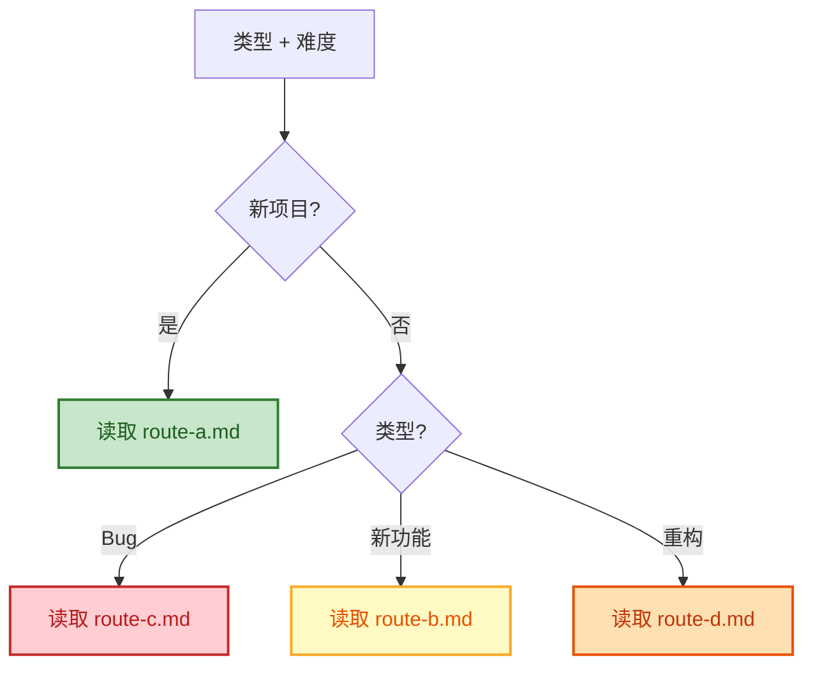

# Orchestrator — 流程编排器

接收用户输入 → 感知上下文 → 评估难度 → **宏观澄清**（按需）→ **范围切片** → 选路径 → 逐 slice 编排四阶段 → 质量卡点 → 交付。

---

## 总流程



---

## 1. 上下文感知

用 project-context 获取项目信息，判定项目类型：



---

## 2. 难度评估

用 task-difficulty 评分（1-10），映射到三级精简度：

| 等级 | 分数 | 流程变体 |
|------|------|---------|
| L1-L2 | 1-3 | lite/fast — 精简流程，跳过非必要 skill |
| L3 | 4-6 | 标准 — 完整流程 |
| L4-L5 | 7-10 | + 变体 — 完整 + 额外评审 + 并行策略 |

用户可覆盖："简单处理" → 降级，"认真做" → 升级。

---

## 2.5 宏观澄清（CLARIFY）

难度评估后、范围切片前，判断是否需要对需求做**宏观级别的澄清和架构讨论**。目的是为 scope-sizer 提供准确的模块清单和架构方向，避免基于模糊输入盲目切片。

### 触发条件（任一满足即触发）

| 条件 | 判定依据 |
|------|---------|
| 需求模糊/宽泛 | 用户输入未明确列出功能模块或具体范围 |
| 难度 L4+ | task-difficulty 评分 ≥ 7，架构方向会影响切片方式 |

### 跳过条件（全部满足则跳过）

| 条件 | 示例 |
|------|------|
| 需求已经具体 | "在 user 模块加修改密码 API"、"GET /api/novels/123 返回 500" |
| 难度 L1-L3 | 简单任务，天然范围窄 |

### CLARIFY 包含的 skill

| 顺序 | Skill | 模式 | 做什么 | 粒度 |
|------|-------|------|--------|------|
| 1 | requirement-qa | **scope 模式** | 识别模块清单、主要功能列表、用户角色、非功能约束 | 宏观 — 不进入功能细节 |
| 2 | brainstorm（仅 L4+） | 战略级 | 架构方向讨论：单体/微服务、数据库选型方向、前后端分离方式 | 战略 — 不做详设 |

### CLARIFY 在不同路径下的差异

| 路径 | CLARIFY 要回答的核心问题 |
|------|----------------------|
| **A（新项目）** | 有哪些模块？核心功能是什么？架构方向？ |
| **B（新功能）** | 影响哪些现有模块？有跨模块依赖吗？是否需要新建模块？ |
| **C（Bug 修复）** | 通常跳过。仅当"系统性 bug 影响多模块"时触发 |
| **D（重构）** | 重构涉及哪些模块？目标架构是什么？ |

### CLARIFY 产出物

```markdown
### Scope 级澄清结果

**路径**: A / B / C / D
**模块清单**: [列出识别到的模块]
**核心功能**: [按模块列出主要功能，每个 1-2 句]
**架构方向**: [如适用 — 整体架构选型结论]
**非功能约束**: [如适用 — 性能/安全/部署要求]
```

此产出**直接输入给 scope-sizer**。

### 与 Plan 中同名 skill 的关系

- Plan 中的 requirement-qa 切换为 **slice 模式**：只问当前 slice 的详细功能，不重复宏观问题
- Plan 中的 brainstorm **默认跳过**（CLARIFY 已做），除非 slice 内出现新的架构争议才触发

---

## 2.6 范围切片（Scope Sizer）

CLARIFY 之后（或跳过 CLARIFY 后），评估任务的**广度**（scope breadth），决定是否拆分为多个 slice。

详细规则 → 读取 `references/scope-sizer.md`



**核心规则**：
- 每个 slice 独立走完 Plan→Execute→Validate→Deliver 四阶段
- slice 间通过 Deliver 的 docs-output + project-context 传递上下文
- 后续 slice 的 Plan 阶段可读取前置 slice 的产出物
- 用户可在任意 slice 完成后暂停，下次会话从 progress 恢复

---

## 3. 路径选择

组合 **项目类型 × 难度等级**，读取对应路径文件：



⚠️ 只读命中的那一个 route-{x}.md，不读其他。

---

## 4. 阶段导航

### Slice 迭代器

多 slice 时，按依赖排序逐个执行。每个 slice 独立走完 Plan→Execute→Validate→Deliver：

- **第一个 slice**：走完整 Plan skill 链（含全局性 skill：tech-stack、engineering-principles 等，全局产出复用给后续 slice）
- **后续 slice**：Plan 阶段跳过全局性 skill，只执行 slice 级 skill（requirement-qa 针对本 slice 功能、spec-writing 只写本 slice 文档、api-contract-design 只做增量端点）
- **slice 间传递**：前一个 slice 的 Deliver 产出（docs/ + .cache/context.db）是后续 slice 的 Plan 输入

### Plan

读取命中的 route-{x}.md，按其中的 skill 编排执行 Plan。

### Plan 卡点 / Validate 卡点

到达卡点时 → 读取 `references/gates.md`

### Execute

Plan 卡点通过后 → 读取 `references/execute.md`，按其中的规则执行编码。

Execute 内部结构（三层）：


| 变体 | 任务分解 | TDD | 执行模式 | 审查 |
|------|---------|-----|---------|------|
| lite/fast | 不分解 | 可选 | 主 agent 直接编码 | 快速自检 |
| 标准 | 按模块/功能 | 强制 | 主 agent 按 task | 标准自检 |
| + 变体 | 按关注点严格分解 | 严格 | SubAgent 隔离执行 | 两阶段审查 |

**后台进程加速**（所有路径通用）：
- 骨架生成后 → 后台 `npm install` / `mvn resolve`，主线程开始编码
- 写完一批代码 → 后台 `tsc --noEmit`，主线程继续下一模块
- 测试写完 → 后台 `npm test` / `mvn test`，主线程继续写集成测试
- 后台进程失败不阻塞，但结果在 Validate 前确认

### Deliver

Validate 通过后 → 读取 `references/deliver.md`

**每个 slice 的 Deliver 都执行完整同步**（非仅最终 slice），确保中间产出可持久化、可跨会话恢复。

Deliver 包含三个强制步骤：
1. **SubAgent 并行**：docs-output + project-context 同步
2. **Reconcile 对账**：机械对比 Plan/Execute 产出清单 vs 实际落盘状态，发现遗漏立即补写
3. **交付摘要**：输出本 Slice 或最终交付摘要

### 并行策略（按需）

需要决定并行方式时 → 读取 `references/parallel.md`
