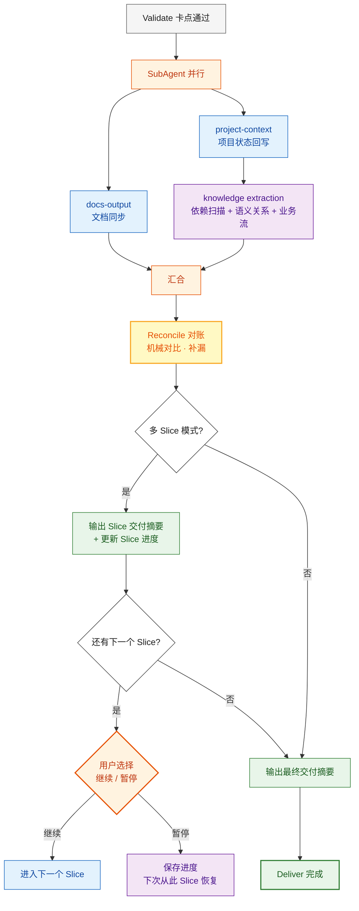

# Deliver 阶段

Validate 卡点通过后进入 Deliver。此阶段包含**三个强制步骤**，任何路径都不可跳过。**每个 Slice 的 Deliver 都执行完整同步**——不仅是最终 Slice，中间 Slice 也必须同步，确保产出可持久化、可跨会话恢复。project-context 回写现已包含**知识提取**（依赖扫描 + 语义关系 + 业务流链路）。



## docs-output（强制）

逐条执行，不可省略：

### D1. 模块文档更新

对本次涉及的**每个业务模块**，调用命令写入/更新详细文档：

```bash
python scripts/docs_manager.py update \
  --root <project_root> \
  --module <模块名> \
  --name <文档名> \
  --content "<本模块本次迭代的详细描述（Markdown）>" \
  --title "<文档标题>"
```

- **内容要求**：不是空壳，包含功能描述、接口定义、关键逻辑、技术决策
- **覆盖范围**：本次 Slice 涉及的所有模块，每个模块至少一个文档
- 如果文档已存在，update 会覆盖——确保内容反映最新实现

### D2. 进度记录

```bash
python scripts/docs_manager.py progress \
  --root <project_root> \
  --topic "<主题>" \
  --type "<需求开发|Bug修复|技术方案|重构|其他>" \
  --summary "<一句话摘要>" \
  --files '[{"path":"<变更文件>","reason":"<变更原因>"}]' \
  --decisions "<技术决策（如有）>" \
  --todos "<遗留问题（如有）>"
```

- 首次调用返回 `session_id`，同会话后续调用传 `--session-id` 追加

## project-context（强制）

逐条执行，不可省略：

### D3. 文件树同步

```bash
python scripts/context_db.py sync --root <project_root>
```

### D4. 依赖扫描

```bash
python scripts/context_db.py deps --root <project_root>
```

### D5. 知识提取

根据本次任务涉及的文件和符号，提取语义关系：

```bash
python scripts/context_db.py knowledge \
  --root <project_root> \
  --type edges \
  --data '[{"source_file":"<源文件>","source_symbol":"<函数/类名>","target_file":"<目标文件>","target_symbol":"<目标符号>","relation":"<calls|extends|implements|triggers|reads|writes|validates|delegates>","context":"<一句话描述>"}]'
```

如本次任务涉及跨模块业务流程：

```bash
python scripts/context_db.py knowledge \
  --root <project_root> \
  --type flows \
  --data '[{"flow_name":"<流程名>","steps":[{"file":"<文件>","symbol":"<符号>","action":"<动作描述>"}],"description":"<流程描述>"}]'
```

- **判断规则**：回顾本次实际触碰的文件，如果 A 文件的函数调用了 B 文件的函数 → 必须记录
- **最少记录**：本次涉及 ≥2 个文件间交互时，至少产出 1 条 edge
- **不确定的关系**：confidence 设为 `inferred`

## Reconcile 对账（强制）

SubAgent 并行同步完成后、输出交付摘要之前，执行一次**机械对比**。不依赖模型记忆，靠对比清单发现遗漏。

### 对账规则

| 对比维度 | 左侧（Plan/Execute 产出清单） | 右侧（实际落盘状态） | 差异处理 |
|---------|------|------|---------|
| **文档完整性** | Plan 阶段产出的 spec/设计/API 文件列表 | `docs/` 目录下实际存在的文件 | 缺失 → 立即补写 |
| **上下文一致性** | Execute 涉及的模块/文件清单 | `.cache/context.db` 中记录的模块 | 缺失 → 增量同步 |
| **决策可追溯** | 本 Slice 中做出的技术决策清单 | `docs/` 中对应的决策记录 | 缺失 → 补录到对应模块文档 |

### 对账输出格式

```markdown
### Reconcile 对账

| # | 维度 | 结果 | 说明 |
|---|------|------|------|
| R1 | 文档完整性 | ✅ | Plan 产出 4 个文件，docs/ 中均存在 |
| R2 | 上下文一致性 | ⚠️ | Execute 新增 user 模块，context.db 未记录 → 已补同步 |
| R3 | 决策可追溯 | ✅ | 2 个技术决策均有记录 |

**补漏动作**: 已增量同步 user 模块到 context.db
```

### 执行方式

- **主 agent 自行执行**，不派 SubAgent（对比 + 补漏很轻量）
- 有差异时直接补写/同步，不需要回流
- 对账完成后才进入交付摘要

## Slice 交付摘要（多 Slice 模式）

每个 Slice 完成后输出：
- 本 Slice 完成了什么（scope）
- 变更了哪些文件/模块
- 下一个 Slice 的范围预览
- 是否继续下一个 Slice 还是暂停

## 最终交付摘要

所有 Slice 完成后（或单 Slice 模式）输出：
- 本次完成了什么（scope）
- 变更了哪些文件/模块
- 遗留问题或后续 TODO
- 下一步建议

## Slice 进度持久化

多 Slice 模式时，每个 Slice 的 Deliver 还需额外写入 Slice 进度到 docs/progress/：

```markdown
## Slice 进度

| Slice | 状态 | 完成时间 | 范围 |
|-------|------|---------|------|
| S1 | ✅ 已完成 | 2026-04-08 | 基础设施 + 认证 |
| S2 | ⏳ 进行中 | - | 核心域：小说管理 |
| S3 | ⏸️ 待开始 | - | 支撑域：用户 + 书架 |
| S4 | ⏸️ 待开始 | - | 集成：搜索 + 推荐 |
```

下次会话恢复时读取此表即可定位续做位置。

---

## ⛔ Phase Chain Guard 集成

Deliver 阶段完成所有同步和对账后，**必须**执行以下收尾：

```bash
# 1. 记录 Deliver 阶段卡点通过
python3 skills/project-context/scripts/phase_guard.py gate \
  --root . --slice <SN> --phase deliver --result pass

# 2. 对账完整阶段链（plan→execute→validate→deliver 4 个 gate-pass）
python3 skills/project-context/scripts/phase_guard.py reconcile \
  --root . --slice <SN>
```

reconcile 会验证该 Slice 是否走过完整的 `plan.enter → plan.gate-pass → execute.enter → execute.gate-pass → validate.enter → validate.gate-pass → deliver.enter → deliver.gate-pass` 链条。如果缺少任何环节，会输出 `INCOMPLETE` 并列出缺失项。
