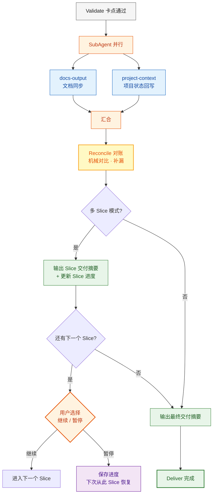

# Deliver 阶段

Validate 卡点通过后进入 Deliver。此阶段包含**三个强制步骤**，任何路径都不可跳过。**每个 Slice 的 Deliver 都执行完整同步**——不仅是最终 Slice，中间 Slice 也必须同步，确保产出可持久化、可跨会话恢复。



## docs-output（强制）

- 将本次 Slice 迭代产出的所有文档同步到 docs/ 目录
- 包括：需求文档、设计文档、API 契约、测试方案等
- A 系列首个 Slice 在 Plan 阶段已初始化，此处做终态更新
- 后续 Slice / B/C/D 系列做增量同步

## project-context（强制）

- 将本次 Slice 迭代的关键信息回写到项目上下文
- 包括：新增模块、变更的文件、新的技术决策、已知问题
- 确保下次对话或下个 Slice 能正确感知当前项目状态

## Reconcile 对账（强制）

SubAgent 并行同步完成后、输出交付摘要之前，执行一次**机械对比**。不依赖模型记忆，靠对比清单发现遗漏。

### 对账规则

| 对比维度 | 左侧（Plan/Execute 产出清单） | 右侧（实际落盘状态） | 差异处理 |
|---------|------|------|---------|
| **文档完整性** | Plan 阶段产出的 spec/设计/API 文件列表 | `docs/` 目录下实际存在的文件 | 缺失 → 立即补写 |
| **上下文一致性** | Execute 涉及的模块/文件清单 | `.cache/context.db` 中记录的模块 | 缺失 → 增量同步 |
| **决策可追溯** | 本 Slice 中做出的技术决策清单 | `docs/` 中对应的决策记录 | 缺失 → 补录到对应模块文档 |

### 对账输出格式

```markdown
### Reconcile 对账

| # | 维度 | 结果 | 说明 |
|---|------|------|------|
| R1 | 文档完整性 | ✅ | Plan 产出 4 个文件，docs/ 中均存在 |
| R2 | 上下文一致性 | ⚠️ | Execute 新增 user 模块，context.db 未记录 → 已补同步 |
| R3 | 决策可追溯 | ✅ | 2 个技术决策均有记录 |

**补漏动作**: 已增量同步 user 模块到 context.db
```

### 执行方式

- **主 agent 自行执行**，不派 SubAgent（对比 + 补漏很轻量）
- 有差异时直接补写/同步，不需要回流
- 对账完成后才进入交付摘要

## Slice 交付摘要（多 Slice 模式）

每个 Slice 完成后输出：
- 本 Slice 完成了什么（scope）
- 变更了哪些文件/模块
- 下一个 Slice 的范围预览
- 是否继续下一个 Slice 还是暂停

## 最终交付摘要

所有 Slice 完成后（或单 Slice 模式）输出：
- 本次完成了什么（scope）
- 变更了哪些文件/模块
- 遗留问题或后续 TODO
- 下一步建议

## Slice 进度持久化

多 Slice 模式时，每个 Slice 的 Deliver 还需额外写入 Slice 进度到 docs/progress/：

```markdown
## Slice 进度

| Slice | 状态 | 完成时间 | 范围 |
|-------|------|---------|------|
| S1 | ✅ 已完成 | 2026-04-08 | 基础设施 + 认证 |
| S2 | ⏳ 进行中 | - | 核心域：小说管理 |
| S3 | ⏸️ 待开始 | - | 支撑域：用户 + 书架 |
| S4 | ⏸️ 待开始 | - | 集成：搜索 + 推荐 |
```

下次会话恢复时读取此表即可定位续做位置。
