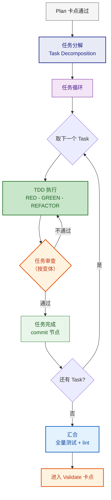
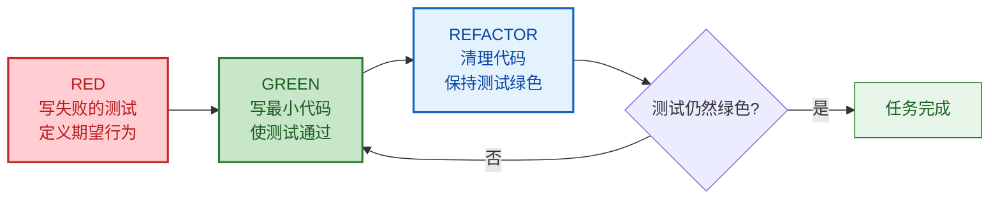
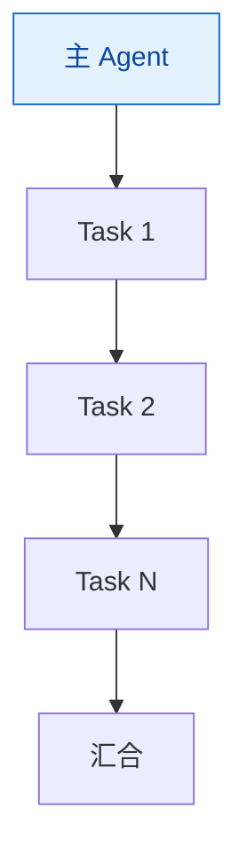
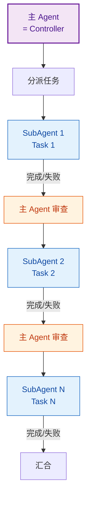
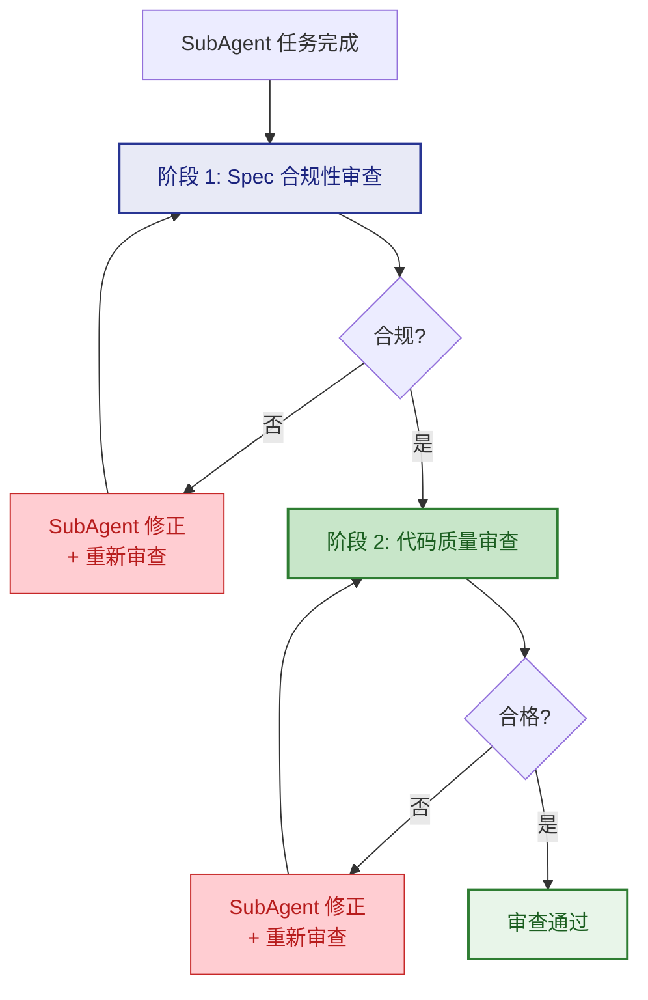
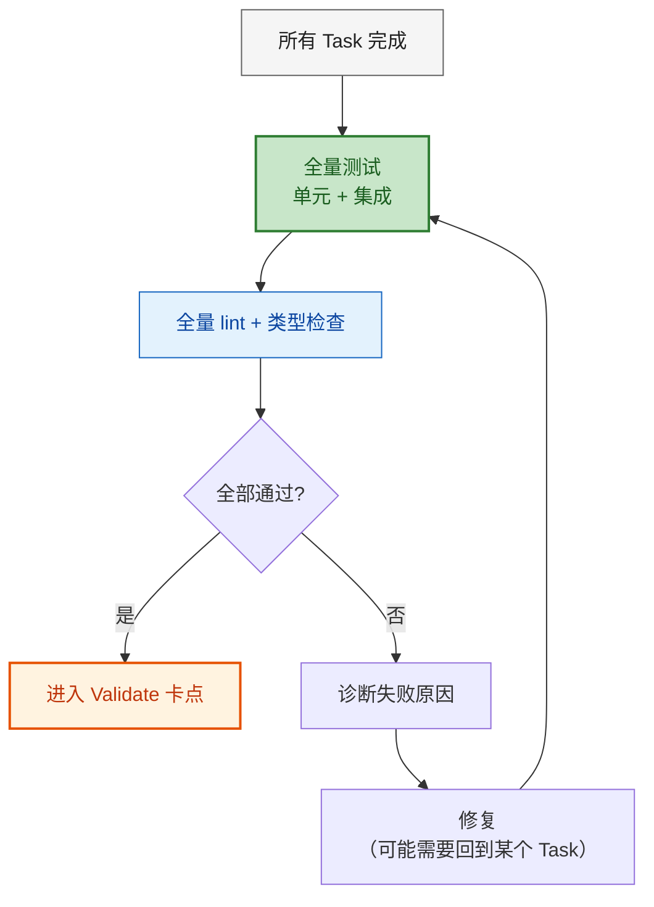

# Execute 阶段详细规则

Plan 卡点通过后进入 Execute。此阶段将 Plan 产出（spec + API 契约 + 设计文档）转化为**可运行的代码**，通过任务分解 → TDD 驱动的任务循环 → 汇合三个层次完成。



---

## 1. 任务分解（Task Decomposition）

将 Plan 产出转化为有序的原子任务列表。这是 Plan（设计层）到 Execute（代码层）的**桥梁**。

### 分解原则

| 原则 | 说明 |
|------|------|
| **原子性** | 每个任务聚焦一个关注点：一个函数、一个端点、一个组件 |
| **可验证** | 每个任务有明确的验证方式（测试命令 / 类型检查 / 手动验证） |
| **有序** | 任务之间有明确依赖关系，基础设施 → 数据层 → 服务层 → 接口层 → UI |
| **TDD 友好** | 每个任务先写测试再写实现（测试和实现可以在同一个任务内） |

### 任务格式

```markdown
### Task N: [任务名称]

**目标**: [一句话描述]
**文件**: [精确到文件路径]
  - `src/domain/novel/Novel.java` — 新建
  - `src/domain/novel/NovelRepository.java` — 新建
  - `test/domain/novel/NovelTest.java` — 新建
**依赖**: Task N-1（或无）
**验证**: `mvn test -pl novel-domain` 通过，0 错误

#### 步骤
1. 创建 `NovelTest.java`，写 3 个测试用例（RED）
2. 创建 `Novel.java` 实体类，实现逻辑使测试通过（GREEN）
3. 创建 `NovelRepository.java` 接口
4. 检查代码，消除重复（REFACTOR）
```

### 变体差异

| 变体 | 任务分解方式 | 补充说明 |
|------|------------|---------|
| **lite / fast** | **不分解**，主 agent 按 Plan 直接编码 | Bug 热修、简单功能无需拆分 |
| **标准** | **按模块/功能分解**，每个任务可能涉及 2-5 个文件 | 单个任务粒度 ~5-10 分钟 |
| **+ 变体** | **按关注点严格分解**，每个任务聚焦单一关注点 | 单个任务粒度 ~2-5 分钟，包含完整代码 |

---

## 2. TDD 驱动的任务执行

所有标准及以上变体强制 TDD。TDD 不是"写完代码后补测试"，而是**测试先行**。

### TDD 循环



### RED 阶段规则

- 先写测试，描述**期望行为**而非实现细节
- 测试必须**当前会失败**（编译错误或断言失败）
- 一次只写一个测试场景，不要一次把所有 case 都写完

### GREEN 阶段规则

- 写**最少的代码**使测试通过
- 不追求优雅，只追求正确
- 不提前优化，不添加未被测试要求的功能（YAGNI）

### REFACTOR 阶段规则

- 消除重复代码（DRY）
- 改善命名和结构
- 每次重构后立即运行测试确认绿色
- 重构不改变外部行为

### 变体差异

| 变体 | TDD 要求 |
|------|---------|
| **lite / fast** | **可选** — 主 agent 自行决定是否先写测试 |
| **标准** | **强制** — 每个任务必须 RED→GREEN→REFACTOR |
| **+ 变体** | **严格** — 每个测试场景单独一轮 RED→GREEN，不允许批量 |

---

## 3. 执行模式：主 Agent vs SubAgent

根据变体选择执行模式。核心区别在于**上下文隔离**。

### 主 Agent 执行（lite / fast / 标准）



- 主 agent 按任务列表顺序执行
- 共享上下文，前一个任务的代码对后一个任务可见
- 遇到问题可直接回看 spec 和前置代码
- **适用**：任务间耦合紧密、需要频繁参照上下文

### SubAgent 隔离执行（+ 变体）



- 每个任务由 **fresh SubAgent** 执行，避免上下文污染
- SubAgent 接收的输入包（精确控制）：
  - 任务描述（来自任务分解）
  - 涉及的文件内容（当前版本）
  - spec 摘要（与本任务相关的部分）
  - 前置任务的产出概要（如有）
- **SubAgent 不接收**：完整的 Plan 产出、其他任务的代码、会话历史
- **适用**：任务间相对独立、需要防止注意力分散

### SubAgent 状态报告

SubAgent 完成后向 Controller 报告状态：

| 状态 | 含义 | Controller 行为 |
|------|------|----------------|
| **DONE** | 任务完成，测试通过 | 进入审查 |
| **DONE_WITH_CONCERNS** | 任务完成，但有疑虑 | 审查时重点关注疑虑点 |
| **NEEDS_CONTEXT** | 缺少信息，无法完成 | 补充上下文后重新分派 |
| **BLOCKED** | 被前置依赖阻塞 | 调整任务顺序或先解决阻塞 |

---

## 4. 任务审查（Task Review）

每个任务完成后，在进入下一个任务前执行审查。审查深度按变体递进。

### 快速自检（lite / fast）

主 agent 在编码后做快速检查：
- [ ] 代码编译通过，无新 lint/type 错误
- [ ] 核心逻辑与 spec 一致
- 不需要正式审查流程

### 标准自检（标准变体）

主 agent 在每个任务完成后做：
- [ ] TDD 三阶段完成：测试先行 → 实现通过 → 重构完成
- [ ] 代码与 spec 一致（接口签名、数据模型、行为逻辑）
- [ ] 无新 lint/type 错误
- [ ] 新代码不破坏已有测试

### 两阶段 SubAgent 审查（+ 变体）



**阶段 1：Spec 合规性审查**

由主 Agent（Controller）执行，对比：

| 检查维度 | 对比对象 |
|---------|---------|
| 接口签名 | API 契约文档 vs 实际代码 |
| 数据模型 | 领域模型设计 vs 实际实体类 |
| 行为逻辑 | spec 中的业务规则 vs 实际实现 |
| 错误处理 | error-handling-strategy vs 实际异常处理 |

不通过 → SubAgent 修正 → 重新审查。**每个任务最多 2 轮修正**，仍不通过则升级到 Validate 阶段处理。

**阶段 2：代码质量审查**

阶段 1 通过后执行：

| 检查维度 | 关注点 |
|---------|--------|
| 安全性 | OWASP Top 10、输入验证、输出编码 |
| 可读性 | 命名、函数长度、复杂度 |
| DRY | 有无重复代码 |
| YAGNI | 有无超出需求的代码 |
| 测试质量 | 测试是否测行为（非实现）、覆盖是否足够 |

不通过 → SubAgent 修正 → 重新审查。同样最多 2 轮。

---

## 5. 汇合（Merge）

所有任务完成后，执行全量验证：



汇合阶段检查任务集成后的整体健康度：
- 单独通过的任务组合后是否仍然通过
- 是否有遗漏的集成点（模块间调用、事件传播等）
- 全量 lint/type check 无新增错误

---

## 6. 路径特化规则

不同路径上的 Execute 有特殊行为。详细规则定义在对应的 `route-{x}.md` 文件中。

**通用原则**：本文件（execute.md）定义 TDD、任务分解、审查等**通用机制**，各 route-{x}.md 的 Execute 段定义**路径特化规则**（如 scaffold 时机、回归测试策略、行为等价约束）。两者互补，以 route 文件为准。

---

## 7. 模型选型建议（可选）

如果执行环境支持多模型切换（如 SubAgent 可指定模型），根据任务类型选择：

| 任务类型 | 推荐模型 | 示例 |
|---------|---------|------|
| **机械性** | 快速/经济模型 | 样板代码、CRUD 端点、配置文件、重复模式代码 |
| **集成性** | 标准模型 | 跨模块调用、中间件集成、数据库迁移脚本 |
| **架构性** | 最强模型 | 新模式引入、复杂状态管理、性能关键路径、安全敏感代码 |

如果环境不支持模型切换，忽略本节，统一使用当前模型。

---

## 总结：变体策略速查表

| 维度 | lite / fast | 标准 | + 变体 |
|------|-----------|------|--------|
| **任务分解** | 不分解 | 按模块/功能分解 | 按关注点严格分解 |
| **TDD** | 可选 | 强制 | 严格（逐场景） |
| **执行模式** | 主 agent 直接编码 | 主 agent 按任务执行 | SubAgent 隔离执行 |
| **任务审查** | 快速自检 | 标准自检 | 两阶段 SubAgent 审查 |
| **模型选型** | 不适用 | 不适用 | 按任务类型选择 |
| **汇合** | 手动确认 | 全量测试 + lint | 全量测试 + lint + 集成验证 |
