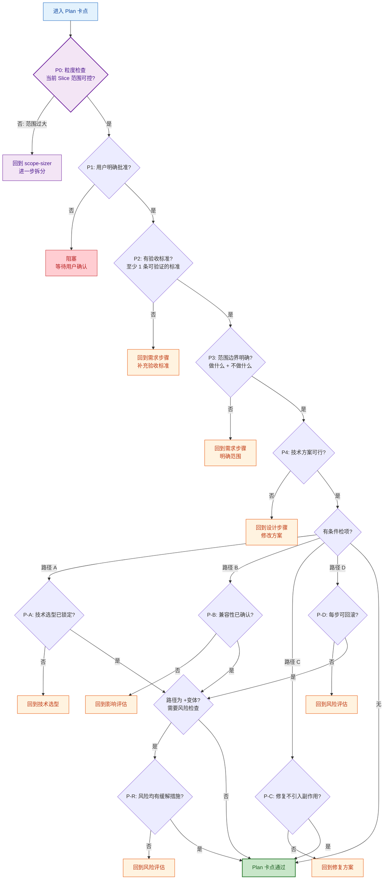
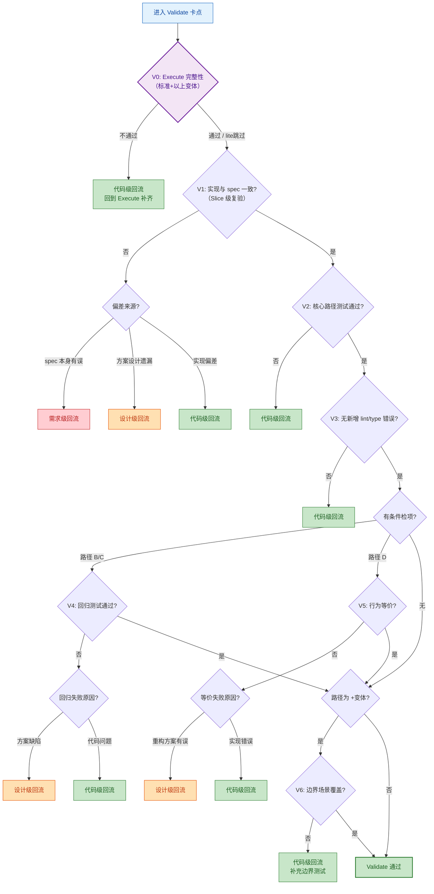
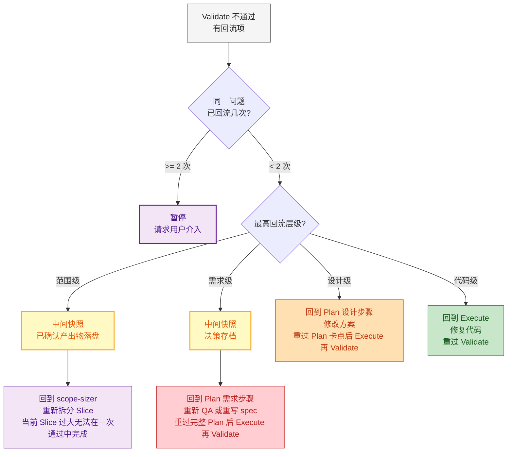

# 质量卡点详细规则

## Plan 卡点判定流程



### P0 粒度检查规则

Plan 卡点新增的首项检查——在用户批准前先判断当前 Slice 是否**粒度合理**：

| 信号 | 判定 | 动作 |
|------|------|------|
| 当前 Slice 涉及 > 3 个模块 | 范围过大 | 回到 scope-sizer 进一步拆分 |
| 当前 Slice 的 spec 文档 > 5 个文件 | 范围过大 | 回到 scope-sizer 进一步拆分 |
| 当前 Slice 预估新增文件 > 30 个 | 范围过大 | 回到 scope-sizer 进一步拆分 |
| 以上均不超标 | 粒度正常 | 继续 P1 |

P0 检查仅在首次 Plan 卡点时执行。如果已经通过 scope-sizer 拆分过，P0 直接通过。

## Validate 卡点判定流程



### V0 Execute 完整性检查

V0 是 Validate 的首项检查——验证 Execute 阶段的**过程质量**而非仅看最终结果。

| 变体 | V0 检查内容 | 不通过动作 |
|------|-----------|----------|
| **lite / fast** | **跳过** V0，直接进 V1 | — |
| **标准** | 每个任务完成了 TDD 循环（有测试覆盖）；全量测试通过 | 回到 Execute 补测试 |
| **+ 变体** | 每个任务通过两阶段审查（Spec 合规 + 代码质量）；无任务处于 BLOCKED/NEEDS_CONTEXT 状态 | 回到 Execute 补齐审查或解决阻塞 |

V0 检查的是 Execute 过程的**完备性**，不是代码正确性（那是 V1-V3 的职责）。如果 V0 不通过，说明 Execute 阶段有步骤被跳过，需要回去补齐。

### V1 说明（增强）

V1 在融合后承担 **Slice 级的 Spec 合规复验**。与 Execute 中 task 级的 Spec 合规审查的区别：

| 维度 | Execute Task 审查 | Validate V1 |
|------|-----------------|-------------|
| 粒度 | 单个 task vs 其对应的 spec 片段 | 整个 Slice 的全部 task 组合 vs 完整 spec |
| 视角 | 局部正确性 | 全局一致性 — 任务间的衔接、遗漏、冲突 |
| 场景 | task 内 | 跨 task 集成后 |

## 回流层级判定



### 范围级回流触发条件

当 Validate 阶段发现以下情况时，触发范围级回流：
- Execute 过程中发现当前 Slice 实际涉及的模块或文件远超预期
- 测试覆盖范围过大导致无法在合理时间内完成
- 代码生成量超过上下文窗口承载能力

范围级回流后，回到 scope-sizer 将当前 Slice 进一步拆分为更小的子 Slice。

---

## 回流中间快照（强制）

当触发**范围级**或**需求级**回流时，在跳转到回流目标之前，必须先输出一份中间快照。这是回流动作的一部分，不是独立步骤——模型在输出回流结论时直接附带快照。

**设计级**和**代码级**回流影响范围小，不需要快照。

### 触发规则

| 回流层级 | 是否快照 | 原因 |
|---------|---------|------|
| 范围级 | **是（强制）** | 当前 Slice 将被拆分，已完成的部分产出必须落盘，否则子 Slice 无法感知 |
| 需求级 | **是（强制）** | 需求可能被颠覆，之前的设计决策需要存档以便对比 |
| 设计级 | 否 | 仅修改方案，spec 变化在 Plan 重做时覆盖即可 |
| 代码级 | 否 | 仅修复代码，无文档/上下文变化 |

### 快照输出格式

回流结论后直接附带，作为回流输出模板的一部分：

```markdown
### 回流中间快照

**当前 Slice**: S2 — 核心域
**回流层级**: 范围级 / 需求级
**触发原因**: [具体原因]

#### 已确认产出物（需落盘）
| 产出物 | 目标路径 | 状态 |
|--------|---------|------|
| 技术选型文档 | docs/tech-stack.md | ✅ 已同步 |
| S1 API 契约 | docs/api/auth.md | ✅ 已同步 |
| S2 需求 spec | docs/novel/spec.md | ⚠️ 需写入 |

#### 需要持久化的决策
- [决策1]: ...
- [决策2]: ...

#### 动作
1. 写入上述 ⚠️ 标记的文件
2. 更新 .cache/context.db（增量同步涉及的模块）
3. 更新 docs/progress/ 状态（标记当前 Slice 为"回流中"）
4. 跳转到 [回流目标]
```

### 快照执行方式

- **不派 SubAgent**：主 agent 直接写文件，减少开销
- **仅写变更部分**：不做全量同步，只把"已确认但未落盘"的产出物写入
- **快照完成后**：再执行回流跳转

---

## 卡点输出格式

每次卡点检查后输出：

```markdown
### ✅ / ❌ [Plan / Validate] 卡点检查

| # | 检查项 | 结果 | 说明 |
|---|--------|------|------|
| P0 | 粒度检查 | ✅ | Slice 范围 2 模块 · 4 功能点 |
| P1 | 用户批准 | ✅ | 用户回复"确认" |
| P2 | 验收标准 | ✅ | 3 条验收标准 |
| P3 | 范围边界 | ❌ | 未说明"不做什么" |
| P4 | 技术可行 | ✅ | — |

**结论**: ❌ 不通过
**不通过原因**: P3 — 范围边界不明确
**建议动作**: 回到需求步骤，补充"本次不做"清单
**回流目标**: Plan → 需求 QA
```

---

## ⛔ Phase Chain Guard 集成

卡点检查输出后，**必须**调用 `phase_guard.py gate` 记录结果。这是机械化证据链，不可跳过。

### Plan 卡点通过后

```bash
python3 skills/project-context/scripts/phase_guard.py gate \
  --root . --slice <SN> --phase plan --result pass \
  --outputs '[{"path":"docs/plan.md"},{"path":"docs/spec.md"}]'
```

### Plan 卡点失败后

```bash
python3 skills/project-context/scripts/phase_guard.py gate \
  --root . --slice <SN> --phase plan --result fail
```

### Validate 卡点通过后

```bash
python3 skills/project-context/scripts/phase_guard.py gate \
  --root . --slice <SN> --phase validate --result pass
```

### Validate 卡点失败后（触发回流）

```bash
python3 skills/project-context/scripts/phase_guard.py gate \
  --root . --slice <SN> --phase validate --result fail
```

回流修复完成后，重新进入对应阶段时 `phase_guard.py enter` 会正常放行（因为它检查的是**前置**阶段的 gate-pass，不是当前阶段）。
