# 并行执行策略

四种执行机制，按适用场景选择：

```mermaid
graph TB
    PAR["执行策略"] --> SA["SubAgent 并行<br>skill 级独立任务"]
    PAR --> TASK_SA["Task SubAgent<br>Execute 任务级隔离"]
    PAR --> BG["后台进程并行<br>工具级 CLI 任务"]
    PAR --> SEQ["严格串行<br>有输入输出依赖"]

    SA --> SA1["A+ P2 三件套<br>performance + impl-complexity<br>+ observability"]
    SA --> SA2["Deliver 双写<br>docs-output + project-context"]
    SA --> SA3["brainstorm 多角色<br>已有 SubAgent 机制"]

    TASK_SA --> TSA1["+ 变体 Execute<br>每个 task 由 fresh SubAgent 执行"]
    TASK_SA --> TSA2["两阶段审查<br>主 Agent 做 Controller"]

    BG --> BG1["依赖安装<br>npm install / mvn resolve"]
    BG --> BG2["类型检查<br>tsc --noEmit"]
    BG --> BG3["测试执行<br>npm test / mvn test"]
    BG --> BG4["lint + format<br>eslint / prettier"]

    SEQ --> SEQ1["Plan skill 链<br>qa - spec - tech - eng - api - err"]
    SEQ --> SEQ2["Execute 任务链<br>task 间有依赖时串行"]
    SEQ --> SEQ3["质量卡点<br>顺序门控检查"]

    style PAR fill:#f5f5f5,stroke:#616161,color:#212121
    style SA fill:#f3e5f5,stroke:#6a1b9a,color:#4a148c
    style TASK_SA fill:#e8eaf6,stroke:#283593,color:#1a237e,stroke-width:2px
    style BG fill:#c8e6c9,stroke:#2e7d32,color:#1b5e20
    style SEQ fill:#e3f2fd,stroke:#1565c0,color:#0d47a1
    style SA1 fill:#f3e5f5,stroke:#6a1b9a,color:#4a148c
    style SA2 fill:#f3e5f5,stroke:#6a1b9a,color:#4a148c
    style SA3 fill:#f3e5f5,stroke:#6a1b9a,color:#4a148c
    style TSA1 fill:#e8eaf6,stroke:#283593,color:#1a237e
    style TSA2 fill:#e8eaf6,stroke:#283593,color:#1a237e
    style BG1 fill:#c8e6c9,stroke:#2e7d32,color:#1b5e20
    style BG2 fill:#c8e6c9,stroke:#2e7d32,color:#1b5e20
    style BG3 fill:#c8e6c9,stroke:#2e7d32,color:#1b5e20
    style BG4 fill:#c8e6c9,stroke:#2e7d32,color:#1b5e20
    style SEQ1 fill:#e3f2fd,stroke:#1565c0,color:#0d47a1
    style SEQ2 fill:#e3f2fd,stroke:#1565c0,color:#0d47a1
    style SEQ3 fill:#e3f2fd,stroke:#1565c0,color:#0d47a1
```

## SubAgent 并行规则

- 派遣 SubAgent 前确保输入数据已就绪（设计文档、上下文等）
- 每个 SubAgent 接收相同输入，独立产出，主线程汇合结果后继续
- A+ P2：3 个 SubAgent 并行，汇合后交 docs-output
- Deliver：2 个 SubAgent 并行，汇合后生成交付摘要

## Task SubAgent 规则（+ 变体 Execute 专用）

仅在 + 变体的 Execute 阶段使用。详细规则 → 读取 `references/execute.md`。

- 每个 task 由 **fresh SubAgent** 执行，上下文隔离，避免注意力分散
- SubAgent 按串行分派（task 间有依赖），不并行执行 task
- **输入包精确控制**：只传任务描述 + 涉及文件 + spec 摘要 + 前置任务概要
- 主 Agent 作为 Controller 负责分派、审查、状态管理
- SubAgent 报告状态：DONE / DONE_WITH_CONCERNS / NEEDS_CONTEXT / BLOCKED
- 每个 SubAgent 完成后，主 Agent 做两阶段审查（spec 合规 + 代码质量）再分派下一个
- 与 SubAgent 并行的区别：SubAgent 并行是**多 agent 同时跑**同一输入；Task SubAgent 是**单 agent 串行**，每个 task 隔离上下文

## 后台进程规则

- 仅用于无需 AI 介入的 CLI 工具（安装、编译、测试执行、lint）
- 启动后主线程继续编写下一模块，稍后检查后台输出
- 后台进程失败不阻塞主线程，但结果需在 Validate 卡点前确认
