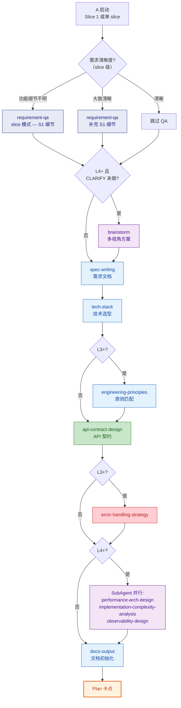
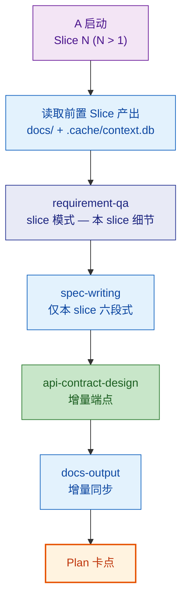
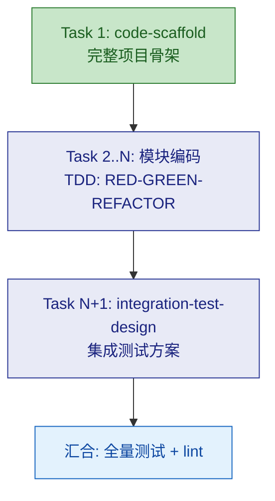
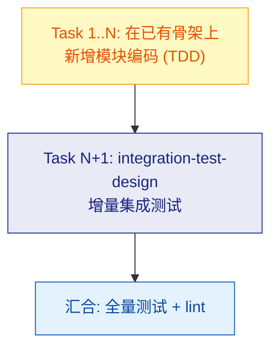

# A：新项目

## Plan

### 首个 Slice（或单 slice 模式）

首个 Slice 执行完整 Plan skill 链，产出全局性文档（tech-stack、engineering-principles 等）。

> **注意**：如果 CLARIFY 阶段已执行，Plan 中的 requirement-qa 切换为 **slice 模式**（仅问 S1 具体功能细节，不重复宏观问题）；brainstorm 默认**跳过**（CLARIFY 已做架构讨论），除非 S1 内出现新的架构争议才触发。

### 后续 Slice（多 slice 模式时）

后续 Slice 跳过全局性 skill（tech-stack、engineering-principles、error-handling-strategy），只执行 slice 级增量 skill。requirement-qa 始终为 **slice 模式**，brainstorm **跳过**（CLARIFY 已做）。

### 变体差异

| Skill | A-lite | A | A+ |
|-------|--------|---|-----|
| requirement-qa | 轻量 | 标准 | 深度 |
| brainstorm | 跳过 | 跳过 | CLARIFY 未做则必做；CLARIFY 已做则跳过 |
| spec-writing | 要点列表 | 六段式 | 六段式 |
| tech-stack | 默认模板 | 完整选型 | 完整选型 |
| engineering-principles | 跳过 | 标准 | 多模式匹配 |
| api-contract-design | 端点列表 | 完整契约 | 完整契约 |
| error-handling-strategy | 跳过 | 标准 | 标准 |
| SubAgent 三件套 | 跳过 | 跳过 | 并行执行 |
| docs-output | 最小化 | 初始化 | 完整初始化 |

> brainstorm 仅在 A+（L4-L5）变体中且 **CLARIFY 阶段未执行** 时必做。如果 CLARIFY 已完成架构讨论，Plan 中的 brainstorm 跳过。

---

## Execute

通用执行流程（任务分解 → TDD 循环 → 审查 → 汇合）→ 读取 `references/execute.md`。以下为 Route A 的**特化规则**：

### 首个 Slice

任务分解时必须遵守：

| # | 强制任务 | 说明 |
|---|---------|------|
| Task 1 | `code-scaffold` | 生成完整项目骨架（目录结构、构建配置、公共模块） |
| 最后 | `integration-test-design` | 设计集成测试框架和策略 |
| 中间 | 本 slice 模块编码 | 按 TDD 循环逐 task 执行 |

### 后续 Slice

- `code-scaffold` **跳过**（骨架已存在），Task 1 直接是模块编码
- `integration-test-design` 做增量（仅本 slice 新增模块的集成测试）

