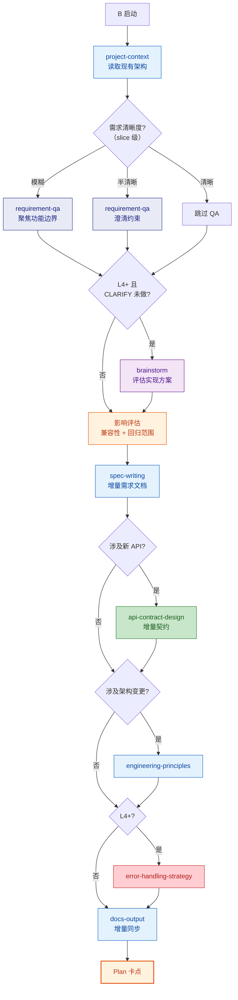
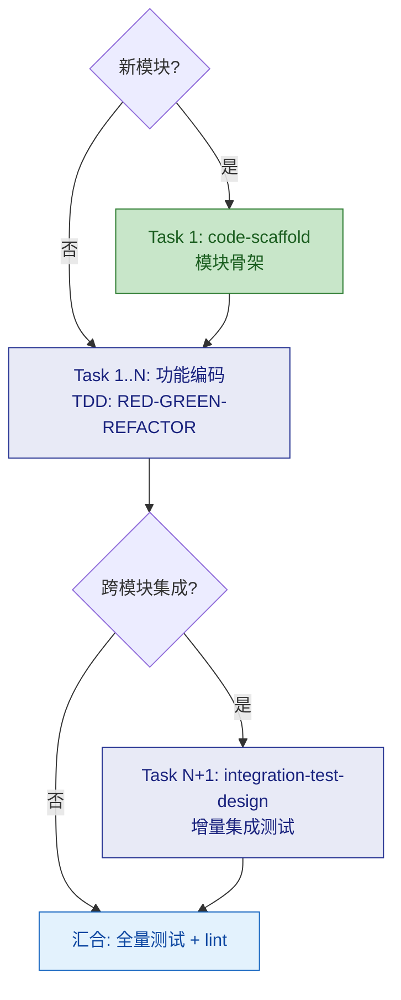

# B：已有项目新功能

⛔ **路径锁定**：本路径的 Mermaid 流程图是强制执行路线，不是参考。每个节点必须按图中箭头顺序执行，条件分支按实际情况走对应分支。禁止跳过任何节点、禁止提前退出。每完成一个节点后，沿箭头进入下一个。

---

## Plan

> **注意**：如果 CLARIFY 阶段已执行，Plan 中的 requirement-qa 切换为 **slice 模式**（仅问当前 slice 的功能细节和影响范围，不重复宏观问题）；brainstorm 默认**跳过**（CLARIFY 已做架构讨论），除非 slice 内出现新的实现方案争议才触发。

### 变体差异

| Skill | B-lite | B | B+ |
|-------|--------|---|-----|
| project-context | 读取 | 读取 | 读取 |
| requirement-qa | 快速澄清 | 标准 | 深度 |
| brainstorm | 跳过 | 跳过 | CLARIFY 未做则必做；CLARIFY 已做则跳过 |
| 影响评估 | 跳过 | 标准 | 深度 |
| spec-writing | 增量 | 增量 | 增量 |
| api-contract-design | 按需 | 按需 | 按需 |
| engineering-principles | 跳过 | 按需 | 按需 |
| error-handling-strategy | 跳过 | 跳过 | 标准 |
| docs-output | 跳过 | 增量同步 | 增量同步 |

---

## Execute

通用执行流程（任务分解 → TDD 循环 → 审查 → 汇合）→ 读取 `references/execute.md`。以下为 Route B 的**特化规则**：

| 条件 | 任务分解特殊处理 |
|------|----------------|
| **新增模块** | Task 1 = 该模块的 `code-scaffold`（模块级，非项目级） |
| **跨模块集成** | 必须包含 `integration-test-design` 增量任务 |
| **单模块内部** | 无特殊要求，按通用 TDD 流程 |

