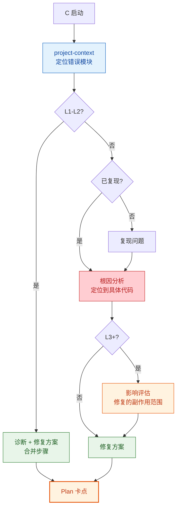
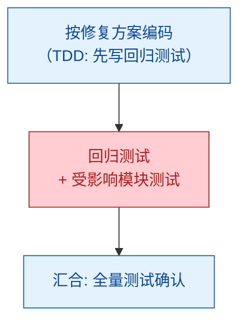

# C：Bug 修复

⛔ **路径锁定**：本路径的 Mermaid 流程图是强制执行路线，不是参考。每个节点必须按图中箭头顺序执行，条件分支按实际情况走对应分支。禁止跳过任何节点、禁止提前退出。每完成一个节点后，沿箭头进入下一个。

---

## Plan

### 变体差异

| 步骤 | C-fast | C | C+ |
|------|--------|---|-----|
| project-context | 定位模块 | 定位模块 | 定位模块 |
| 复现 | 跳过（快速诊断） | 标准复现 | 标准复现 |
| 根因分析 | 合并到诊断 | 标准 | 深度 |
| 影响评估 | 跳过 | 跳过 | 必做 |
| 修复方案 | 合并到诊断 | 标准 | 详细 |

---

## Execute

通用执行流程 → 读取 `references/execute.md`。Route C 的**特化规则**：

- **无 scaffold** — Bug 修复不需要项目/模块骨架
- **回归测试必做** — 确认修复不引入新问题

| 变体 | Execute 策略 | TDD |
|------|------------|-----|
| **C-fast** | 跳过任务分解，主 agent 直接：诊断 → 修复 → 回归测试 | 可选 |
| **C** | 按修复方案分 1-3 个 task，按 TDD 流程执行 | 强制 |
| **C+** | 标准任务分解 + SubAgent 隔离 + 两阶段审查 | 严格 |

