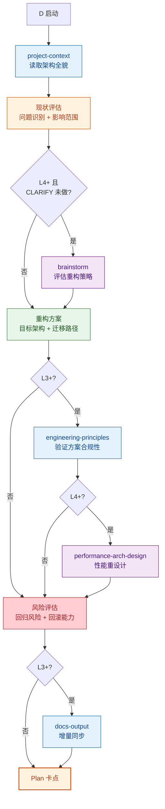
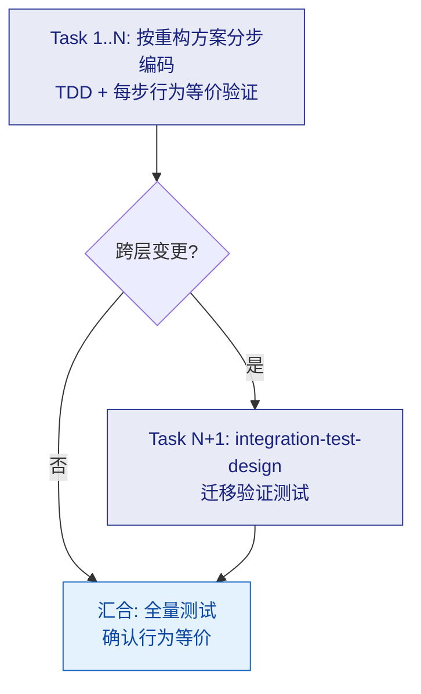

# D：重构

## Plan

> **注意**：如果 CLARIFY 阶段已执行架构讨论，Plan 中的 brainstorm 默认**跳过**，除非重构过程中发现新的策略争议。

### 变体差异

| Skill | D-lite | D | D+ |
|-------|--------|---|-----|
| project-context | 读取架构 | 读取架构 | 读取架构 |
| 现状评估 | 快速 | 标准 | 深度 |
| brainstorm | 跳过 | 跳过 | CLARIFY 未做则必做；CLARIFY 已做则跳过 |
| 重构方案 | 简要 | 标准 | 详细 + 迁移计划 |
| engineering-principles | 跳过 | 标准验证 | 深度验证 |
| performance-arch-design | 跳过 | 跳过 | 性能重设计 |
| 风险评估 | 跳过 | 标准 | 详细 + 回滚方案 |
| docs-output | 跳过 | 增量同步 | 增量同步 |

---

## Execute

通用执行流程（任务分解 → TDD 循环 → 审查 → 汇合）→ 读取 `references/execute.md`。Route D 的**特化规则**：

- **无 scaffold** — 重构不新建项目/模块骨架
- **核心原则**：每个 task 完成后**原有测试必须全部通过**（行为等价）
- `integration-test-design` **仅在跨层重构时触发**
- **不允许积累**：不允许多个 task 完成后再统一测试，每个 task 后立即验证等价性

