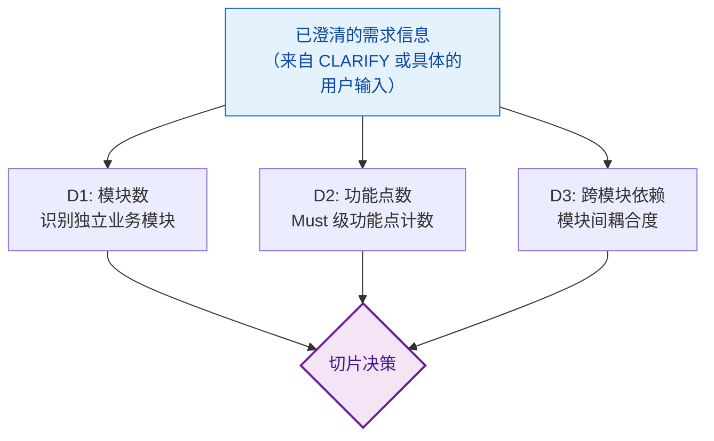
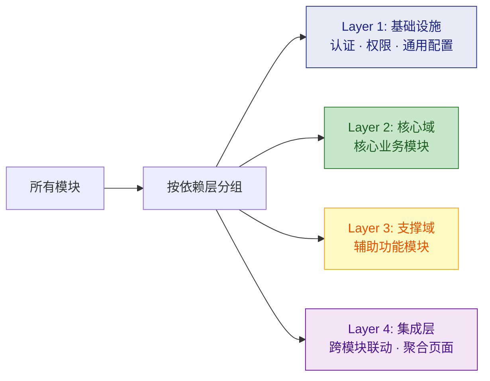
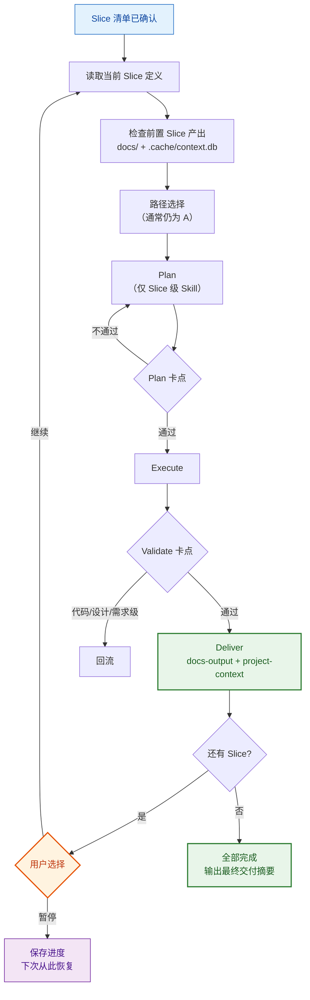

# 范围切片（Scope Sizer）

在 CLARIFY 之后（或 CLARIFY 跳过后）、路径选择之前执行。评估任务的**广度**而非深度，决定是否将一个大需求拆分为多个可管理的 slice。

## 前置输入

scope-sizer 需要**已澄清的需求信息**作为输入，而非原始模糊的用户输入：

| 来源 | 内容 | 何时可用 |
|------|------|---------|
| CLARIFY 产出 | 模块清单、核心功能、架构方向 | CLARIFY 被触发时 |
| 用户输入本身 | 已经足够具体（如"给 user 模块加修改密码"） | CLARIFY 跳过时 |
| project-context | 已有项目的模块结构（B/C/D 路径） | 有代码仓库时 |

---

## 为什么需要切片

- **上下文窗口有限**：一次对话无法完成 8 个模块的 Plan + Execute
- **风险分散**：每个 slice 独立验证，问题早暴露早修复
- **可中断恢复**：用户可在任意 slice 后暂停，下次会话从 progress 恢复
- **增量交付**：每完成一个 slice 就有可部署的增量产出

---

## 评估维度



| 维度 | 单 slice 标准 | 需拆分标准 |
|------|-------------|-----------|
| **模块数** | <= 2 个独立模块 | > 2 个独立模块 |
| **功能点数** | <= 3 个 Must 功能 | > 3 个 Must 功能 |
| **跨模块依赖** | 无依赖或线性依赖 | 存在循环依赖或复杂编织 |

**触发条件**：任意一个维度达到"需拆分标准"即触发切片。

用户可覆盖："不拆，一次做完" → 跳过切片，但需在 Plan 中标注风险。

---

## 切片策略

切片策略因路径不同而异。核心思想相同：**按风险和依赖排序，每个 slice 可独立验证**。

### Route A（新项目）— 按依赖层分组



1. **基础设施优先**：认证、权限、数据库初始化、项目骨架等放在 Slice 1
2. **核心域其次**：系统最核心的业务模块（如小说系统的"小说管理 + 阅读"）放在 Slice 2
3. **支撑域跟随**：锦上添花但非 MVP 核心的模块（如评论、书架、推荐）后续 slice
4. **集成层最后**：需要多模块协作的聚合功能（如首页仪表盘、搜索聚合）放最后

### 每个 slice 的粒度控制

| 约束 | 目标 |
|------|------|
| 最大模块数 | 单个 slice 不超过 2-3 个模块 |
| 最大功能点 | 单个 slice 不超过 5 个 Must 功能 |
| 最大预估文件 | 单个 slice 新增/修改不超过 ~30 个文件 |
| 可独立运行 | 每个 slice 完成后项目应可编译运行 |

### 全局 vs Slice 级 Skill

| Skill | 首个 Slice | 后续 Slice |
|-------|-----------|-----------|
| requirement-qa | 全局 + Slice 1 细节 | 仅 Slice N 细节 |
| brainstorm | 全局架构方案 | **默认跳过**（CLARIFY 已做）；仅新架构争议时触发 |
| spec-writing | 全局概览 + Slice 1 六段式 | 仅 Slice N 六段式 |
| tech-stack | **完整输出**（全局性） | **跳过**（复用 Slice 1 产出） |
| engineering-principles | **完整匹配**（全局性） | **跳过**（复用） |
| api-contract-design | Slice 1 涉及的端点 | Slice N 增量端点 |
| error-handling-strategy | **完整设计**（全局性） | **跳过**（复用） |
| code-scaffold | **完整骨架**（仅 Slice 1） | **跳过**（骨架已存在） |
| docs-output | 初始化 + Slice 1 同步 | **Slice N 增量同步** |
| project-context | 初始化 + Slice 1 回写 | **Slice N 增量回写** |

### Route B（新功能）— 按实现阶段分组

已有项目上添加新功能时，切片维度从"模块数"转变为"实现阶段"和"影响范围"：

| 维度 | 单 slice 标准 | 需拆分标准 |
|------|-------------|-----------|
| **影响模块数** | 仅 1 个模块内部 | 跨 2+ 模块 |
| **实现层次** | 单层（仅后端 / 仅前端） | 前后端 + 数据迁移 |
| **数据变更** | 无 schema 变更 | 需要数据迁移 |

**分组原则**：

1. **数据层优先**：如需 schema 变更或数据迁移，单独一个 slice
2. **后端 API 其次**：新增/修改后端接口
3. **前端 UI 跟随**：依赖后端 API 的前端页面/组件
4. **集成联调最后**：端到端集成测试 + 回归

示例："给小说系统加搜索功能"
| Slice | 范围 | 内容 |
|-------|------|------|
| S1 | 数据层 | ES 索引设计 · 数据同步管道 · schema 迁移 |
| S2 | 后端 | SearchService · 搜索 API · 分页/排序 |
| S3 | 前端 + 集成 | 搜索 UI · 联调 · 回归测试 |

### Route C（Bug 修复）— 通常单 slice

Bug 修复天然范围窄，**默认不切片**。仅当以下条件满足时才触发：

| 信号 | 判定 |
|------|------|
| 系统性 bug 影响 3+ 模块 | 需按模块逐个修复验证 |
| 修复需要数据修正 + 代码修复 | 分为"数据修正 slice"+"代码修复 slice" |
| 其他情况 | **单 slice，跳过切片** |

### Route D（重构）— 按安全边界分步

重构的切片原则是**每步可回滚、行为等价**：

| 维度 | 单 slice 标准 | 需拆分标准 |
|------|-------------|-----------|
| **受影响模块** | 仅 1 个模块内部重构 | 跨 2+ 模块或公共层 |
| **API 变更** | 内部实现变更，API 不变 | API 签名/协议变更 |
| **数据模型变更** | 无 schema 变更 | 需要数据迁移 |

**分组原则**：

1. **内部重构优先**：不改变外部 API 的模块内部重构（最安全）
2. **接口重构其次**：API 签名变更 + 调用方适配
3. **数据迁移最后**：schema 变更 + 数据转换（风险最高）

示例："把认证模块重构为微服务"
| Slice | 范围 | 内容 |
|-------|------|------|
| S1 | 内部抽象 | 提取 AuthService 接口 · 解耦直接调用 |
| S2 | 服务拆分 | 独立服务部署 · gRPC/HTTP 通信 |
| S3 | 数据迁移 | 用户表迁移 · 双写过渡 · 旧代码清理 |

---

## 切片清单输出格式

评估完成后，输出切片清单供用户确认：

```markdown
### Slice 切片计划

**需求**: [需求名称]
**评估结果**: [模块数] 个模块 · [功能点] 个 Must 功能 → 拆分为 [N] 个 slice

| Slice | 范围 | 包含模块 | 关键功能 | 依赖 |
|-------|------|---------|---------|------|
| S1 | 基础设施 + 核心骨架 | auth, common | 项目初始化 · 认证 · 权限 | 无 |
| S2 | 核心域 | novel, chapter | 小说 CRUD · 章节管理 · 阅读器 | S1 |
| S3 | 支撑域 | user, bookshelf | 用户档案 · 书架 · 收藏 | S1, S2 |
| S4 | 集成 | search, dashboard | 全文搜索 · 首页推荐 | S1-S3 |

**预计每个 Slice 独立走完 Plan→Execute→Validate→Deliver。**
**每个 Slice 完成后同步 docs/ 和 .cache/context.db。**

确认此切片计划？（可调整顺序、合并或拆分 slice）
```

---

## Slice 迭代器行为



### 暂停与恢复

- 每个 Slice 的 Deliver 阶段强制同步 docs/ 和 .cache/context.db
- 如果用户暂停（或会话中断），下次启动 Orchestrator 时：
  1. project-context 读取 .cache/context.db → 发现项目已有代码和文档
  2. 读取 docs/progress/ → 发现上次完成到 Slice N
  3. 自动从 Slice N+1 继续，无需重新评估全局上下文
