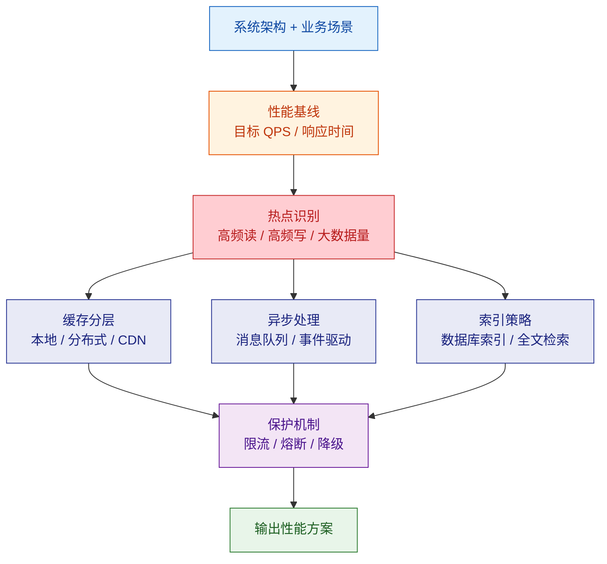
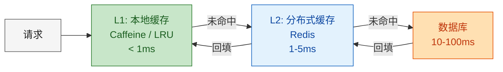
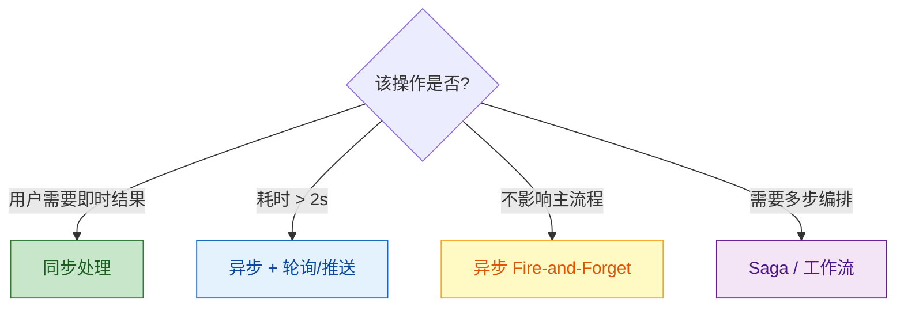

# 性能前置设计

在编码前从架构层面识别性能瓶颈，设计缓存分层、异步处理、索引策略和限流方案。

---

## 设计流程



---

## 1. 性能基线定义

### 目标模板

| 指标 | 目标 | 测量方式 |
|--|--|--|
| P99 响应时间 | < 200ms (读) / < 500ms (写) | APM 工具 |
| QPS | 根据业务估算 | 压测工具 |
| 错误率 | < 0.1% | 监控告警 |
| 数据库查询 | < 50ms (单表) / < 200ms (联表) | 慢查询日志 |

### 估算公式

```
预估 QPS = 日活用户 × 人均请求数 / 有效时长(秒)
峰值 QPS = 预估 QPS × 3（峰值系数）
```

---

## 2. 热点识别

### 读热点

| 特征 | 示例 | 优化策略 |
|--|--|--|
| 同一数据被大量请求 | 商品详情、配置信息 | 缓存 |
| 列表查询频繁 | 首页数据、排行榜 | 预计算 + 缓存 |
| 大数据量全表扫描 | 搜索、报表 | 索引 / 全文检索 / 物化视图 |

### 写热点

| 特征 | 示例 | 优化策略 |
|--|--|--|
| 高并发写同一行 | 库存扣减、计数器 | 乐观锁 / 分桶计数 |
| 批量数据写入 | 日志写入、数据导入 | 异步 + 批量 |
| 大事务 | 多表级联操作 | 拆分事务 / Saga |

---

## 3. 缓存分层



### 缓存策略选择

| 场景 | 策略 | TTL | 说明 |
|--|--|--|--|
| 基本不变的数据 | Cache-Aside | 24h | 配置、字典表 |
| 频繁读少量写 | Cache-Aside + 写失效 | 1h | 用户信息、商品详情 |
| 读写均衡 | Write-Through | 30min | 会话数据 |
| 写多读少 | Write-Behind | N/A | 日志、统计 |
| 排行榜/计数 | Redis 原生结构 | 持久化 | SortedSet / HyperLogLog |

### 缓存问题防护

| 问题 | 原因 | 解决方案 |
|--|--|--|
| 缓存穿透 | 查询不存在的数据 | 布隆过滤器 / 缓存空值(短 TTL) |
| 缓存击穿 | 热点 Key 过期 | 互斥锁加载 / 永不过期+异步刷新 |
| 缓存雪崩 | 大量 Key 同时过期 | TTL 加随机偏移 / 多级缓存 |

---

## 4. 异步处理

### 适用场景判定



### 消息队列选型

| 队列 | 适用 | 特点 |
|--|--|--|
| Redis Stream | 轻量级、单机 | 简单、不持久化 |
| RabbitMQ | 中小型、需要路由 | 灵活路由、可靠投递 |
| Kafka | 大数据量、日志流 | 高吞吐、持久化、分区 |

---

## 5. 数据库索引策略

### 索引设计原则

| 原则 | 说明 |
|--|--|
| 高选择性字段优先 | 唯一值多的列效果好 |
| 查询条件即索引 | WHERE / ORDER BY / JOIN 的列 |
| 复合索引最左前缀 | 遵循查询模式排列列顺序 |
| 覆盖索引 | 索引包含查询所有列，避免回表 |
| 避免过度索引 | 每增加一个索引，写入性能下降 |

### N+1 查询防护

| 场景 | ORM 解法 | SQL 解法 |
|--|--|--|
| 关联查询 | Eager Loading / Join Fetch | LEFT JOIN |
| 批量查询 | `findAllById(ids)` | `WHERE id IN (...)` |
| 分页+关联 | 先查 ID 再批量加载 | 子查询分页 |

### 慢查询预防清单
- [ ] 所有 WHERE 条件都有索引覆盖
- [ ] 无全表 COUNT(*)（用近似计数或缓存）
- [ ] 无 `SELECT *`（只查需要的列）
- [ ] 分页用游标/Keyset 而非 OFFSET
- [ ] 大 IN 列表拆分为批次（< 1000 条）

---

## 6. 限流策略

| 算法 | 适用 | 特点 |
|--|--|--|
| 固定窗口 | 简单限流 | 有边界突刺问题 |
| 滑动窗口 | 一般 API | 平滑、内存稍多 |
| 令牌桶 | 允许突发 | 可积累令牌应对突发 |
| 漏桶 | 严格匀速 | 流量平滑 |

### 限流维度

| 维度 | 示例 |
|--|--|
| 用户级 | 每用户 100 次/分 |
| IP 级 | 每 IP 200 次/分 |
| API 级 | 某接口全局 1000 次/秒 |
| 服务级 | 上游调用方配额 |

---

## 7. 输出清单

| 制品 | 说明 |
|--|--|
| 性能基线文档 | 目标 QPS、响应时间、错误率 |
| 热点分析表 | 读热点 + 写热点 + 优化策略 |
| 缓存设计方案 | 分层策略、TTL、防护措施 |
| 异步处理方案 | 场景列表 + 队列选型 |
| 索引设计清单 | 每张表的索引定义 |
| 限流配置 | 维度 + 算法 + 阈值 |

---

## 参考

详细规则参见 `references/` 目录：
- `performance-rules.md` — 性能设计详细规则与反模式
