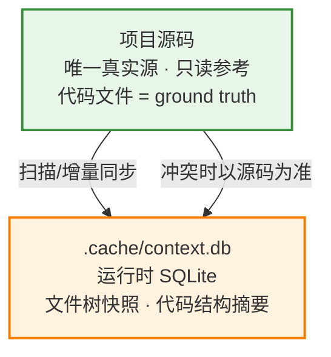
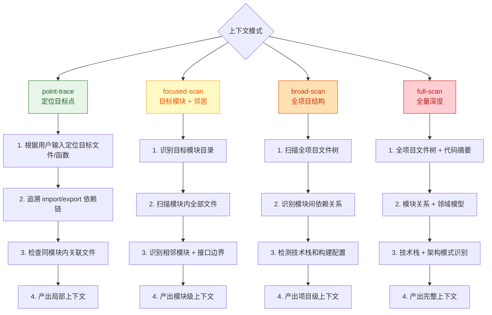

# 项目结构感知

本 Skill 解决一个核心问题：**AI 模型在跨会话时丢失对项目结构的理解**。每次新会话都要重新扫描目录、重新理解代码组织，效率低且容易遗漏。

本 Skill 通过在项目中维护一个 **SQLite 数据库**（`.cache/context.db`），将项目文件树和代码结构摘要持久化，使得跨会话快速恢复项目认知。

> **新项目适用**：即使项目中尚无源码（Route A 新项目的 Plan 阶段），仍应执行 `init` 创建 db 并记录已有结构（配置文件、文档产出等）。db 中的 `file_tree` 按 category 分类追踪所有文件（source/config/doc/test/asset/other），不仅限于源码。Plan 阶段各 skill 产出的文档（docs/、specs/）同样被 sync 捕获。

## 数据模型



**源码是唯一真实源**。db 是源码结构的缓存，用户可能在不使用本 skill 的情况下修改代码，因此 db 信息可能过期。

## 原则

- **编排器强制调用**：本 skill 是基础设施，由 orchestrator 在上下文感知阶段（路径选择前）和 Deliver 阶段强制调用，禁止跳过。
- **源码优先**：db 是缓存，不是真实源。每次查询前应对涉及范围做增量校验。
- **增量同步**：不全量扫描，基于文件修改时间（mtime）+ 文件哈希做增量检测，仅同步变更部分。
- **最小存储**：只存结构信息和导出符号签名，不存储源码内容本身。

## 数据库位置与 Git 策略

- 路径：`{project_root}/.cache/context.db`
- `.cache/` 目录应加入 `.gitignore`（db 是本地运行时产物）

## 核心能力

### 0. 上下文模式选择

被 orchestrator 调用时，根据输入分类结果选择对应的上下文获取模式：

| 模式 | 说明 | 扫描范围 | 产出 |
|------|------|---------|------|
| **point-trace** | 先定位再扩散 | 用户提及的目标点 → 追溯 import/caller → 同模块文件 | 目标点 + 直接关联文件 + 局部依赖链 |
| **focused-scan** | 聚焦模块 | 目标模块全量 + 相邻模块概要 + API 边界 | 模块详情 + 邻居概要 + 接口边界 |
| **broad-scan** | 广域扫描 | 全项目文件树 + 模块间依赖 + 技术栈 | 完整结构 + 模块关系 + 技术栈 |
| **full-scan** | 全量深度扫描 | 全项目 + 代码摘要 + 领域分析 | 完整上下文 + 架构全貌 |



未被 orchestrator 调用时（独立使用），默认执行 broad-scan 模式。

### 1. init — 初始化

首次在项目中使用时调用。扫描项目文件结构，生成初始快照。

- 扫描：目录树、文件类型、文件大小、修改时间
- 识别：package.json、tsconfig、入口文件等关键配置
- 忽略：node_modules、dist、.git、二进制文件等（遵循 .gitignore）
- 写入：`file_tree` 表 + `project_meta` 表

### 2. sync — 增量同步

对比当前文件系统与 db 中的快照，检测新增/修改/删除的文件，更新 db。

- 基于 mtime + 文件哈希检测变更
- 对变更的代码文件，可提取结构摘要（导出的函数/类/接口签名）

### 3. query — 查询结构

根据路径或关键词查询项目结构信息：

- 项目结构概览（project_meta）
- 某个模块/目录的文件列表与分类
- 某个文件的导出符号摘要

### 4. validate — 校验一致性

对比 db 中的信息与实际源码，标记过期条目：

- 文件已被删除 → 标记为 deleted
- 文件内容已变但摘要未更新 → 标记为 stale

## 数据库 Schema 概要

| 表名 | 用途 |
|------|------|
| `project_meta` | 项目元信息（名称、根路径、monorepo 结构、Node 版本等） |
| `file_tree` | 文件树快照（路径、类型、大小、mtime、hash、状态、分类） |
| `code_summary` | 代码结构摘要（文件→导出的函数/类/接口签名） |

> 完整 Schema（含字段定义与索引）见 → `references/schema.md`

## 向量化扩展（可选升级）

对于大型项目（文件 > 500），可启用向量化扩展实现语义检索。当前版本以关键词全文检索为主（SQLite FTS5），向量化作为未来升级路径。

## Python 脚本

```bash
python scripts/context_db.py init     --root <project_root>
python scripts/context_db.py sync     --root <project_root>
python scripts/context_db.py query    --root <project_root> --scope structure|meta [--module <path>] [--keyword <term>]
python scripts/context_db.py validate --root <project_root>
```

> 脚本实现见 → `scripts/context_db.py`

## 常见问题

- **db 与源码不一致**：调 `validate`标记过期条目，再调 `sync` 更新。源码永远是 truth。
- **db 文件损坏/丢失**：重新 `init` 即可，db 是可重建的缓存。
- **项目太大初始化太慢**：`init` 先只扫描文件树（秒级），代码摘要可延迟到首次查询时按需生成。
